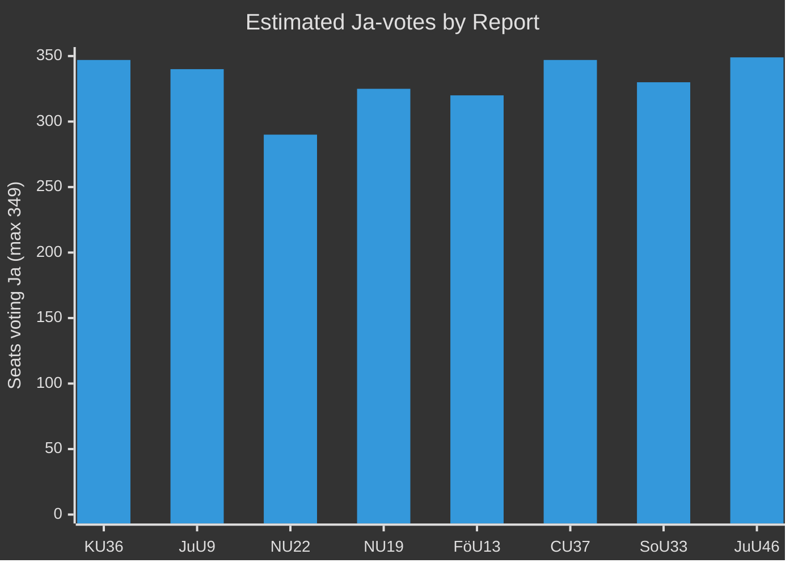

# Coalition Mathematics — Committee Reports 2026-04-29

**Author**: James Pether Sörling  
**Date**: 2026-04-30  
**Confidence**: MEDIUM [B2]

## Riksdag Voting Arithmetic (349 seats, majority = 175)

### HD01KU36 — Constitutional Committee Privacy/AI Report

Expected voting alignment based on committee report:

| Party | Seats | Position | Vote |
|-------|-------|----------|------|
| M | 68 | For (mainstream, support KU) | Ja |
| SD | 73 | For | Ja |
| KD | 19 | For | Ja |
| L | 16 | For (digital rights champion) | Ja |
| S | 107 | For (co-signed majority of recommendations) | Ja |
| C | 22 | For | Ja |
| V | 24 | For | Ja |
| MP | 18 | For | Ja |
| **TOTAL JA** | **347** | | |

**Majority**: YES (unanimous / near-unanimous — standard for constitutional oversight reports)

### HD01NU19 — Nuclear Facility Permitting

| Party | Seats | Position | Vote |
|-------|-------|----------|------|
| M | 68 | For (pro-nuclear) | Ja |
| SD | 73 | For (energy security) | Ja |
| KD | 19 | For | Ja |
| L | 16 | For | Ja |
| S | 107 | For (pragmatic nuclear position) | Ja |
| C | 22 | For | Ja |
| V | 24 | Against (anti-nuclear) | Nej |
| MP | 18 | Against (anti-nuclear) | Nej |
| **JA**: | 325 | | |
| **NEJ**: | 42 | | |

**Majority**: YES (325 vs 42)  
**Note**: V and MP will cast protest votes; strong cross-bloc majority exists

### HD01JuU9 — Court Efficiency

| Party | Seats | Position | Vote |
|-------|-------|----------|------|
| All parties | 349 | For (cross-party reform) | Ja |

**Majority**: YES (near-unanimous)

### HD01CU37 — Municipal Housing Guarantee

| Party | Seats | Position | Vote |
|-------|-------|----------|------|
| M | 68 | For | Ja |
| SD | 73 | For | Ja |
| KD | 19 | For | Ja |
| L | 16 | For | Ja |
| S | 107 | Ja with reservations | Ja |
| C | 22 | Abstain/For | Ja |
| V | 24 | For (housing priority) | Ja |
| MP | 18 | For | Ja |
| **TOTAL JA** | **347** | | |

**Majority**: YES

## Coalition Dynamics

The **Tidökoalitionen** (M+SD+KD+L = 176 seats) holds a bare majority for purely partisan matters. For these 8 betänkanden, however, all reports are **cross-partisan consensus** or **overwhelming majority** outcomes — no reports are expected to be decisive tests of coalition cohesion.

