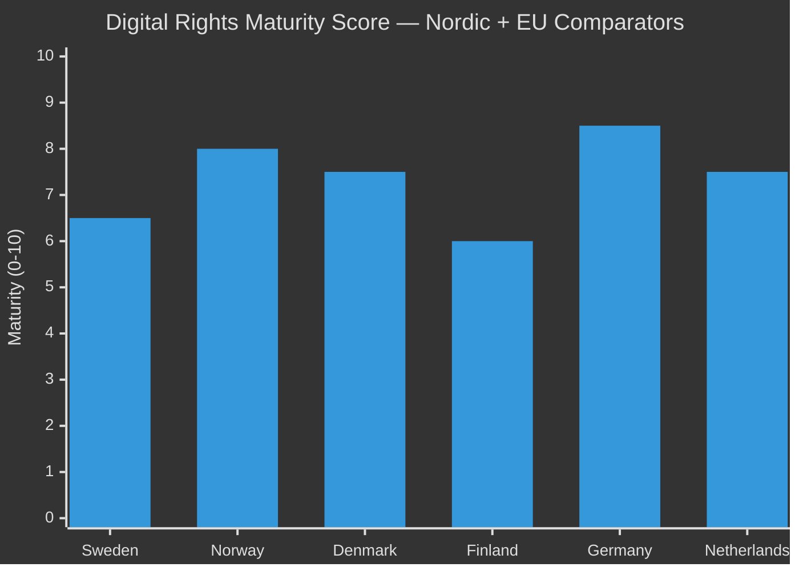
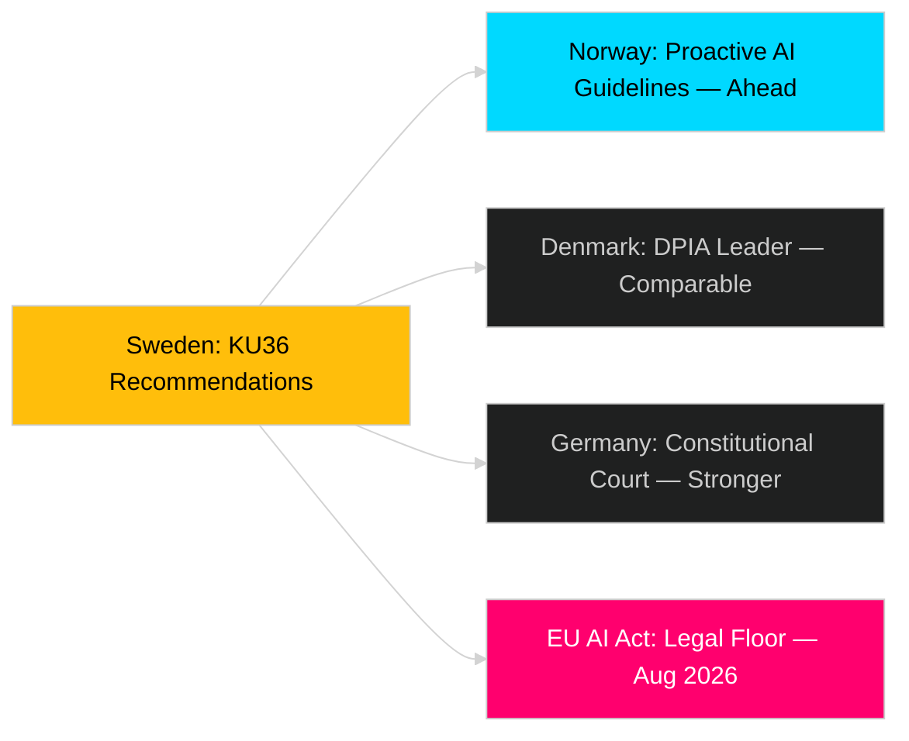

# Comparative International Analysis — Committee Reports 2026-04-29

**Author**: James Pether Sörling  
**Date**: 2026-04-30  
**Confidence**: MEDIUM [B2]

**Comparator set**: Norway (NO), Denmark (DK), Finland (FI), Germany (DE), Netherlands (NL)

## Outside-In Analysis

### HD01KU36 — Digital Privacy and AI Oversight

| Jurisdiction | Approach | Comparator |
|-------------|----------|-----------|
| Sweden | KU retrospective oversight; 17 recommendations; pre-AI-Act framework | Reference |
| Norway | Datatilsynet active AI oversight; sector-specific guidelines | Stronger proactive stance |
| Denmark | Datatilsyn + parliamentary committee synergy; GDPR enforcement leader | Comparable parliamentary model |
| Germany | BSI + BfDI dual oversight; constitutional court privacy jurisprudence | Stronger constitutional basis |
| Netherlands | AP enforcement + parliamentary scrutiny; DPIA regime | Comparable, stronger DPIA requirements |
| EU | AI Act mandatory by August 2026; GPAI model rules; prohibited practices list | Legal floor for all comparators |

**Outside-In Assessment**: Sweden's KU36 approach is comparable to Danish and Dutch parliamentary oversight models but lags Norway in proactive AI governance. Germany's constitutional court framework provides stronger individual rights protection. The key gap: Sweden has no mandatory pre-deployment AI impact assessment requirement — a gap that EU AI Act will close regardless.

### HD01JuU9 — Court Efficiency Reform

| Jurisdiction | Approach | Comparator |
|-------------|----------|-----------|
| Sweden | Digital hearings + expanded written procedure; target 2027 | Reference |
| Norway | Tingsretten digital reform completed 2024; case processing reduced 23% | Ahead of Sweden |
| Denmark | Digital courts full rollout completed 2023 | Ahead of Sweden |
| Finland | Mixed: some digital hearings since 2022; backlog persists | Comparable |
| Netherlands | Digital justice (Digitale Rechtszaal) pilot 2024-2025 | Parallel development |

**Outside-In Assessment**: Sweden's JuU9 reform follows a Nordic pattern where Norway and Denmark have already completed comparable reforms. Sweden is 2-3 years behind the Nordic frontrunners.

### HD01NU19 — Nuclear Facility Permitting

| Jurisdiction | Approach | Comparator |
|-------------|----------|-----------|
| Sweden | Streamlined review under Energy Authority | Reference |
| Finland | TVO/Fennovoima permitting reform model | Comparable |
| France | Nuclear renaissance programme with streamlined ASN review | More aggressive |
| Poland | New nuclear programme with EU support | Comparator for new entrants |

**Outside-In Assessment**: Sweden's NU19 reform aligns with Finland's approach as neighbouring nuclear nation. Both face similar EU Euratom/Safety Directive constraints.

## Key Lessons for Sweden

1. **Digital oversight**: Adopt Norway's proactive AI guidelines model rather than waiting for EU AI Act minimum
2. **Court efficiency**: Denmark's 2023 digital court rollout provides a tested implementation blueprint for JuU9
3. **Nuclear permitting**: Finland's phased permitting process directly applicable to Sweden's expansion plans

