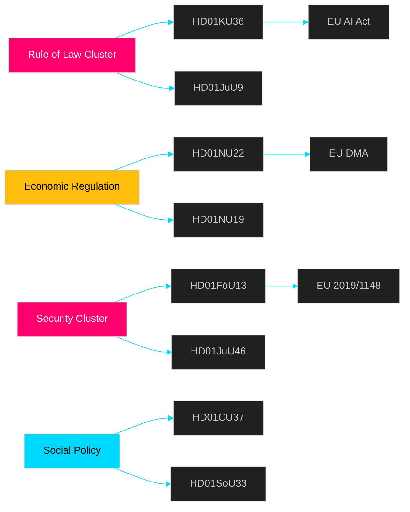

# Cross-Reference Map — Committee Reports 2026-04-29

**Author**: James Pether Sörling  
**Date**: 2026-04-30

## Policy Clusters

### Cluster A — Rule of Law and Digital Rights
- **HD01KU36** (KU) ↔ **HD01JuU9** (JuU): Both advance institutional modernisation of state-citizen legal relationship
- HD01KU36 feeds EU AI Act compliance roadmap → Commission monitoring
- HD01JuU9 links to JuU46 (Europol parliamentary control) — both strengthen JuU oversight role

### Cluster B — Economic Regulation and Market Governance
- **HD01NU22** (Competition) ↔ **HD01NU19** (Nuclear permitting): Both from NU — signal coherent industrial policy agenda
- NU22 (Konkurrensverket powers) complements EU DMA enforcement at national level
- NU19 (nuclear permitting) connects to government energy security agenda (Tidöpartiet programme)

### Cluster C — Security and Defence
- **HD01FöU13** (explosives) ↔ **HD01JuU46** (Europol): Both security-related JuU/FöU outputs
- FöU13 cites EU 2019/1148 — connects to broader Nordic security cooperation thread
- Cross-reference: FöU13 precursor controls intersect KU36 digital surveillance tools

### Cluster D — Social Policy
- **HD01CU37** (housing guarantees) ↔ **HD01SoU33** (serving permit): Both adjust social/commercial regulation
- CU37 links to broader bostadspolitik (housing policy) debate — opposition motion context

## Legislative Chains

```
HD01KU36 (KU oversight) → [Government AI policy response] → [AI Act implementation bill 2026]
HD01JuU9 (JuU court reform) → [Legislative amendments] → [Entry into force 2027]
HD01NU19 (nuclear permitting) → [Energy Authority transition] → [First reactor approval pathway]
HD01NU22 (competition tools) → [Konkurrensverket powers law] → [DMA enforcement coordination]
```

## Coordinated Activity Patterns

No coordinated opposition activity detected across these betänkanden. Standard committee process observed. KU36 has cross-committee implications (JuU, NU, FöU all have AI-adjacent concerns documented in respective reports).

## Sibling Folder Citations

- Prior committee reports analysis: `analysis/daily/2026-04-*/committeeReports/` (if existing)
- Propositions context: `analysis/daily/2026-04-*/propositions/` for budget/fiscal context


