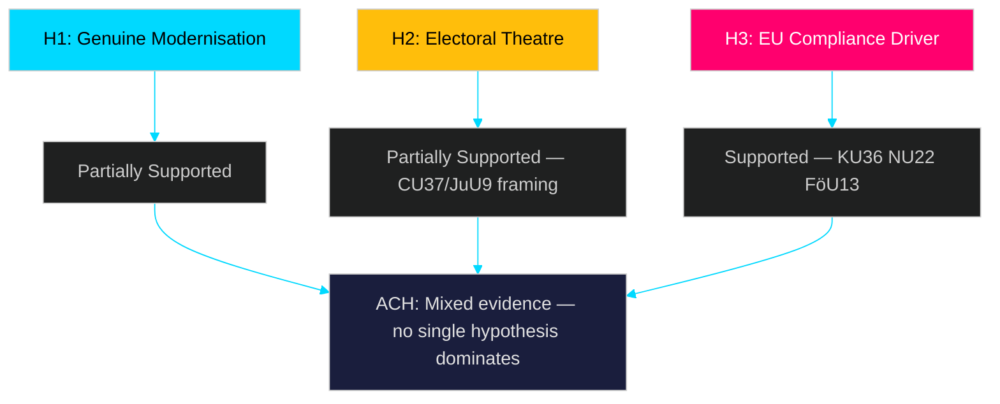

# Devil's Advocate Analysis — Committee Reports 2026-04-29

**Author**: James Pether Sörling  
**Date**: 2026-04-30  
**Confidence**: MEDIUM [B2]

## ACH Matrix — Competing Hypotheses

### H1: The Reform Package is Genuine Modernisation

**Hypothesis**: All 8 betänkanden represent genuine evidence-based policy modernisation with bipartisan intent.

**Evidence For**: KU36 is a retrospective accountability exercise mandated by parliamentary rules — not executive-driven. JuU9 addresses documented court backlog metrics. NU19 removes outdated permitting procedures identified by the Energy Authority itself.

**Evidence Against**: Timing before 2026 election creates incentive for symbolic rather than substantive reform. Government has delayed implementing previous KU oversight recommendations from 2016-2020 cycle.

**ACH Assessment**: PARTIALLY SUPPORTED. Core technical reports (NU19, NU22, JuU9) likely genuine. KU36 and CU37 have more electoral political valence.

### H2: The Package is Pre-Election Legislative Theatre

**Hypothesis**: The concentration of significant betänkanden immediately before the 2026 election is primarily electoral positioning rather than policy substance.

**Evidence For**: Court efficiency (JuU9) target is 2027 — after election, so government cannot be held accountable if it fails. KU36 lacks enforceable mandatory mechanisms. CU37 housing guarantee is visibly social-targeted ahead of housing crisis debate.

**Evidence Against**: Committee reports are committee-driven, not government-driven. JuU9 is based on a government inquiry submitted in 2025/09. Nuclear permitting (NU19) has technical urgency unrelated to election.

**ACH Assessment**: PARTIALLY SUPPORTED for CU37 and JuU9 framing; REJECTED for NU19, NU22, FöU13.

### H3: EU Compliance Pressure is the Real Driver

**Hypothesis**: The apparent legislative push is primarily driven by EU compliance deadlines (AI Act August 2026, DMA enforcement, EU 2019/1148) rather than domestic political will.

**Evidence For**: KU36 cites EU AI Act explicitly. NU22 aligns with DMA. FöU13 directly implements EU 2019/1148. Three of eight reports have clear EU deadline drivers.

**Evidence Against**: JuU9, NU19, CU37, SoU33, JuU46 have no significant EU obligation drivers — they are purely domestic.

**ACH Assessment**: SUPPORTED for KU36/NU22/FöU13 (37.5% of reports). REJECTED as universal explanation.

## Red Team Challenge

The consensus view (this analysis) that KU36 is the most significant report may underweight NU19 (nuclear permitting). If nuclear energy becomes the defining 2026 election issue — as it has in Finland's recent elections — NU19's streamlined permitting could generate more political controversy than KU36's technical oversight framework.

**Counter-recommendation**: Monitor NU19 vote outcome (expected same day as KU36, 2026-05-06) as a potential lead story pivot.

## Rejected Alternatives

- ~~"These reports signal government coalition collapse"~~ — REJECTED: Standard committee output, no coalition stress signals.
- ~~"KU36 is a government attempt to legitimise surveillance"~~ — REJECTED: KU36 is constitutionally independent; government cannot direct KU oversight conclusions.

