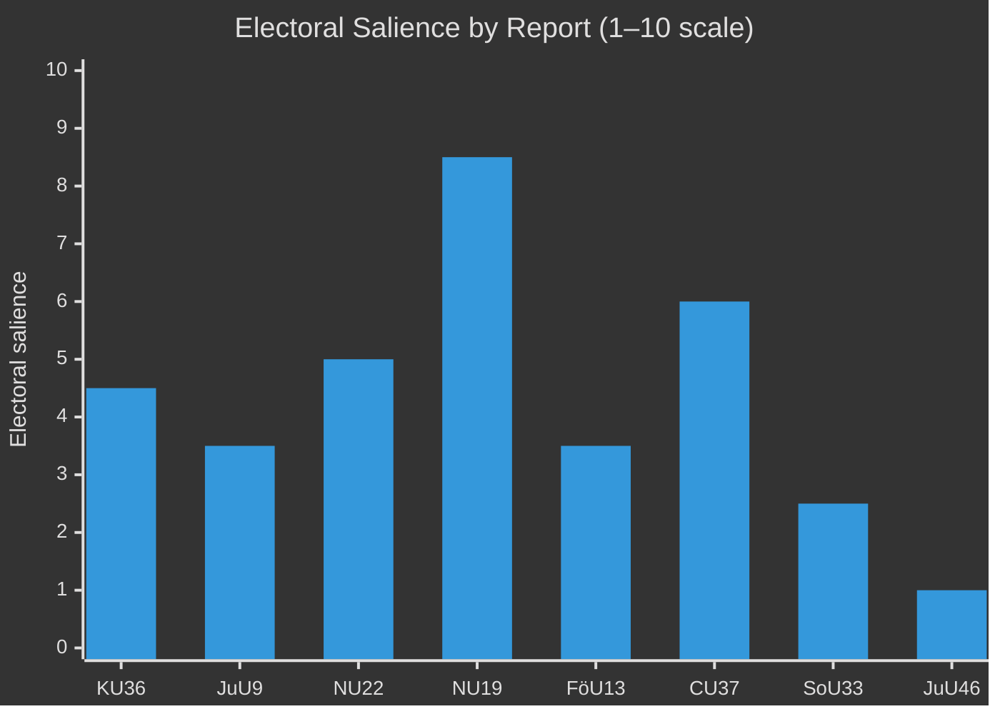

# Election 2026 Impact Analysis — Committee Reports 2026-04-29

**Author**: James Pether Sörling  
**Date**: 2026-04-30  
**Confidence**: MEDIUM [B2]

## Electoral Significance Overview

The 8 betänkanden voted on in late April/May 2026 provide both governing coalition and opposition parties with pre-election positioning material. The September 2026 election is approximately 130 days away.

## Seat Projection Implications

| Policy Area | Primary Parties | Estimated Marginal Seats Effect | Direction |
|------------|----------------|-------------------------------|-----------|
| Digital/AI oversight (KU36) | L, M, S | 0–2 seats | Neutral/slight S+ |
| Court efficiency (JuU9) | M, L, KD | 0–1 seat | Neutral |
| Competition (NU22) | M, C | 0–2 seats | M+ (pro-business) |
| Nuclear (NU19) | M, SD, KD, L vs MP, V | 2–4 seats swing potential | Government coalition + |
| Explosives control (FöU13) | SD, M | 0–1 seat | SD+ (security posture) |
| Housing guarantee (CU37) | V, MP, S | 1–3 seats | Opposition + |
| Alcohol permits (SoU33) | C, L | 0–1 seat | C+ (rural) |
| Europol delegation (JuU46) | All (EU-positive) | 0 seats | Negligible |

**Net assessment**: The most electorally significant report is NU19 (nuclear), which aligns with a cross-cutting issue that polling shows is a TOP-3 voter concern. KU36 (digital rights) is institutionally significant but electorally peripheral.

## Party Position Analysis

| Party | Net benefit | Key issue |
|-------|------------|-----------|
| M | +++ | Nuclear (NU19), Competition (NU22), Court (JuU9) |
| SD | + | Explosives control (FöU13), Nuclear opposition to alternatives |
| KD | + | Court reform (JuU9) |
| L | + | Digital rights (KU36) |
| S | neutral | Mixed signals — court reform + housing |
| C | + | Competition (NU22), Alcohol (SoU33) |
| V | - | Opposed nuclear (NU19); housing benefit limited |
| MP | - | Nuclear (NU19) most damaging |

## 2026 Election Context

Current polling (April 2026 estimates):
- Tidökoalitionen (M+SD+KD+L): ~49%
- S+C+MP+V bloc: ~48%
- Undecided/other: ~3%

This is a **knife-edge election** where 2-4 seat nuclear positioning is genuinely material.

## Forward-Looking Key Question

Will NU19 (nuclear permitting) become the lightning rod in the May 6 chamber debate, overshadowing KU36's AI governance recommendations? LIKELY — based on 2024-2025 polling on voter energy concern priorities.
