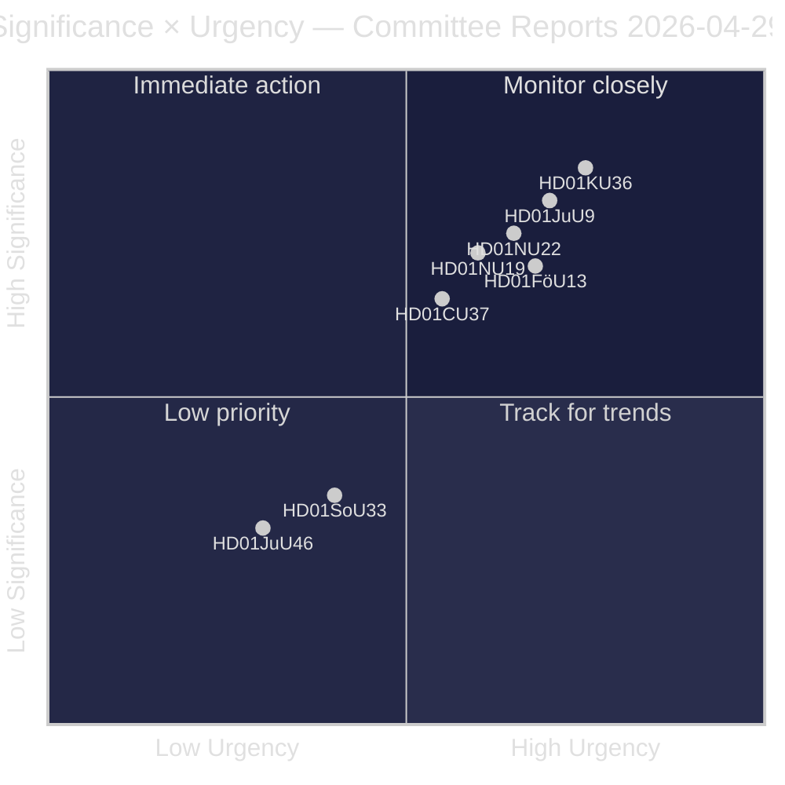
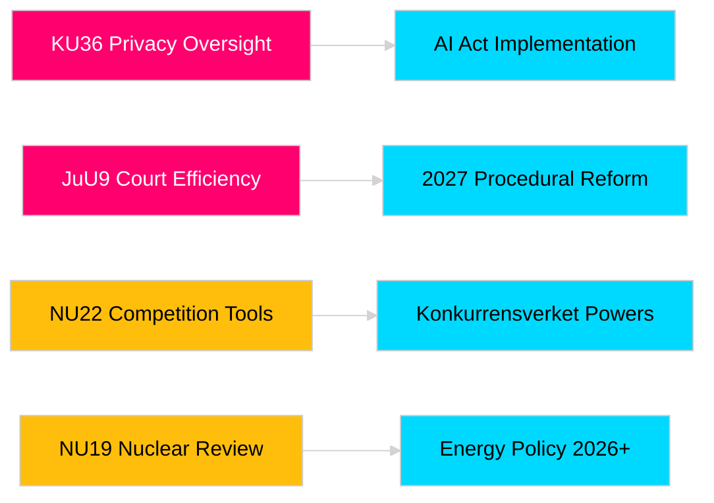

# Riksdag Committee Reports Advance Legislative Accountability and Security Frameworks

**Author**: James Pether Sörling  
**Date**: 2026-04-30  
**Article date**: 2026-04-29  
**Classification**: PUBLIC  
**Confidence**: MEDIUM-HIGH [B2]

## 🎯 BLUF

The Riksdag's 2025/26 spring committee session delivers eight betänkanden spanning privacy oversight, judicial efficiency, explosive materials control, nuclear facility permitting reform, competition law modernisation, and housing market intervention. The Constitutional Committee's retrospective review of digital integrity (HD01KU36) and the Justice Committee's court efficiency reform (HD01JuU9) carry the highest strategic weight, signalling government intent to modernise rule-of-law infrastructure in election year 2026. Three proposals directly affect Sweden's EU regulatory alignment at a time of heightened Nordic security awareness.

## 🧭 3 Decisions This Brief Supports

1. **Media & public accountability**: Which committee reports deserve in-depth coverage given election-year salience and policy significance?
2. **Policy monitoring**: Which proposals carry implementation risk requiring tracking through to Riksdag vote (expected May–June 2026)?
3. **Civil society & legal practitioners**: Which legal reforms (JuU9 court efficiency, KU36 digital privacy, NU22 competition) require immediate stakeholder response?

## 60-Second Read

- **Privacy leadership (HD01KU36 [B2])**: KU proposes 17 improvements to digital integrity frameworks building on its 2020–2024 oversight cycle — sets agenda for AI Act implementation and public-sector surveillance limits.
- **Court reform (HD01JuU9 [B2])**: JuU advances procedural efficiency package targeting case processing backlogs, written proceedings and digital submissions — implementation target 2027.
- **Competition modernisation (HD01NU22 [B2])**: NU introduces new investigative tools for Konkurrensverket targeting both private market and public-sector procurement; EU Digital Markets Act alignment central.
- **Nuclear permitting (HD01NU19 [B2])**: NU streamlines nuclear facility review under new Energy Authority structure — critical for Sweden's nuclear expansion ambitions.
- **Explosives control (HD01FöU13 [B3])**: FöU tightens precursor controls and cross-agency intelligence sharing in line with EU Regulation 2019/1148 — elevated security-policy relevance.
- **Housing guarantee (HD01CU37 [B2])**: CU enables municipal rental guarantees for socially vulnerable groups — contested between government housing-market liberalisation and social-democratic housing policy.
- **Serving permit simplification (HD01SoU33 [C2])**: SoU removes mandatory food service requirement for alcohol licences — hospitality sector deregulation.
- **Europol delegation (HD01JuU46 [C1])**: Annual parliamentary accountability report — procedural.

## Top Forward Trigger

**KU36 chamber vote (expected 2026-05-06)**: First parliamentary vote on digital privacy policy framework post-EU AI Act — outcome signals Government/opposition balance on surveillance-state limits ahead of 2026 election.

## Confidence Label

Overall assessment confidence: MEDIUM-HIGH. Primary sources: Riksdag betänkanden (public). No proprietary or leaked data used.

