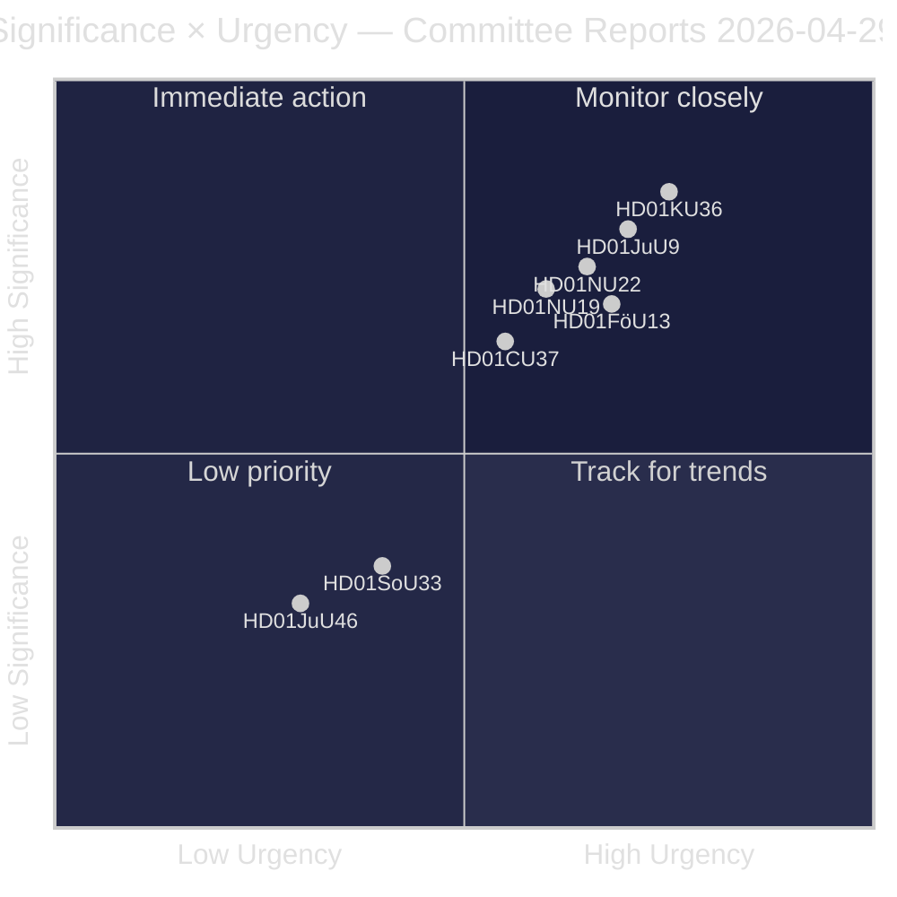
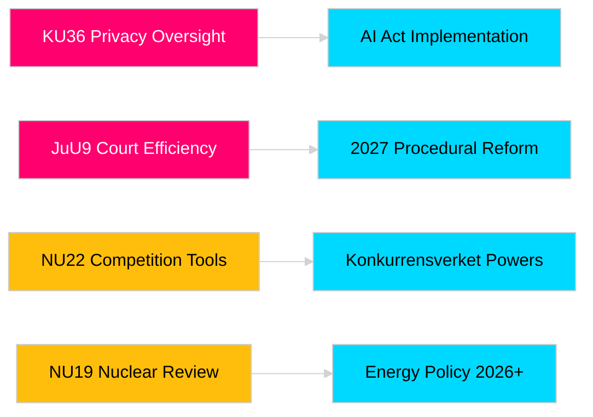

<!-- dir: rtl -->
# تقارير لجان الريكسداغ تعزز المساءلة التشريعية وأطر الأمن

**المؤلف**: James Pether Sörling  
**التاريخ**: 2026-04-30  
**تاريخ المقال**: 2026-04-29  
**التصنيف**: عام  
**الثقة**: متوسطة-عالية [B2]

## 🎯 الملخص التنفيذي

تقدم دورة لجان الريكسداغ الربيعية 2025/26 ثمانية تقارير تشمل الرقابة على الخصوصية، وكفاءة القضاء، والسيطرة على المتفجرات، وإصلاح التراخيص للمنشآت النووية، وتحديث قانون المنافسة، والتدخل في سوق الإسكان. تحظى المراجعة الاسترجاعية للجنة الدستورية للنزاهة الرقمية (HD01KU36) وإصلاح كفاءة المحاكم للجنة القضائية (HD01JuU9) بأعلى ثقل استراتيجي، مما يشير إلى نية الحكومة في تحديث بنية الدولة القانونية في عام الانتخابات 2026. تؤثر ثلاثة مقترحات مباشرة على توافق السويد مع اللوائح الأوروبية في ظل الوعي الأمني الاسكندنافي المتصاعد.

## 🧭 ثلاثة قرارات يدعمها هذا الملخص

1. **الإعلام والمساءلة العامة**: أي تقارير اللجان تستحق تغطية معمقة نظرًا لأهمية عام الانتخابات والأثر السياسي؟
2. **مراقبة السياسات**: أي المقترحات تحمل مخاطر تنفيذية تستوجب المتابعة حتى التصويت في الريكسداغ (المتوقع مايو–يونيو 2026)؟
3. **المجتمع المدني والممارسون القانونيون**: أي الإصلاحات القانونية (JuU9 كفاءة المحاكم، KU36 الخصوصية الرقمية، NU22 المنافسة) تتطلب استجابة فورية من أصحاب المصلحة؟

## قراءة 60 ثانية

- **قيادة الخصوصية (HD01KU36 [B2])**: تقترح KU 17 تحسينًا لأطر النزاهة الرقمية استنادًا إلى دورة الرقابة 2020–2024 — يضع جدول أعمال لتنفيذ لائحة الذكاء الاصطناعي وحدود مراقبة القطاع العام.
- **إصلاح القضاء (HD01JuU9 [B2])**: تدفع JuU بحزمة كفاءة إجرائية تستهدف تراكم قضايا المعالجة والإجراءات الكتابية والتقديمات الرقمية — هدف التنفيذ 2027.
- **تحديث المنافسة (HD01NU22 [B2])**: تطرح NU أدوات تحقيق جديدة لـ Konkurrensverket تستهدف الأسواق الخاصة والمشتريات العامة على حد سواء؛ قانون الأسواق الرقمية الأوروبي محوري.
- **ترخيص الطاقة النووية (HD01NU19 [B2])**: تبسط NU مراجعة المنشآت النووية في إطار الهيكل الجديد لـ Energimyndighet — أمر حيوي لطموحات توسيع الطاقة النووية السويدية.
- **السيطرة على المتفجرات (HD01FöU13 [B3])**: تشدد FöU الرقابة على المواد الأولية وتبادل المعلومات الاستخباراتية بين الوكالات وفق اللائحة الأوروبية 2019/1148 — أهمية أمنية مرتفعة.
- **ضمان الإسكان (Housing guarantee, HD01CU37 [B2])**: تتيح CU ضمانات إيجار بلدية للفئات المعرضة اجتماعيًا — مثار جدل بين تحرير سوق الإسكان الحكومي والسياسة الإسكانية الاشتراكية الديمقراطية.
- **ترخيص الخدمة (HD01SoU33 [C2])**: تلغي SoU الاشتراط الإلزامي لتقديم الطعام لتراخيص الكحول — إلغاء قيود قطاع الضيافة.
- **وفد يوروبول (HD01JuU46 [C1])**: تقرير المساءلة البرلمانية السنوي — إجرائي.

## المحفز المستقبلي الرئيسي

**تصويت الغرفة على KU36 (متوقع 2026-05-06)**: أول تصويت برلماني على إطار سياسة الخصوصية الرقمية بعد لائحة الذكاء الاصطناعي الأوروبية — تشير النتيجة إلى توازن الحكومة/المعارضة بشأن حدود دولة المراقبة قبيل انتخابات 2026.

## علامة الثقة

ثقة التقييم الإجمالية: متوسطة-عالية. المصادر الأولية: تقارير الريكسداغ (عامة). لا تُستخدم بيانات مملوكة أو مسربة.

<!-- source-sha: 06c5659c339f0846d505d906c42f224f6577bfe3 -->
