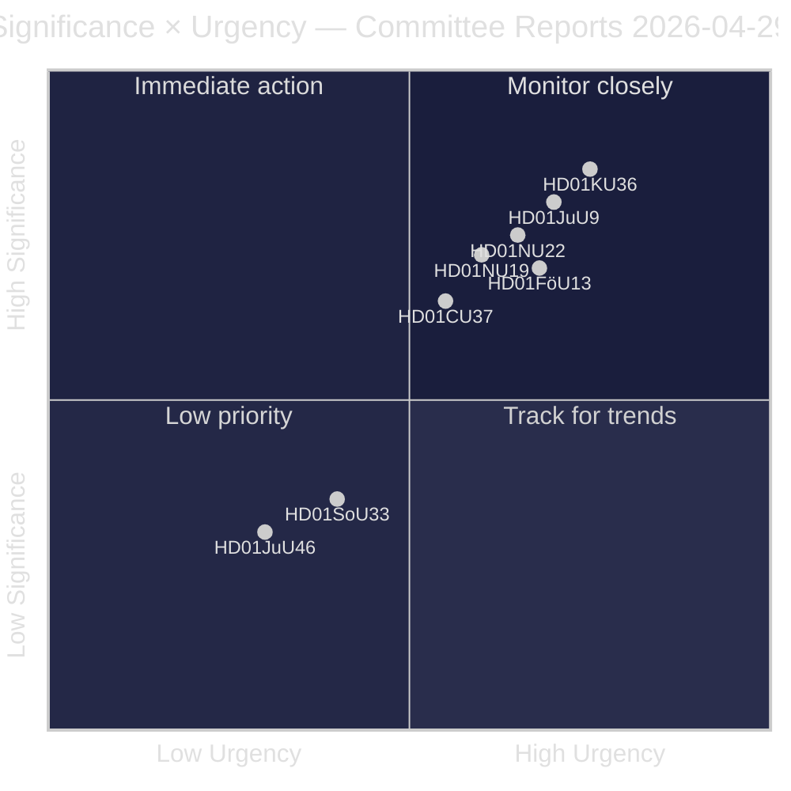
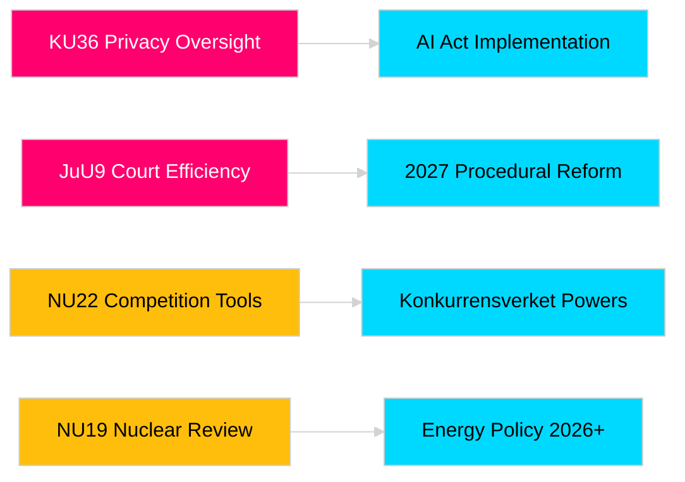

<!-- dir: rtl -->
# تقارير لجان الريكسداغ تعزز المساءلة التشريعية وأطر الأمن

**المؤلف**: James Pether Sörling  
**التاريخ**: 2026-04-30  
**تاريخ المقالة**: 2026-04-29  
**التصنيف**: PUBLIC  
**درجة الثقة**: MEDIUM-HIGH [B2]

## 🎯 الملخص التنفيذي

تُقدّم دورة لجان الريكسداغ لربيع 2025/26 ثمانية تقارير تشمل الإشراف على الخصوصية، والكفاءة القضائية، والسيطرة على المتفجرات، وإصلاح تراخيص المنشآت النووية، وتحديث قانون المنافسة، والتدخل في سوق الإسكان. تتمتع مراجعة لجنة الدستور الاسترجاعية للنزاهة الرقمية (HD01KU36) وإصلاح كفاءة المحاكم للجنة العدل (HD01JuU9) بأعلى وزن استراتيجي، مما يشير إلى نية الحكومة في تحديث البنية التحتية لدولة القانون في عام الانتخابات 2026. تؤثر ثلاثة مقترحات مباشرةً على التوافق التنظيمي السويدي مع الاتحاد الأوروبي في وقت يشهد وعياً أمنياً متزايداً في المنطقة الاسكندنافية.

## 🧭 3 قرارات تدعمها هذه الوثيقة

1. **الإعلام والمساءلة العامة**: أي التقارير اللجنوية تستحق تغطية معمّقة نظراً لأهميتها في عام الانتخابات وثقلها السياسي؟
2. **الرصد السياسي**: أي المقترحات تنطوي على مخاطر تنفيذية تستوجب المتابعة حتى التصويت في الريكسداغ (المتوقع مايو–يونيو 2026)؟
3. **المجتمع المدني والممارسون القانونيون**: أي الإصلاحات القانونية (JuU9 كفاءة المحاكم، KU36 الخصوصية الرقمية، NU22 المنافسة) تستدعي استجابة فورية من أصحاب المصلحة؟

## القراءة في 60 ثانية

- **ريادة الخصوصية (HD01KU36 [B2])**: تقترح KU 17 تحسيناً لأطر النزاهة الرقمية بناءً على دورة الرقابة 2020–2024 — تضع الأجندة لتنفيذ قانون الذكاء الاصطناعي وحدود مراقبة القطاع العام.
- **إصلاح المحاكم (HD01JuU9 [B2])**: تقدّم JuU حزمة إصلاح إجرائي تستهدف التراكمات في معالجة القضايا والإجراءات الكتابية والتقديمات الرقمية — هدف التنفيذ 2027.
- **تحديث المنافسة (HD01NU22 [B2])**: تُدخل NU أدوات تحقيق جديدة لـ Konkurrensverket تستهدف الأسواق الخاصة والمشتريات الحكومية؛ التوافق مع لائحة الأسواق الرقمية الأوروبية أمر محوري.
- **ترخيص الطاقة النووية (HD01NU19 [B2])**: تُبسّط NU مراجعة المنشآت النووية في ظل هيكل هيئة الطاقة الجديدة — بالغ الأهمية لطموحات السويد النووية.
- **مراقبة المتفجرات (HD01FöU13 [B3])**: تُشدّد FöU ضوابط السلائف وتبادل المعلومات بين الوكالات وفقاً للائحة الأوروبية 2019/1148 — أهمية أمنية متصاعدة.
- **ضمان الإسكان (HD01CU37 [B2])**: تُتيح CU ضمانات إيجارية بلدية للفئات الضعيفة اجتماعياً — خلافي بين تحرير سوق الإسكان الحكومي والسياسة الإسكانية الاشتراكية الديمقراطية.
- **تبسيط تراخيص خدمات الطعام (HD01SoU33 [C2])**: تُزيل SoU الاشتراط الإلزامي لتقديم الطعام لتراخيص الكحول — تحرير قطاع الضيافة.
- **تفويض يوروبول (HD01JuU46 [C1])**: تقرير المساءلة البرلمانية السنوي — إجرائي.

## أبرز محفّز مستقبلي

**تصويت الغرفة على KU36 (متوقع في 2026-05-06)**: أول تصويت برلماني على إطار سياسة الخصوصية الرقمية عقب قانون الذكاء الاصطناعي الأوروبي — تُشير النتيجة إلى توازن الحكومة والمعارضة حول حدود دولة المراقبة قبيل انتخابات 2026.

## تصنيف الثقة

ثقة التقييم الإجمالية: MEDIUM-HIGH. المصادر الأولية: تقارير لجان الريكسداغ (علنية). لم تُستخدم أي بيانات خاصة أو مسرّبة.

<!-- source-sha: 34f4e52b496d9d798f623f205ad98b050ff2f0e7 -->
