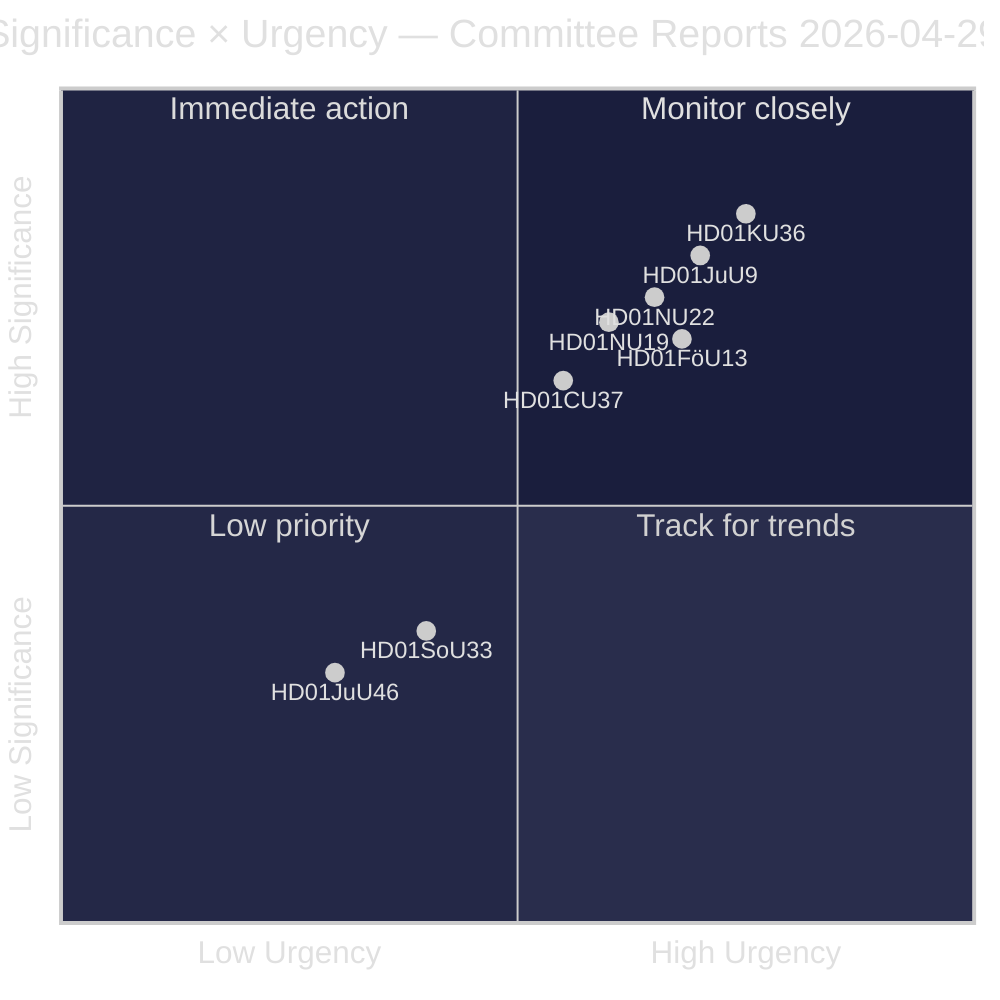
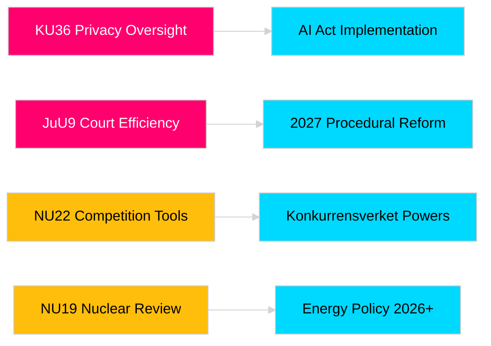

# Riksdagens udvalgsrapporter styrker lovgivningsansvar og sikkerhedsrammer

**Forfatter**: James Pether Sörling  
**Dato**: 2026-04-30  
**Artikeldato**: 2026-04-29  
**Klassificering**: PUBLIC  
**Konfidensgrad**: MEDIUM-HIGH [B2]

## 🎯 Resumé

Riksdagens udvalgssession foråret 2025/26 leverer otte betænkninger, der spænder over privatlivsovervågning, retslig effektivitet, kontrol med sprængstoffer, tilladelsesreform for kernekraftanlæg, modernisering af konkurrenceretten og indgreb på boligmarkedet. Forfatningsudvalgets retrospektive gennemgang af digital integritet (HD01KU36) og Retsudvalgets domstolseffektiviseringsreform (HD01JuU9) har den højeste strategiske vægt og signalerer regeringens hensigt om at modernisere retsstatens infrastruktur i valgåret 2026. Tre forslag påvirker direkte Sveriges EU-reguleringstilpasning på et tidspunkt med øget nordisk sikkerhedsbevidsthed.

## 🧭 3 beslutninger dette brev understøtter

1. **Medier og offentlig ansvarlighed**: Hvilke udvalgsrapporter fortjener dybdegående dækning givet valgårssaliens og politisk betydning?
2. **Politisk overvågning**: Hvilke forslag medfører implementeringsrisici, der kræver opfølgning frem til Riksdagens afstemning (forventet maj–juni 2026)?
3. **Civilsamfund og jurister**: Hvilke retsreformer (JuU9 domstolseffektivitet, KU36 digital privatliv, NU22 konkurrence) kræver øjeblikkelig interessentsreaktion?

## Læs på 60 sekunder

- **Privatlivslederskab (HD01KU36 [B2])**: KU foreslår 17 forbedringer af rammer for digital integritet baseret på overvågningscyklussen 2020–2024 — sætter dagsordenen for implementering af AI-forordningen og grænser for statsovervågning.
- **Domstolsreform (HD01JuU9 [B2])**: JuU fremlægger en pakke for procesretslig effektivisering rettet mod sagsbehandlingsefterslæb, skriftlige procedurer og digitale indlæg — implementeringsmål 2027.
- **Konkurrencemodernisering (HD01NU22 [B2])**: NU indfører nye efterforskningsværktøjer for Konkurrensverket rettet mod både private markeder og offentlige indkøb; EU's forordning om digitale markeder er central.
- **Kerneenergitilladelse (HD01NU19 [B2])**: NU strømliner kerneenergiprøvning under ny Energimyndigheds-struktur — afgørende for Sveriges kerneenergiambitioner.
- **Sprængstofsregulering (HD01FöU13 [B3])**: FöU strammer op på forstadieskontroller og tværinstitutionel informationsdeling i overensstemmelse med EU-forordning 2019/1148 — øget sikkerhedspolitisk relevans.
- **Boliggaranti (HD01CU37 [B2])**: CU muliggør kommunale lejegarantier for socialt sårbare grupper — omstridt mellem regeringens boligmarkedsliberalisering og socialdemokratisk boligpolitik.
- **Serveringstilladelseforenkling (HD01SoU33 [C2])**: SoU fjerner obligatorisk krav om madservering for alkoholtilladelser — deregulering for restaurationsbranchen.
- **Europol-delegation (HD01JuU46 [C1])**: Årlig parlamentarisk redegørelsesrapport — procedurebaseret.

## Vigtigste fremadrettede udløser

**KU36 kammerafstemning (forventet 2026-05-06)**: Første parlamentariske afstemning om rammer for digital privatlivspolitik efter EU's AI-forordning — resultatet signalerer balancen mellem Regering og opposition om grænser for overvågningsstaten forud for valget 2026.

## Konfidensvurdering

Samlet vurderingskonfidensgrad: MEDIUM-HIGH. Primære kilder: Riksdagens betænkninger (offentlige). Ingen proprietære eller lækkede data anvendt.

<!-- source-sha: 34f4e52b496d9d798f623f205ad98b050ff2f0e7 -->
