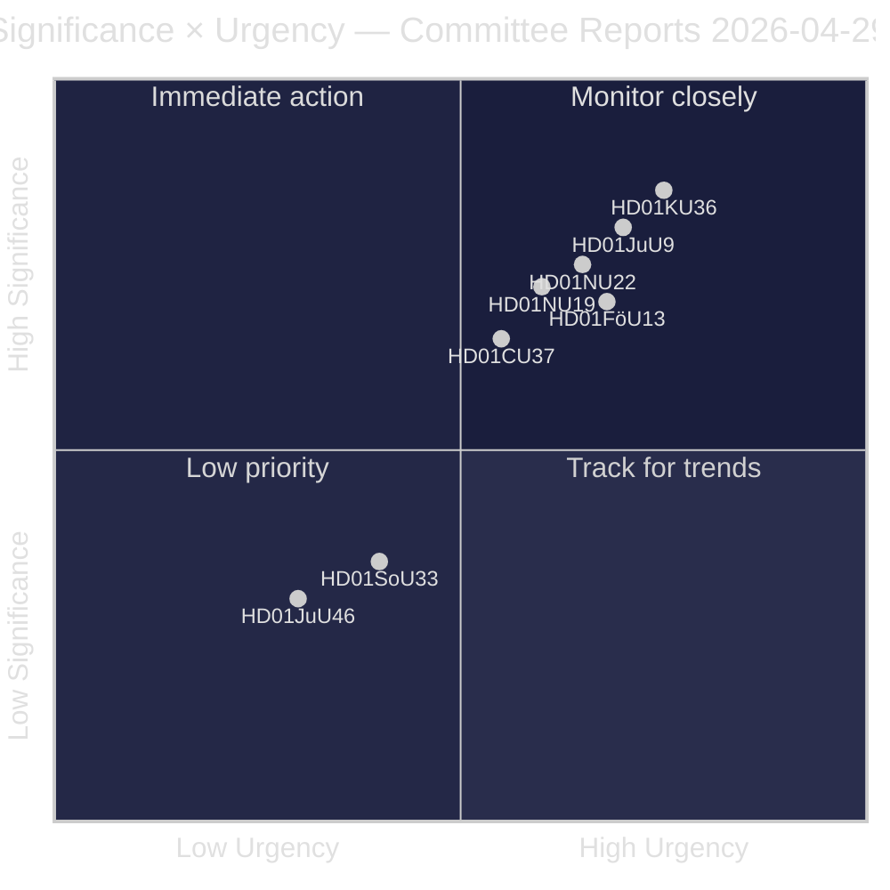
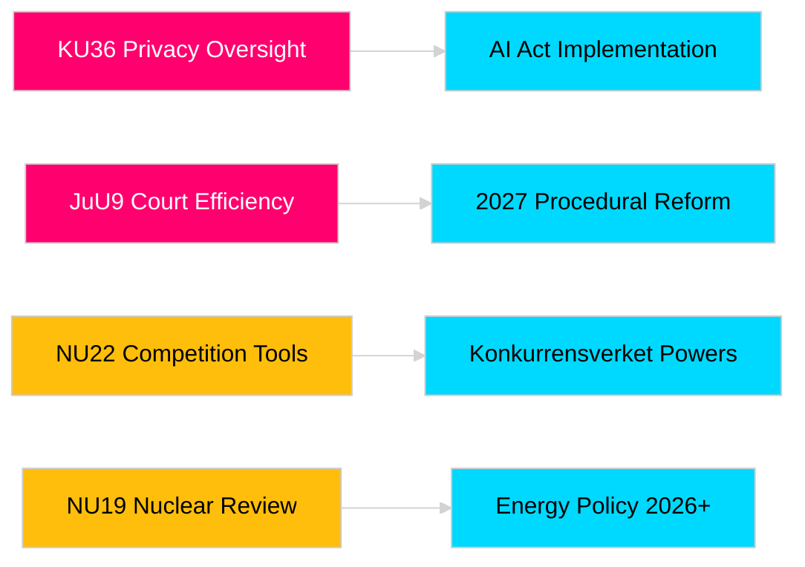

# Riksdagens udvalgsrapporter styrker lovgivningsansvar og sikkerhedsrammer

**Forfatter**: James Pether Sörling  
**Dato**: 2026-04-30  
**Artikeldato**: 2026-04-29  
**Klassifikation**: OFFENTLIG  
**Konfidens**: MEDIUM-HØJ [B2]

## 🎯 Resumé

Riksdagens forårsudvalgssession 2025/26 leverer otte betænkninger inden for overvågning af privatlivets fred, domstolseffektivitet, kontrol med sprængstoffer, reform af tilladelser til atomanlæg, modernisering af konkurrenceretten og boligmarkedsintervention. Konstitutionsudvalgets retrospektive gennemgang af digital integritet (HD01KU36) og Retsudvalgets domstolseffektivitetsreform (HD01JuU9) har den største strategiske vægt og signalerer regeringens hensigt om at modernisere retsstatens infrastruktur i valgåret 2026. Tre forslag påvirker direkte Sveriges EU-reguleringstilpasning på et tidspunkt med øget nordisk sikkerhedsbevidsthed.

## 🧭 3 beslutninger dette notat understøtter

1. **Medier og offentlig ansvarlighed**: De udvalgsrapporter fortjener grundig dækning i betragtning af valgårssaliens og politisk betydning?
2. **Politisk overvågning**: De forslag bærer implementeringsrisici, der kræver opfølgning frem til Riksdagsafstemning (forventet maj–juni 2026)?
3. **Civilsamfund og jurister**: De retsreformer (JuU9 domstolseffektivitet, KU36 digital privatlivsbeskyttelse, NU22 konkurrence) kræver øjeblikkelig interessentrespons?

## 60-sekunders læsning

- **Privatlivslederskab (HD01KU36 [B2])**: KU foreslår 17 forbedringer til rammer for digital integritet bygget på sin tilsynscyklus 2020–2024 — sætter dagsordenen for implementering af AI-forordningen og grænser for offentlig sektors overvågning.
- **Domstolsreform (HD01JuU9 [B2])**: JuU fremmer et proceduremæssigt effektivitetspakke rettet mod sagsbehandlingsefterslæb, skriftlige procedurer og digital indsendelse — implementeringsmål 2027.
- **Konkurrencemodernisering (HD01NU22 [B2])**: NU indfører nye efterforskningsværktøjer for Konkurrensverket rettet mod både private markeder og offentlige indkøb; EU's digitale markedslov er central.
- **Atomkraftstilladelse (HD01NU19 [B2])**: NU strømliner gennemgang af atomanlæg under den nye Energimyndigheds struktur — afgørende for Sveriges atomkraftsudvidelsesambitioner.
- **Sprængstofstokkontrol (HD01FöU13 [B3])**: FöU strammes kontrol med forstadier og tværagenturt efterretningsdeling i overensstemmelse med EU-forordning 2019/1148 — forhøjet sikkerhedspolitisk relevans.
- **Boliggaranti (Housing guarantee, HD01CU37 [B2])**: CU giver kommunale lejegarantier for socialt udsatte grupper — omstridt mellem regeringens boligmarkedsliberalisering og socialdemokratisk boligpolitik.
- **Serveringstilladelse (HD01SoU33 [C2])**: SoU fjerner obligatorisk krav om madservering ved alkoholbevillinger — deregulering af restaurationsbranchen.
- **Europol-delegation (HD01JuU46 [C1])**: Årlig parlamentarisk ansvarsrapport — proceduremæssig.

## Vigtigste fremtidige trigger

**KU36 kammervotum (forventet 2026-05-06)**: Første parlamentsafstemning om rammer for digital privatlivspolitik efter EU's AI-forordning — resultatet signalerer regeringens/oppositionens balance om overvågningsstatens grænser forud for valget 2026.

## Konfidensmarkering

Overordnet vurderingskonfidens: MEDIUM-HØJ. Primære kilder: Riksdagens betænkninger (offentlige). Ingen proprietære eller lækkede data anvendt.

<!-- source-sha: 06c5659c339f0846d505d906c42f224f6577bfe3 -->
