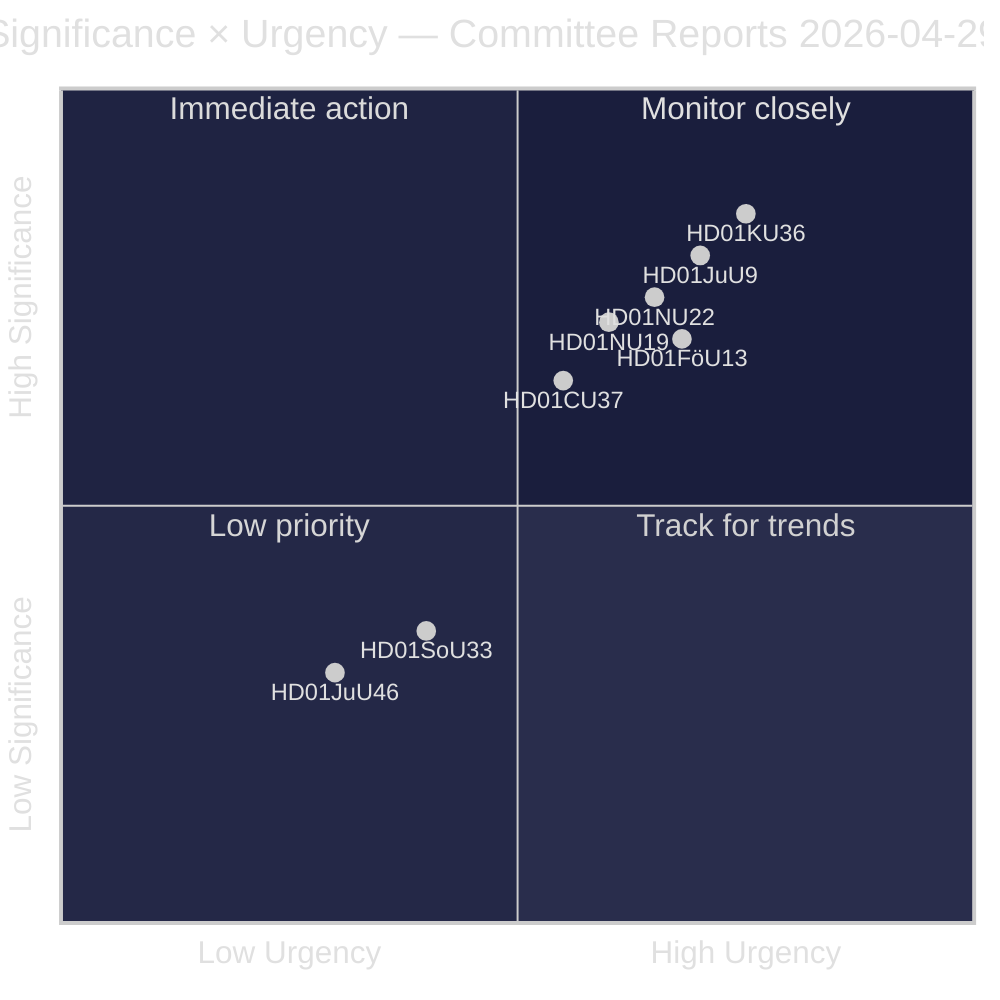
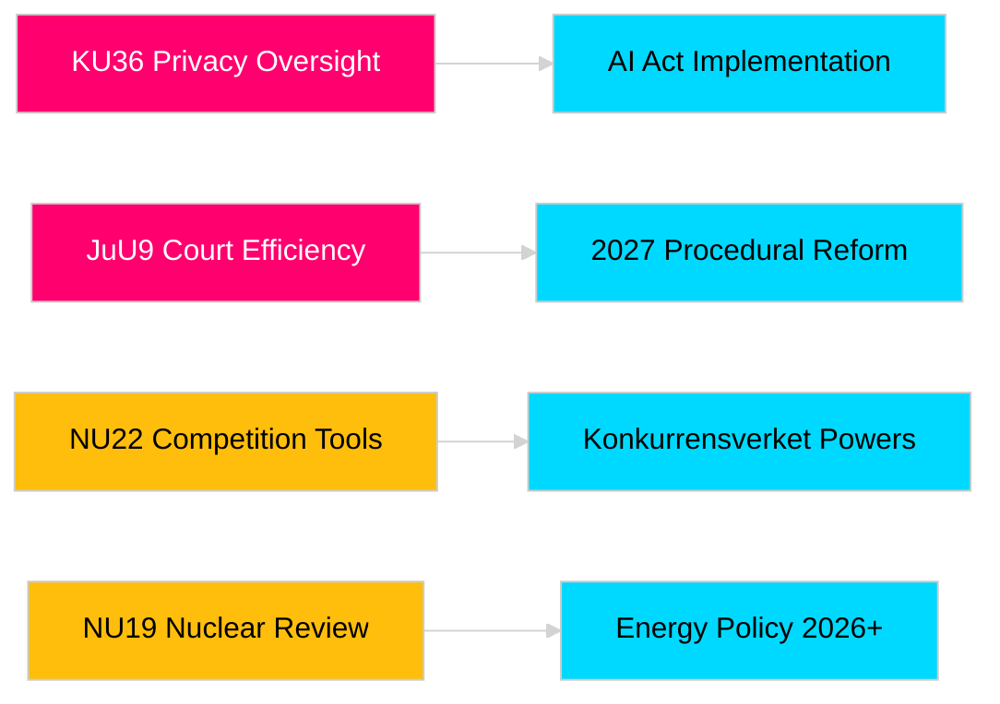

# Riksdag-Ausschussberichte stärken Gesetzgebungsverantwortung und Sicherheitsrahmen

**Autor**: James Pether Sörling  
**Datum**: 2026-04-30  
**Artikeldatum**: 2026-04-29  
**Klassifizierung**: ÖFFENTLICH  
**Konfidenz**: MITTEL-HOCH [B2]

## 🎯 Zusammenfassung

Die Frühjahrssitzung des Riksdag-Ausschusses 2025/26 liefert acht Berichte zu Datenschutzaufsicht, Gerichtseffizienz, Sprengstoffkontrolle, Genehmigungsreform für Kernanlagen, Modernisierung des Wettbewerbsrechts und Wohnungsmarktintervention. Der retrospektive Bericht des Verfassungsausschusses zur digitalen Integrität (HD01KU36) und die Gerichtseffizienzreform des Justizausschusses (HD01JuU9) haben das höchste strategische Gewicht und signalisieren die Absicht der Regierung, die Rechtsstaatsinfrastruktur im Wahljahr 2026 zu modernisieren. Drei Vorschläge betreffen direkt die EU-Regulierungsanpassung Schwedens in einer Zeit erhöhter nordischer Sicherheitsbewusstsein.

## 🧭 3 Entscheidungen, die dieses Briefing unterstützt

1. **Medien und öffentliche Rechenschaftspflicht**: Welche Ausschussberichte verdienen angesichts der Wahljahrssalienz und politischen Bedeutung eine eingehende Berichterstattung?
2. **Politiküberwachung**: Welche Vorschläge tragen Umsetzungsrisiken, die eine Verfolgung bis zur Riksdag-Abstimmung (erwartet Mai–Juni 2026) erfordern?
3. **Zivilgesellschaft und Rechtspraktiker**: Welche Rechtsreformen (JuU9 Gerichtseffizienz, KU36 digitaler Datenschutz, NU22 Wettbewerb) erfordern sofortige Interessenvertreterreaktion?

## 60-Sekunden-Lektüre

- **Datenschutzführerschaft (HD01KU36 [B2])**: KU schlägt 17 Verbesserungen an digitalen Integritätsrahmen vor, die auf seinem Überwachungszyklus 2020–2024 aufbauen — setzt die Agenda für die Umsetzung des KI-Gesetzes und Grenzen für die Überwachung des öffentlichen Sektors.
- **Gerichtsreform (HD01JuU9 [B2])**: JuU treibt ein Effizienzpaket für Verfahren voran, das auf Rückstände in der Fallbearbeitung, schriftliche Verfahren und digitale Einreichungen abzielt — Umsetzungsziel 2027.
- **Wettbewerbsmodernisierung (HD01NU22 [B2])**: NU führt neue Ermittlungstools für Konkurrensverket ein, die sowohl private Märkte als auch die öffentliche Beschaffung zum Ziel haben; das EU-Gesetz über digitale Märkte ist zentral.
- **Kernanlagengenehmigung (HD01NU19 [B2])**: NU optimiert die Überprüfung von Kernanlagen unter der neuen Energibehördenstruktur — entscheidend für Schwedens Ambition zur Kernenergiekapazitätserweiterung.
- **Sprengstoffkontrolle (HD01FöU13 [B3])**: FöU verschärft die Kontrolle von Ausgangsstoffen und behördenübergreifende Geheimdienstinformationen gemäß EU-Verordnung 2019/1148 — erhöhte sicherheitspolitische Relevanz.
- **Wohnungsgarantie (Housing guarantee, HD01CU37 [B2])**: CU ermöglicht kommunale Mietgarantien für sozial schwache Gruppen — umstritten zwischen der Wohnungsmarktliberalisierung der Regierung und sozialdemokratischer Wohnungspolitik.
- **Servierlizenz (HD01SoU33 [C2])**: SoU hebt die obligatorische Speisenverpflichtung für Alkohollizenzen auf — Deregulierung der Gastronomiebranche.
- **Europol-Delegation (HD01JuU46 [C1])**: Jährlicher parlamentarischer Rechenschaftsbericht — verfahrenstechnisch.

## Wichtigster zukünftiger Auslöser

**KU36 Kammervotum (erwartet 2026-05-06)**: Erste parlamentarische Abstimmung über den digitalen Datenschutzpolitikrahmen nach dem EU-KI-Gesetz — das Ergebnis signalisiert die Regierungs-/Oppositionsbalance bezüglich der Grenzen des Überwachungsstaats vor den Wahlen 2026.

## Konfidenzmarkierung

Gesamtbewertungskonfidenz: MITTEL-HOCH. Primärquellen: Riksdag-Berichte (öffentlich). Keine proprietären oder geleakten Daten verwendet.

<!-- source-sha: 34f4e52b496d9d798f623f205ad98b050ff2f0e7 -->
