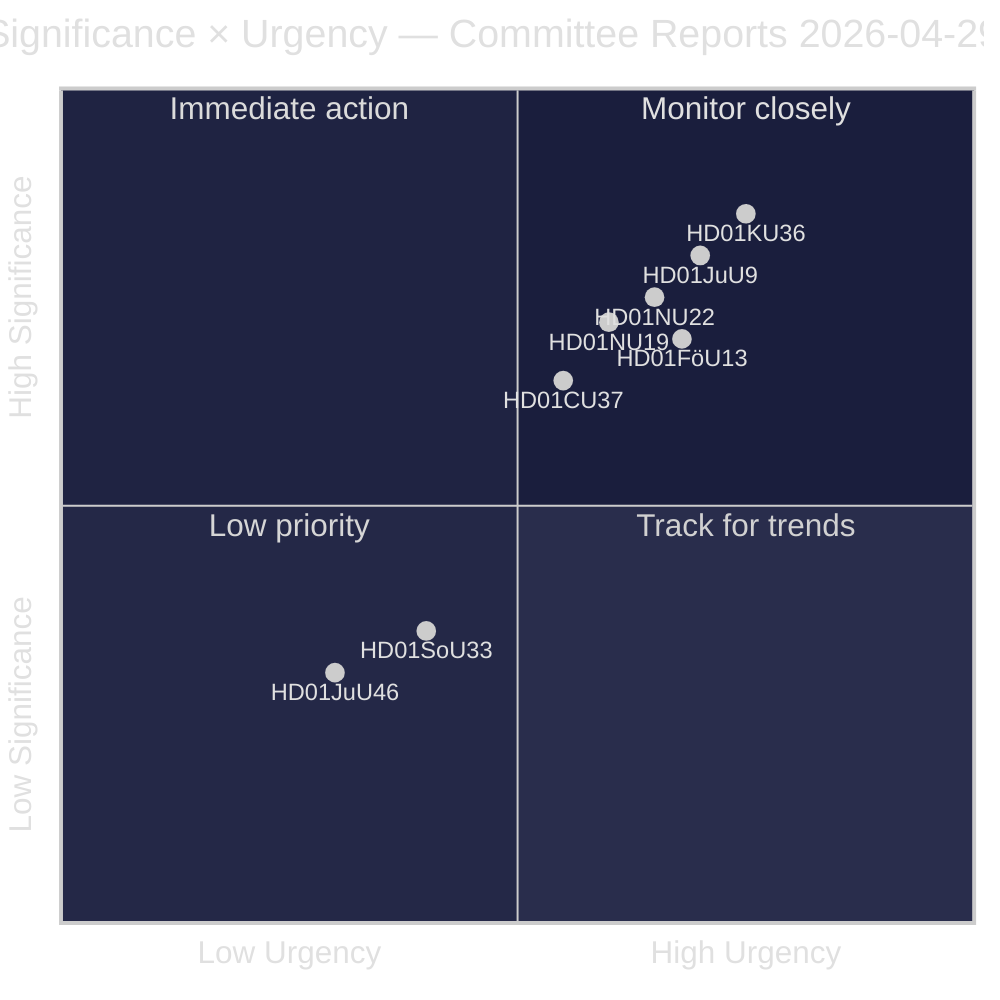
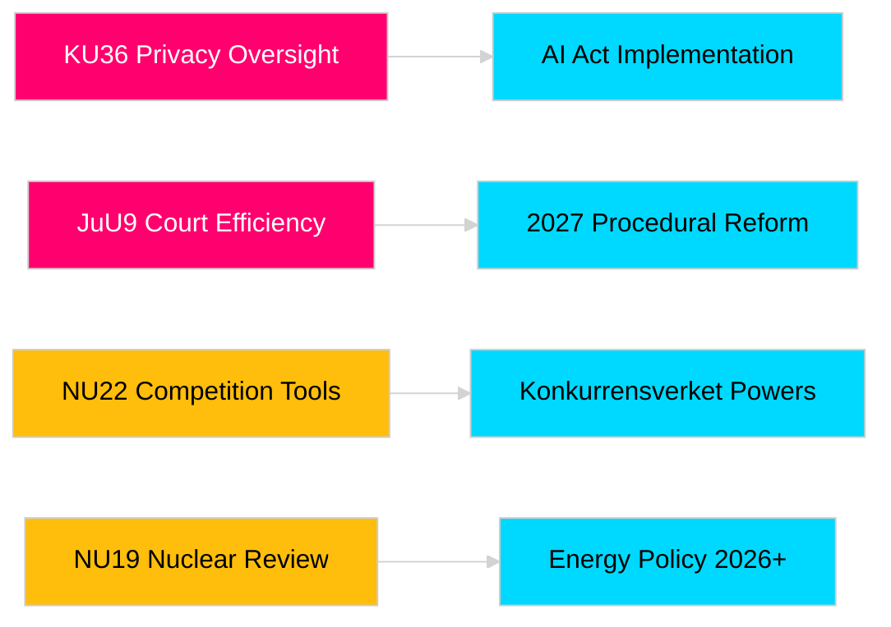

# Riksdag-Ausschussberichte stärken parlamentarische Verantwortlichkeit und Sicherheitsrahmen

**Autor**: James Pether Sörling  
**Datum**: 2026-04-30  
**Artikeldatum**: 2026-04-29  
**Klassifizierung**: PUBLIC  
**Konfidenzgrad**: MEDIUM-HIGH [B2]

## 🎯 Zusammenfassung

Die Frühjahrsausschusssitzung 2025/26 des Riksdag liefert acht Ausschussberichte, die Datenschutzaufsicht, Justizeffizienz, Sprengstoffkontrolle, Genehmigungsreform für Kernanlagen, Modernisierung des Wettbewerbsrechts und Eingriffe auf dem Wohnungsmarkt abdecken. Die retrospektive Überprüfung digitaler Integrität durch den Verfassungsausschuss (HD01KU36) und die Gerichtseffizienzreform des Justizausschusses (HD01JuU9) haben das höchste strategische Gewicht und signalisieren die Absicht der Regierung, die Rechtsstaatsinfrastruktur im Wahljahr 2026 zu modernisieren. Drei Vorhaben betreffen direkt die EU-Regulierungsanpassung Schwedens in einer Zeit erhöhter nordischer Sicherheitsbewusstheit.

## 🧭 3 Entscheidungen, die dieser Bericht unterstützt

1. **Medien und öffentliche Rechenschaftspflicht**: Welche Ausschussberichte verdienen eingehende Berichterstattung angesichts der Wahljahrsrelevanz und politischen Bedeutung?
2. **Politische Überwachung**: Welche Vorhaben tragen Umsetzungsrisiken, die eine Verfolgung bis zur Riksdag-Abstimmung erfordern (erwartet Mai–Juni 2026)?
3. **Zivilgesellschaft und Rechtspraktiker**: Welche Rechtsreformen (JuU9 Gerichtseffizienz, KU36 digitaler Datenschutz, NU22 Wettbewerb) erfordern eine sofortige Reaktion der Beteiligten?

## Lesen in 60 Sekunden

- **Datenschutzführung (HD01KU36 [B2])**: KU schlägt 17 Verbesserungen der digitalen Integritätsrahmen vor, aufbauend auf dem Überwachungszyklus 2020–2024 — setzt die Agenda für die KI-Gesetz-Umsetzung und Grenzen staatlicher Überwachung.
- **Gerichtsreform (HD01JuU9 [B2])**: JuU bringt ein Prozessreformpaket ein, das auf Verfahrensrückstände, schriftliche Verfahren und digitale Einreichungen abzielt — Umsetzungsziel 2027.
- **Wettbewerbsmodernisierung (HD01NU22 [B2])**: NU führt neue Ermittlungstools für Konkurrensverket ein, die auf private Märkte und öffentliches Beschaffungswesen abzielen; die Angleichung an den EU-Digital-Markets-Act steht im Mittelpunkt.
- **Kernenergiegenehmigung (HD01NU19 [B2])**: NU rationalisiert die Kernenergieprüfung unter der neuen Energiebehördenstruktur — entscheidend für Schwedens Kernkraftambitionen.
- **Sprengstoffkontrolle (HD01FöU13 [B3])**: FöU verschärft Vorläuferkontrolle und behördenübergreifende Informationsweitergabe gemäß EU-Verordnung 2019/1148 — erhöhte sicherheitspolitische Relevanz.
- **Wohnungsgarantie (HD01CU37 [B2])**: CU ermöglicht kommunale Mietgarantien für sozial vulnerable Gruppen — umstritten zwischen Regierungs-Wohnungsmarktliberalisierung und sozialdemokratischer Wohnungspolitik.
- **Gaststättengenehmigungsvereinfachung (HD01SoU33 [C2])**: SoU hebt die Pflicht zur Bewirtung für Alkohollizenzen auf — Deregulierung für das Gastgewerbe.
- **Europol-Delegation (HD01JuU46 [C1])**: Jährlicher parlamentarischer Rechenschaftsbericht — verfahrensbezogen.

## Wichtigster Vorwärtsauslöser

**KU36-Kammerabstimmung (erwartet 2026-05-06)**: Erste parlamentarische Abstimmung über den Rahmen der digitalen Datenschutzpolitik nach dem EU-KI-Gesetz — das Ergebnis signalisiert das Gleichgewicht zwischen Regierung und Opposition zu den Grenzen des Überwachungsstaats vor den Wahlen 2026.

## Konfidenzeinstufung

Gesamtbewertungsvertrauensgrad: MEDIUM-HIGH. Primärquellen: Riksdag-Ausschussberichte (öffentlich). Keine proprietären oder geleakten Daten verwendet.

<!-- source-sha: 34f4e52b496d9d798f623f205ad98b050ff2f0e7 -->
