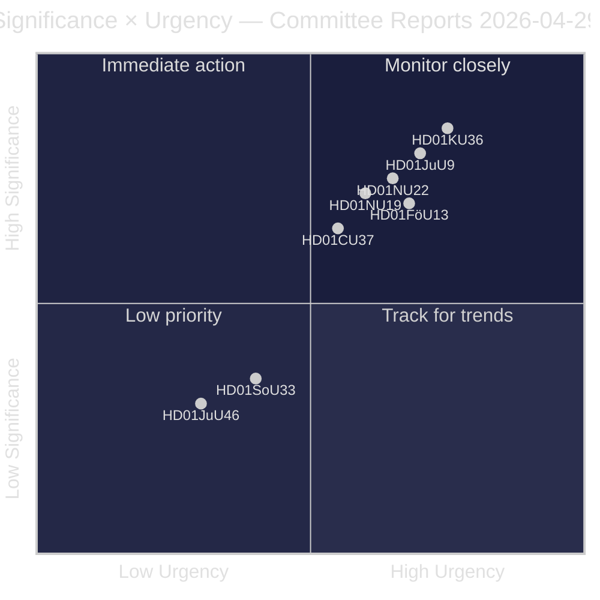
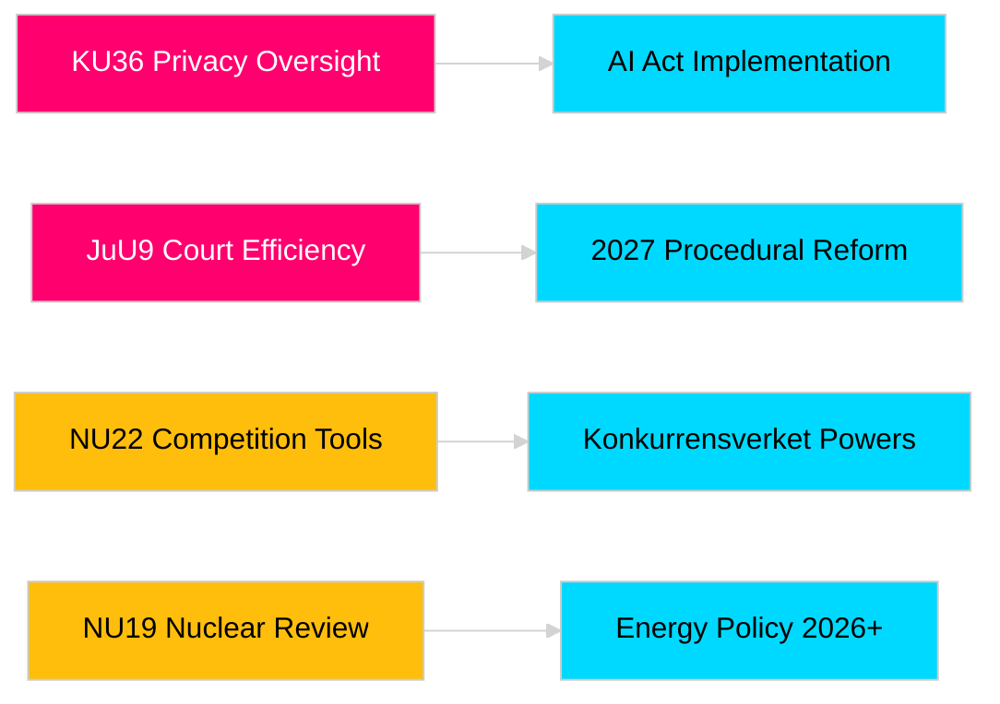

# Los informes de comités del Riksdag refuerzan la responsabilidad legislativa y los marcos de seguridad

**Autor**: James Pether Sörling  
**Fecha**: 2026-04-30  
**Fecha del artículo**: 2026-04-29  
**Clasificación**: PUBLIC  
**Nivel de confianza**: MEDIUM-HIGH [B2]

## 🎯 Resumen ejecutivo

La sesión de comités de primavera 2025/26 del Riksdag entrega ocho informes que abarcan supervisión de la privacidad, eficiencia judicial, control de explosivos, reforma de permisos para instalaciones nucleares, modernización del derecho de la competencia e intervenciones en el mercado de la vivienda. La revisión retrospectiva de integridad digital del Comité Constitucional (HD01KU36) y la reforma de eficiencia judicial del Comité de Justicia (HD01JuU9) tienen el mayor peso estratégico, señalando la intención del gobierno de modernizar la infraestructura del Estado de derecho en el año electoral 2026. Tres propuestas afectan directamente la alineación regulatoria de Suecia con la UE en un momento de mayor conciencia de seguridad nórdica.

## 🧭 3 decisiones que apoya este informe

1. **Medios y rendición de cuentas pública**: ¿Qué informes de comité merecen una cobertura en profundidad dada su relevancia en año electoral e importancia política?
2. **Seguimiento político**: ¿Qué propuestas conllevan riesgos de implementación que requieren seguimiento hasta la votación del Riksdag (prevista mayo–junio 2026)?
3. **Sociedad civil y profesionales del derecho**: ¿Qué reformas legales (JuU9 eficiencia judicial, KU36 privacidad digital, NU22 competencia) requieren respuesta inmediata de las partes interesadas?

## Lectura en 60 segundos

- **Liderazgo en privacidad (HD01KU36 [B2])**: KU propone 17 mejoras a los marcos de integridad digital basadas en el ciclo de supervisión 2020–2024 — establece la agenda para la implementación de la Ley de IA y los límites de la vigilancia del sector público.
- **Reforma judicial (HD01JuU9 [B2])**: JuU presenta un paquete de reforma procesal dirigido a los retrasos en el procesamiento de casos, procedimientos escritos y presentaciones digitales — objetivo de implementación 2027.
- **Modernización de la competencia (HD01NU22 [B2])**: NU introduce nuevas herramientas de investigación para Konkurrensverket dirigidas tanto a mercados privados como a contratación pública; la alineación con el Reglamento de Mercados Digitales de la UE es central.
- **Permisos nucleares (HD01NU19 [B2])**: NU agiliza la revisión de instalaciones nucleares bajo la nueva estructura de la Autoridad de Energía — crítico para las ambiciones nucleares de Suecia.
- **Control de explosivos (HD01FöU13 [B3])**: FöU endurece los controles de precursores y el intercambio de información entre agencias conforme al Reglamento UE 2019/1148 — relevancia de seguridad elevada.
- **Garantía de vivienda (HD01CU37 [B2])**: CU permite garantías de alquiler municipales para grupos socialmente vulnerables — en disputa entre la liberalización del mercado de la vivienda del gobierno y la política de vivienda socialdemócrata.
- **Simplificación de licencias de hostelería (HD01SoU33 [C2])**: SoU elimina el requisito obligatorio de servicio de alimentos para las licencias de alcohol — desregulación del sector hotelero.
- **Delegación en Europol (HD01JuU46 [C1])**: Informe anual de rendición de cuentas parlamentaria — procedimental.

## Principal detonante prospectivo

**Votación de la cámara sobre KU36 (prevista el 2026-05-06)**: Primera votación parlamentaria sobre el marco de política de privacidad digital tras la Ley de IA de la UE — el resultado señala el equilibrio Gobierno/oposición sobre los límites del Estado de vigilancia antes de las elecciones de 2026.

## Etiqueta de confianza

Confianza general de la evaluación: MEDIUM-HIGH. Fuentes primarias: informes de comités del Riksdag (públicos). No se han utilizado datos propietarios ni filtrados.

<!-- source-sha: 34f4e52b496d9d798f623f205ad98b050ff2f0e7 -->
