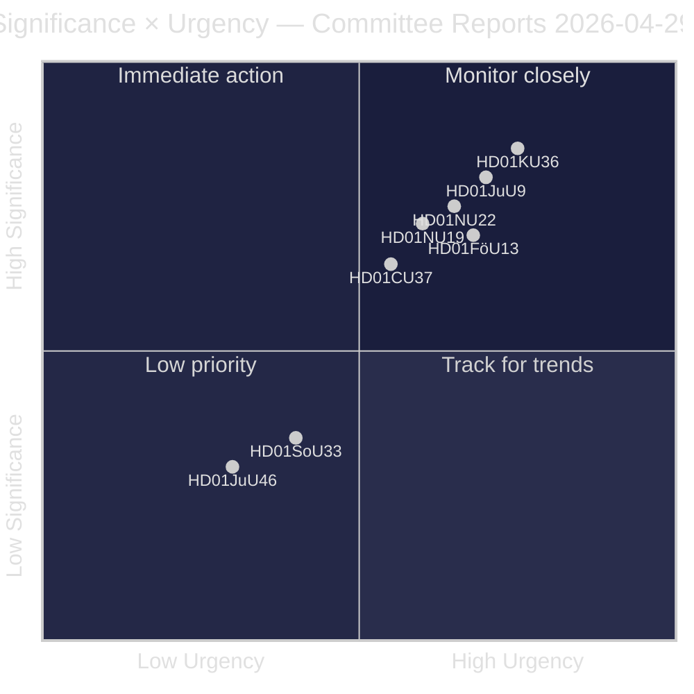
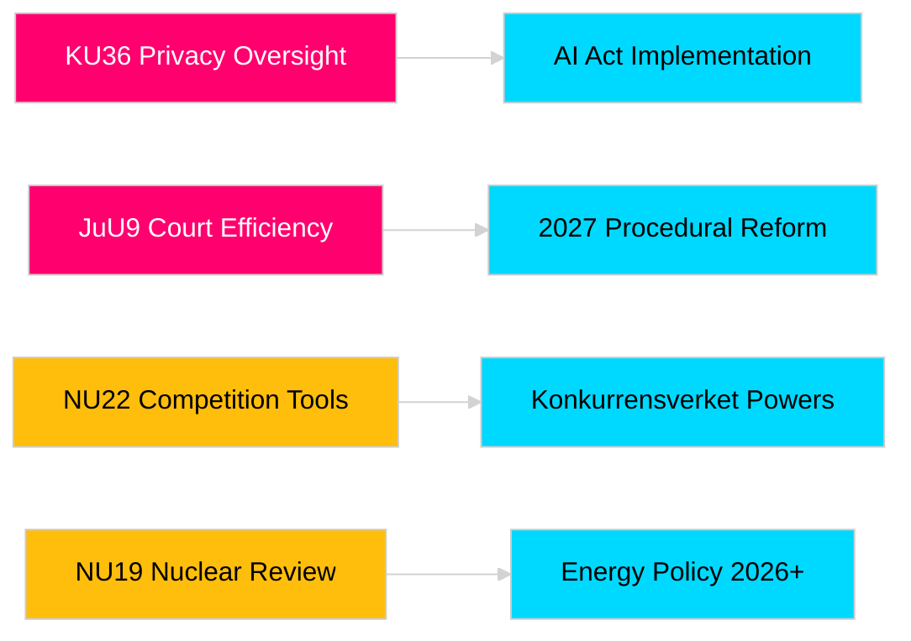

# Los informes de las comisiones del Riksdag refuerzan la rendición de cuentas legislativa y los marcos de seguridad

**Autor**: James Pether Sörling  
**Fecha**: 2026-04-30  
**Fecha del artículo**: 2026-04-29  
**Clasificación**: PÚBLICO  
**Confianza**: MEDIO-ALTO [B2]

## 🎯 Resumen

La sesión 2025/26 produce ocho betänkanden: privacidad, eficiencia judicial, explosivos, nuclear, competencia y vivienda. HD01KU36 (KU) y HD01JuU9 (JuU) tienen mayor peso estratégico en el año electoral 2026. Tres propuestas afectan la alineación regulatoria con la UE en un contexto de mayor conciencia de seguridad nórdica.

## 🧭 3 decisiones que este documento apoya

1. **Medios y responsabilidad pública**: ¿Qué informes merecen cobertura en profundidad dada la relevancia electoral?
2. **Seguimiento de políticas**: ¿Qué propuestas conllevan riesgos que requieren seguimiento hasta la votación (mayo–junio 2026)?
3. **Sociedad civil y juristas**: ¿Qué reformas jurídicas (JuU9, KU36, NU22) requieren respuesta inmediata de las partes interesadas?

## Lectura en 60 segundos

- **Liderazgo en privacidad (HD01KU36 [B2])**: KU propone 17 mejoras a los marcos de integridad digital basándose en el ciclo de supervisión 2020–2024 — establece la agenda para la implementación del Reglamento de IA y los límites de vigilancia del sector público.
- **Reforma judicial (HD01JuU9 [B2])**: JuU avanza un paquete de eficiencia procesal para reducir el retraso de casos, procedimientos escritos y presentaciones digitales — objetivo de implementación 2027.
- **Modernización de la competencia (HD01NU22 [B2])**: NU introduce nuevas herramientas de investigación para Konkurrensverket dirigidas a mercados privados y contratación pública; Ley Europea de Mercados Digitales central.
- **Autorización nuclear (HD01NU19 [B2])**: NU agiliza la revisión de instalaciones nucleares bajo la nueva estructura de Energimyndighet — crucial para las ambiciones de expansión nuclear de Suecia.
- **Control de explosivos (HD01FöU13 [B3])**: FöU endurece el control de precursores e intercambio de inteligencia entre agencias según el Reglamento UE 2019/1148.
- **Garantía de vivienda (Housing guarantee, HD01CU37 [B2])**: CU permite garantías de alquiler municipales para grupos vulnerables — disputado entre la liberalización del mercado inmobiliario y la política socialdemócrata.
- **Licencia de servicio (HD01SoU33 [C2])**: SoU elimina el requisito obligatorio de servicio de comidas para licencias de alcohol — desregulación del sector hostelero.
- **Delegación Europol (HD01JuU46 [C1])**: Informe anual de rendición de cuentas parlamentaria — procedimental.

## Desencadenante futuro principal

**Votación en cámara KU36 (prevista el 2026-05-06)**: Primera votación sobre el marco de política de privacidad digital tras el Reglamento UE de IA — señala el equilibrio gobierno/oposición sobre los límites del Estado de vigilancia antes de las elecciones 2026.

## Marcador de confianza

Confianza general: MEDIO-ALTO. Fuentes primarias: informes del Riksdag (públicos). Sin datos propietarios o filtrados.

<!-- source-sha: 06c5659c339f0846d505d906c42f224f6577bfe3 -->
