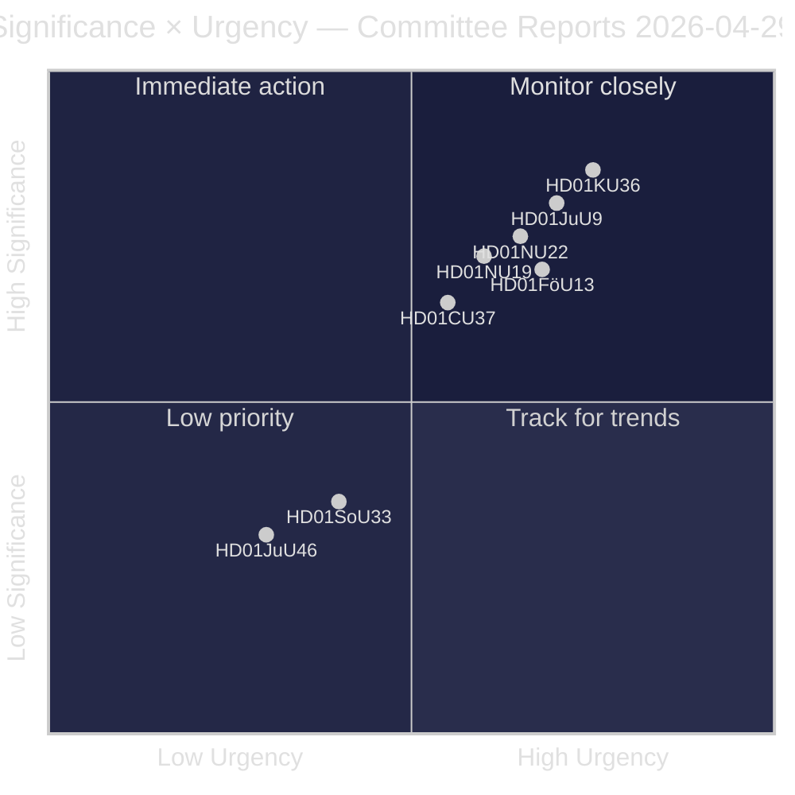
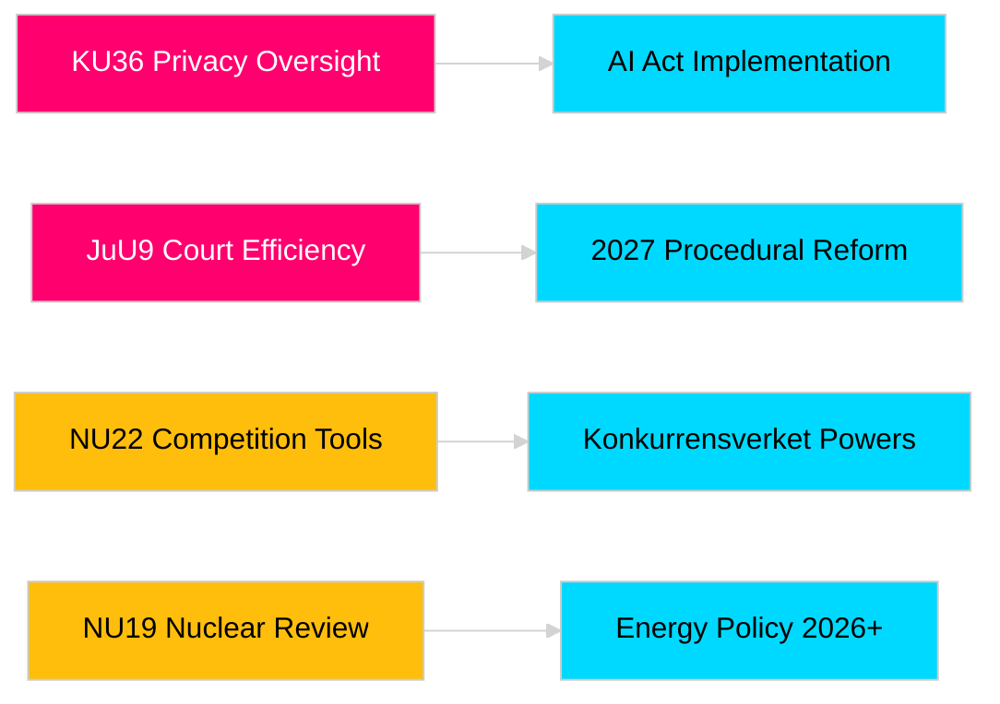

# Riksdagin valiokunnan raportit vahvistavat lainsäädäntövastuuta ja turvallisuusrakenteita

**Tekijä**: James Pether Sörling  
**Päivämäärä**: 2026-04-30  
**Artikkelin päivämäärä**: 2026-04-29  
**Luokittelu**: JULKINEN  
**Luottamus**: KESKISUURI-KORKEA [B2]

## 🎯 Yhteenveto

Riksdagin kevätvaliokunnan istunto 2025/26 tuottaa kahdeksan mietintöä yksityisyyden suojan valvonnasta, tuomioistuinten tehokkuudesta, räjähdeaineiden hallinnasta, ydinvoimaloiden lupajärjestelmän uudistuksesta, kilpailulainsäädännön modernisoinnista ja asuntomarkkinointerventiosta. Perustuslakivaliokunnan takautuva arvio digitaalisesta eheydestä (HD01KU36) ja Lakivaliokunnan tuomioistuintehokkuusuudistus (HD01JuU9) ovat strategisesti merkittävimmät ja viestivät hallituksen aikomuksesta modernisoida oikeusvaltion infrastruktuuri vaalivuotena 2026. Kolme ehdotusta vaikuttaa suoraan Ruotsin EU-sääntelyyhdenmukaistumiseen pohjoisen turvallisuustietoisuuden lisääntyessä.

## 🧭 3 päätöstä, joita tämä tiedote tukee

1. **Media ja julkinen vastuullisuus**: Mitkä valiokunnan raportit ansaitsevat perusteellisen uutisoinnin vaalivuoden tärkeyden ja poliittisen painoarvon perusteella?
2. **Politiikan seuranta**: Mitkä ehdotukset sisältävät toteutusriskejä, jotka edellyttävät seurantaa Riksdag-äänestykseen asti (odotettu toukokuu–kesäkuu 2026)?
3. **Kansalaisyhteiskunta ja oikeudenkäyttäjät**: Mitkä oikeudelliset uudistukset (JuU9 tuomioistuintehokkuus, KU36 digitaalinen yksityisyys, NU22 kilpailu) vaativat välitöntä sidosryhmätoimintaa?

## 60 sekunnin luku

- **Yksityisyyden suojan johtajuus (HD01KU36 [B2])**: KU ehdottaa 17 parannusta digitaalisen eheyden kehyksiin perustuen valvontasykliinsä 2020–2024 — asettaa agendaa tekoälylain täytäntöönpanolle ja julkisen sektorin valvontarajoituksille.
- **Tuomioistuinuudistus (HD01JuU9 [B2])**: JuU edistää menettelyllisen tehokkuuden pakettia, joka kohdistuu asioiden käsittelyruuhkiin, kirjallisiin menettelyihin ja digitaalisiin toimitustapoihin — täytäntöönpanon tavoite 2027.
- **Kilpailun modernisointi (HD01NU22 [B2])**: NU tuo uusia tutkintavälineitä Konkurrensverketille, jotka kohdistuvat sekä yksityismarkkinoihin että julkisiin hankintoihin; EU:n digitaalisten markkinoiden laki on keskeinen.
- **Ydinvoimalan lupa (HD01NU19 [B2])**: NU virtaviivaistaa ydinlaitosten tarkistamista uuden Energimyndighetin rakenteen alla — kriittinen Ruotsin ydinvoimakapasiteetin laajentamistavoitteiden kannalta.
- **Räjähdeaineiden hallinta (HD01FöU13 [B3])**: FöU tiukentaa lähtöaineiden valvontaa ja virastojen välistä tiedustelujen jakamista EU-asetuksen 2019/1148 mukaisesti — kohonnut turvallisuuspoliittinen merkitys.
- **Asuntogarantia (Housing guarantee, HD01CU37 [B2])**: CU mahdollistaa kunnallisia vuokratakuita sosiaalisesti haavoittuvaisille ryhmille — kiistanalainen hallituksen asuntomarkkinoiden vapautumisen ja sosiaalidemokraattisen asuntopolitiikan välillä.
- **Anniskelulupa (HD01SoU33 [C2])**: SoU poistaa pakollisen ruokapalveluvaatimuksen alkoholiluvista — ravintola-alan sääntelyn purkaminen.
- **Europol-delegaatio (HD01JuU46 [C1])**: Vuotuinen parlamentaarinen vastuullisuusraportti — menettelyllinen.

## Tärkein tulevaisuuden laukaistija

**KU36 täysistuntoäänestys (odotettu 2026-05-06)**: Ensimmäinen parlamenttiäänestys digitaalisen yksityisyyspolitiikan kehyksestä EU:n tekoälylain jälkeen — tulos viestii hallituksen/opposition tasapainosta valvontavaltion rajojen suhteen ennen vuoden 2026 vaaleja.

## Luottamusmerkintä

Kokonaisarvioinnin luottamus: KESKISUURI-KORKEA. Ensisijaiset lähteet: Riksdagin mietinnöt (julkiset). Ei käytetä omistusoikeudellisia tai vuodettuja tietoja.

<!-- source-sha: 06c5659c339f0846d505d906c42f224f6577bfe3 -->
