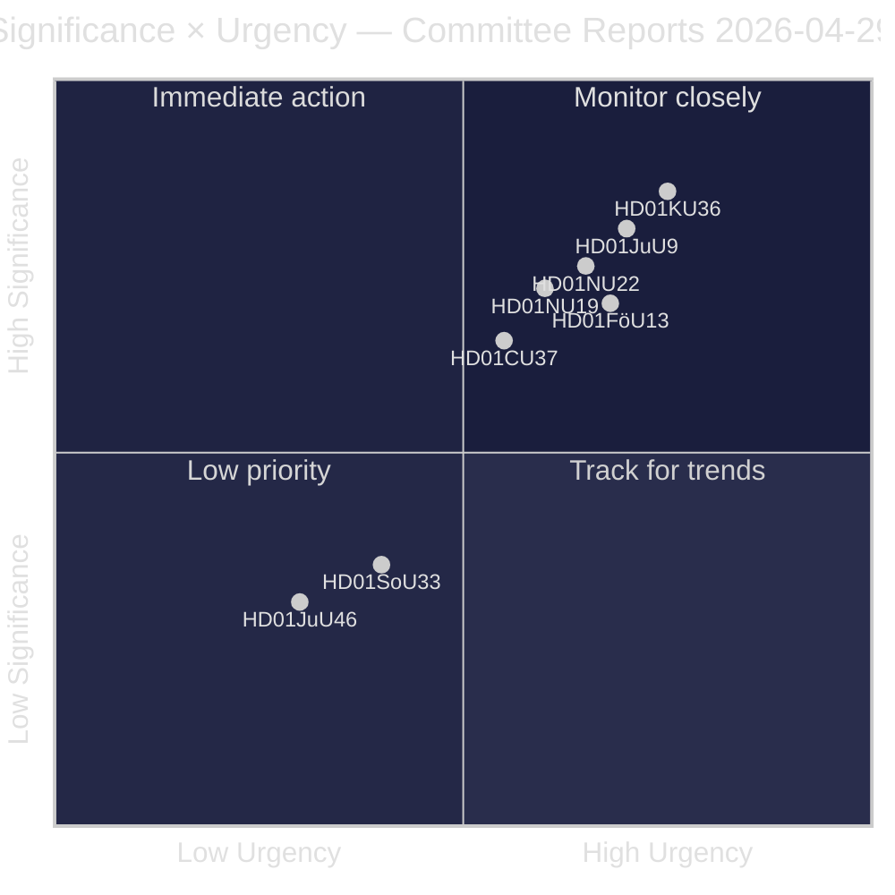
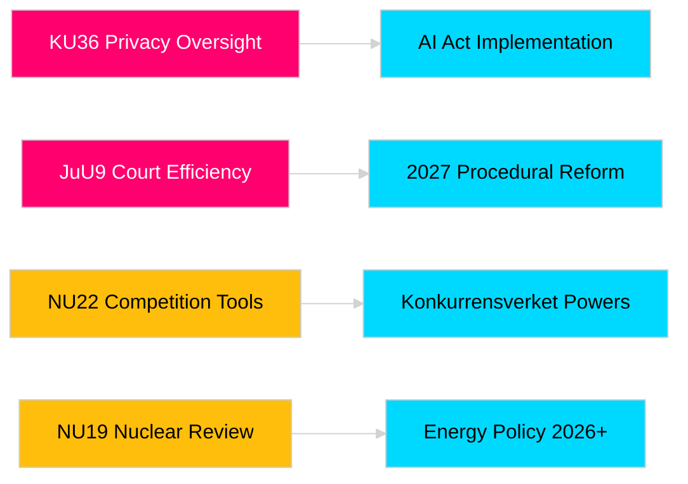

# Riksdagin valiokuntamietinnöt vahvistavat lainsäädäntövastuuta ja turvallisuuskehyksiä

**Tekijä**: James Pether Sörling  
**Päivämäärä**: 2026-04-30  
**Artikkelin päivämäärä**: 2026-04-29  
**Luokitus**: PUBLIC  
**Luottamustaso**: MEDIUM-HIGH [B2]

## 🎯 Tiivistelmä

Riksdagin kevään 2025/26 valiokuntaistunto tuottaa kahdeksan mietintöä, jotka kattavat yksityisyydensuojan valvonnan, oikeudellisen tehokkuuden, räjähdeaineiden valvonnan, ydinvoimalaitosten lupa-uudistuksen, kilpailuoikeuden modernisoinnin ja asuntomarkkinoihin puuttumisen. Perustuslakivaliokunnan digitaalisen yksityisyyden retrospektiivinen tarkastelu (HD01KU36) ja Lakivaliokunnan tuomioistuintehokkuusuudistus (HD01JuU9) ovat strategisesti merkittävimpiä ja signaloivat hallituksen aikomusta modernisoida oikeusvaltion infrastruktuuria vaalivuonna 2026. Kolme ehdotusta vaikuttaa suoraan Ruotsin EU-sääntelyn yhdenmukaistamiseen aikana, jolloin pohjoismainen turvallisuustietoisuus on kohonnut.

## 🧭 3 päätöstä, joita tämä tiedote tukee

1. **Media ja julkinen vastuu**: Mitkä valiokuntamietinnöt ansaitsevat syvällisen käsittelyn vaalivuoden merkittävyyden ja poliittisen painoarvon vuoksi?
2. **Poliittinen seuranta**: Mitkä ehdotukset sisältävät toteutusriskejä, jotka edellyttävät seurantaa Riksdagin äänestykseen asti (odotetaan touko–kesäkuu 2026)?
3. **Kansalaisyhteiskunta ja lakimiehet**: Mitkä oikeudelliset uudistukset (JuU9 tuomioistuintehokkuus, KU36 digitaalinen yksityisyys, NU22 kilpailu) edellyttävät välitöntä sidosryhmävastetta?

## Lue 60 sekunnissa

- **Yksityisyydensuojan johtajuus (HD01KU36 [B2])**: KU ehdottaa 17 parannusta digitaalisen yksityisyyden kehyksiin perustuen vuosien 2020–2024 valvontajaksoon — asettaa ohjelman tekoälylain täytäntöönpanolle ja julkisen sektorin valvonnan rajoille.
- **Tuomioistuinuudistus (HD01JuU9 [B2])**: JuU esittää prosessiuudistuspaketin, joka kohdistuu asian käsittelyruuhkiin, kirjallisiin menettelyihin ja digitaalisiin hakemuksiin — täytäntöönpanon tavoite 2027.
- **Kilpailumodernisaatio (HD01NU22 [B2])**: NU ottaa käyttöön uusia tutkintavälineitä Konkurrensverketille, jotka kohdistuvat sekä yksityisiin markkinoihin että julkisiin hankintoihin; EU:n digitaalisia markkinoita koskevan lain yhdenmukaistaminen on keskeistä.
- **Ydinvoimalalupa (HD01NU19 [B2])**: NU virtaviivaistaa ydinvoimaloiden tarkastelua uuden Energiaviraston rakennetta — kriittinen Ruotsin ydinvoimatavoitteille.
- **Räjähdeaineiden valvonta (HD01FöU13 [B3])**: FöU tiukentaa lähtöaineiden valvontaa ja virastojen välistä tiedonjakoa EU-asetuksen 2019/1148 mukaisesti — kohonnut turvallisuuspoliittinen merkitys.
- **Asuntogarantia (HD01CU37 [B2])**: CU mahdollistaa kuntien vuokratakuut sosiaalisesti haavoittuville ryhmille — kiistelty hallituksen asuntomarkkinoiden vapauttamisen ja sosiaalidemokraattisen asuntopolitiikan välillä.
- **Anniskelulupien yksinkertaistaminen (HD01SoU33 [C2])**: SoU poistaa ruokatarjoilun pakollisen vaatimuksen alkoholiluvista — ravintola-alan sääntelyn purku.
- **Europol-valtuutus (HD01JuU46 [C1])**: Vuotuinen parlamentaarinen tilinpäätösraportti — menettelyllinen.

## Tärkein ennakoiva laukaisin

**KU36:n täysistuntoäänestys (odotetaan 2026-05-06)**: Ensimmäinen parlamentaarinen äänestys digitaalisen yksityisyyspolitiikan kehyksestä EU:n tekoälylain jälkeen — tulos signaloi hallituksen ja opposition tasapainoa valvontavaltion rajoista ennen vuoden 2026 vaaleja.

## Luottamusluokitus

Kokonaisvaltainen arviointiluottamustaso: MEDIUM-HIGH. Ensisijaiset lähteet: Riksdagin mietinnöt (julkiset). Ei omistusoikeudellisia tai vuodettuja tietoja käytetty.

<!-- source-sha: 34f4e52b496d9d798f623f205ad98b050ff2f0e7 -->
