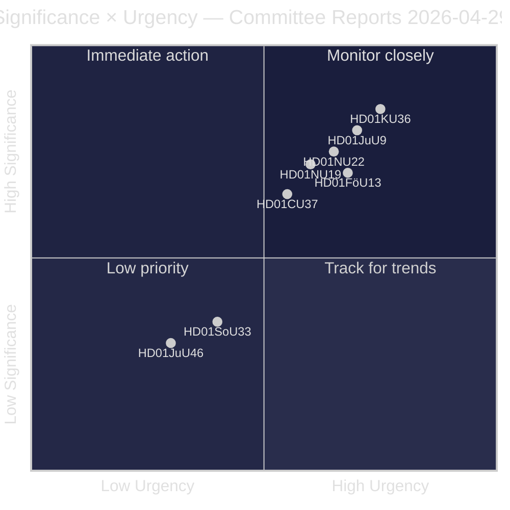
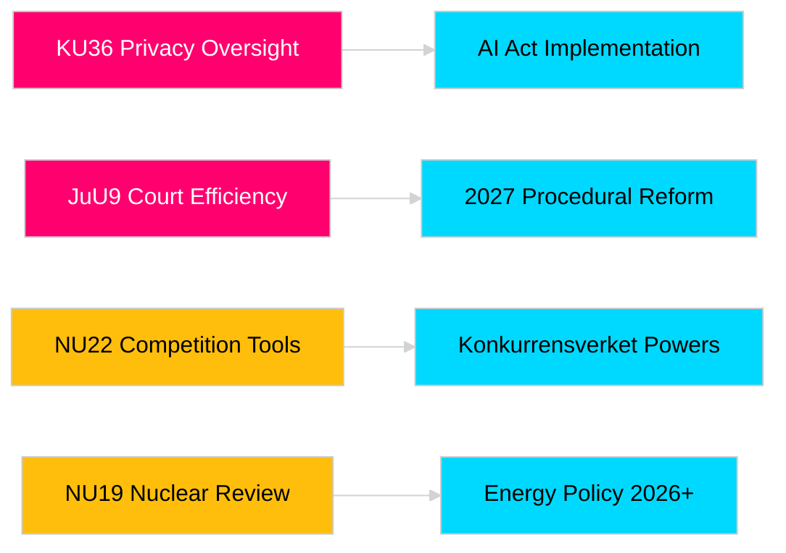

# Les rapports des commissions du Riksdag renforcent la responsabilité législative et les cadres de sécurité

**Auteur**: James Pether Sörling  
**Date**: 2026-04-30  
**Date de l'article**: 2026-04-29  
**Classification**: PUBLIC  
**Confiance**: MOYEN-ÉLEVÉ [B2]

## 🎯 Résumé

La session 2025/26 produit huit betänkanden: surveillance numérique, efficacité judiciaire, explosifs, nucléaire, concurrence et logement. HD01KU36 (KU) et HD01JuU9 (JuU) ont le poids stratégique le plus élevé en cette année électorale 2026. Trois propositions affectent l'alignement UE dans un contexte de sécurité nordique renforcée.

## 🧭 3 décisions que ce document soutient

1. **Médias et responsabilité publique**: Quels rapports méritent une couverture approfondie vu la saillance électorale et l'importance politique?
2. **Surveillance des politiques**: Quelles propositions portent des risques nécessitant un suivi jusqu'au vote (mai–juin 2026)?
3. **Société civile et praticiens du droit**: Quelles réformes juridiques (JuU9, KU36, NU22) nécessitent une réponse immédiate des parties prenantes?

## Lecture en 60 secondes

- **Leadership en matière de confidentialité (HD01KU36 [B2])**: La KU propose 17 améliorations aux cadres d'intégrité numérique s'appuyant sur son cycle de supervision 2020–2024 — fixe l'agenda pour la mise en œuvre du règlement sur l'IA et les limites de surveillance du secteur public.
- **Réforme judiciaire (HD01JuU9 [B2])**: La JuU fait avancer un ensemble d'efficacité procédurale ciblant les arriérés de traitement des affaires, les procédures écrites et les soumissions numériques — objectif de mise en œuvre 2027.
- **Modernisation de la concurrence (HD01NU22 [B2])**: La NU introduit de nouveaux outils d'enquête pour Konkurrensverket ciblant les marchés privés et les marchés publics; la loi européenne sur les marchés numériques est centrale.
- **Autorisation nucléaire (HD01NU19 [B2])**: La NU rationalise l'examen des installations nucléaires sous la nouvelle structure de l'Energimyndighet — crucial pour les ambitions d'expansion nucléaire de la Suède.
- **Contrôle des explosifs (HD01FöU13 [B3])**: La FöU resserre le contrôle des précurseurs et le partage de renseignements inter-agences conformément au règlement UE 2019/1148 — pertinence sécuritaire élevée.
- **Garantie de logement (Housing guarantee, HD01CU37 [B2])**: La CU permet des garanties de location municipales pour les groupes socialement vulnérables — contesté entre la libéralisation du marché immobilier du gouvernement et la politique de logement social-démocrate.
- **Licence de service (HD01SoU33 [C2])**: La SoU supprime l'obligation obligatoire de restauration pour les licences d'alcool — déréglementation du secteur de la restauration.
- **Délégation Europol (HD01JuU46 [C1])**: Rapport annuel de responsabilité parlementaire — procédural.

## Déclencheur futur principal

**Vote en chambre KU36 (prévu le 2026-05-06)**: Premier vote parlementaire sur le cadre de politique de confidentialité numérique après le règlement UE sur l'IA — le résultat signale l'équilibre gouvernement/opposition sur les limites de l'État de surveillance avant les élections 2026.

## Marqueur de confiance

Confiance globale d'évaluation: MOYEN-ÉLEVÉ. Sources primaires: rapports du Riksdag (publics). Aucune donnée propriétaire ou divulguée utilisée.

<!-- source-sha: 06c5659c339f0846d505d906c42f224f6577bfe3 -->
