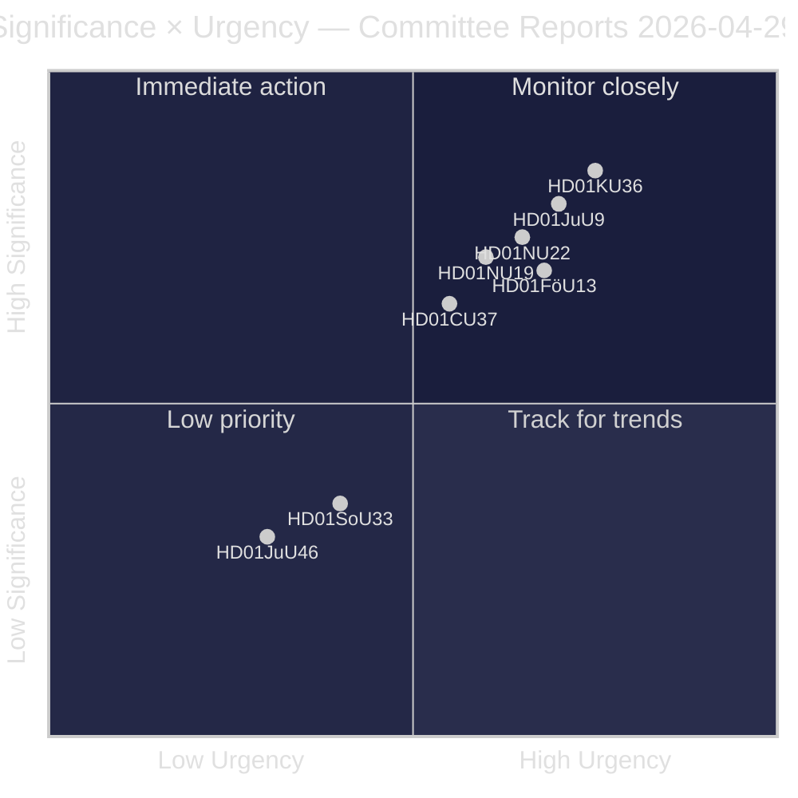
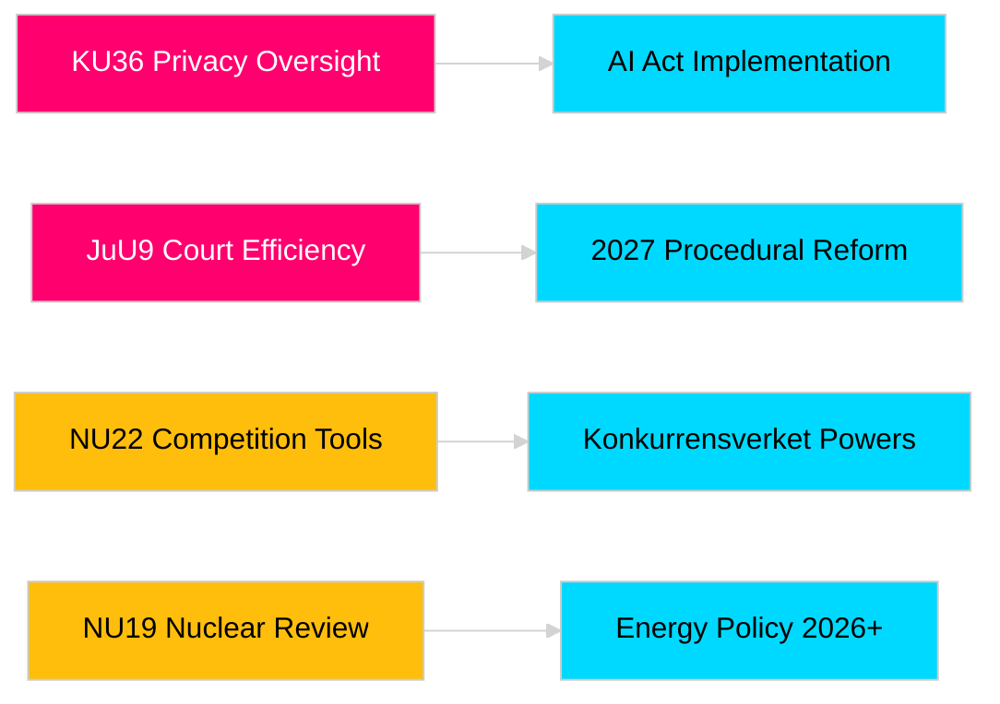

# Les rapports des commissions du Riksdag renforcent la responsabilité législative et les cadres de sécurité

**Auteur** : James Pether Sörling  
**Date** : 2026-04-30  
**Date de l'article** : 2026-04-29  
**Classification** : PUBLIC  
**Niveau de confiance** : MEDIUM-HIGH [B2]

## 🎯 Synthèse

La session printanière 2025/26 des commissions du Riksdag livre huit rapports couvrant la supervision de la vie privée, l'efficacité judiciaire, le contrôle des explosifs, la réforme des autorisations pour les installations nucléaires, la modernisation du droit de la concurrence et les interventions sur le marché du logement. La révision rétrospective de l'intégrité numérique par la Commission constitutionnelle (HD01KU36) et la réforme de l'efficacité judiciaire de la Commission de justice (HD01JuU9) ont le poids stratégique le plus élevé, signalant l'intention du gouvernement de moderniser l'infrastructure de l'État de droit en cette année électorale 2026. Trois propositions concernent directement l'alignement réglementaire de la Suède sur l'UE à un moment de vigilance sécuritaire nordique accrue.

## 🧭 3 décisions que cette note soutient

1. **Médias et responsabilité publique** : Quels rapports de commission méritent une couverture approfondie compte tenu de leur pertinence en année électorale et de leur importance politique ?
2. **Veille politique** : Quelles propositions comportent des risques de mise en œuvre nécessitant un suivi jusqu'au vote du Riksdag (attendu mai–juin 2026) ?
3. **Société civile et praticiens du droit** : Quelles réformes juridiques (JuU9 efficacité judiciaire, KU36 vie privée numérique, NU22 concurrence) exigent une réponse immédiate des parties prenantes ?

## Lecture en 60 secondes

- **Leadership en matière de vie privée (HD01KU36 [B2])** : KU propose 17 améliorations des cadres d'intégrité numérique sur la base du cycle de supervision 2020–2024 — fixe l'agenda pour la mise en œuvre de la loi sur l'IA et les limites de la surveillance publique.
- **Réforme judiciaire (HD01JuU9 [B2])** : JuU présente un paquet de réforme procédurale ciblant les arriérés de traitement des affaires, les procédures écrites et les dépôts numériques — objectif de mise en œuvre 2027.
- **Modernisation de la concurrence (HD01NU22 [B2])** : NU introduit de nouveaux outils d'enquête pour Konkurrensverket ciblant les marchés privés et les marchés publics ; l'alignement sur le règlement européen sur les marchés numériques est central.
- **Autorisation nucléaire (HD01NU19 [B2])** : NU rationalise l'examen des installations nucléaires sous la nouvelle structure de l'Autorité de l'énergie — essentiel pour les ambitions nucléaires de la Suède.
- **Contrôle des explosifs (HD01FöU13 [B3])** : FöU resserre les contrôles des précurseurs et le partage interinstitutionnel d'informations conformément au règlement UE 2019/1148 — pertinence accrue en matière de sécurité.
- **Garantie logement (HD01CU37 [B2])** : CU permet des garanties locatives municipales pour les groupes socialement vulnérables — point de discorde entre la libéralisation du marché du logement du gouvernement et la politique du logement social-démocrate.
- **Simplification des licences de restauration (HD01SoU33 [C2])** : SoU supprime l'obligation de restauration pour les licences d'alcool — déréglementation du secteur de l'hôtellerie-restauration.
- **Délégation Europol (HD01JuU46 [C1])** : Rapport annuel de reddition de comptes parlementaire — procédural.

## Principal déclencheur prospectif

**Vote de la chambre sur KU36 (attendu le 2026-05-06)** : Premier vote parlementaire sur le cadre de la politique de confidentialité numérique après la loi européenne sur l'IA — le résultat indique l'équilibre Gouvernement/opposition sur les limites de l'État de surveillance avant les élections 2026.

## Étiquette de confiance

Niveau de confiance global de l'évaluation : MEDIUM-HIGH. Sources primaires : rapports des commissions du Riksdag (publics). Aucune donnée propriétaire ou divulguée utilisée.

<!-- source-sha: 34f4e52b496d9d798f623f205ad98b050ff2f0e7 -->
