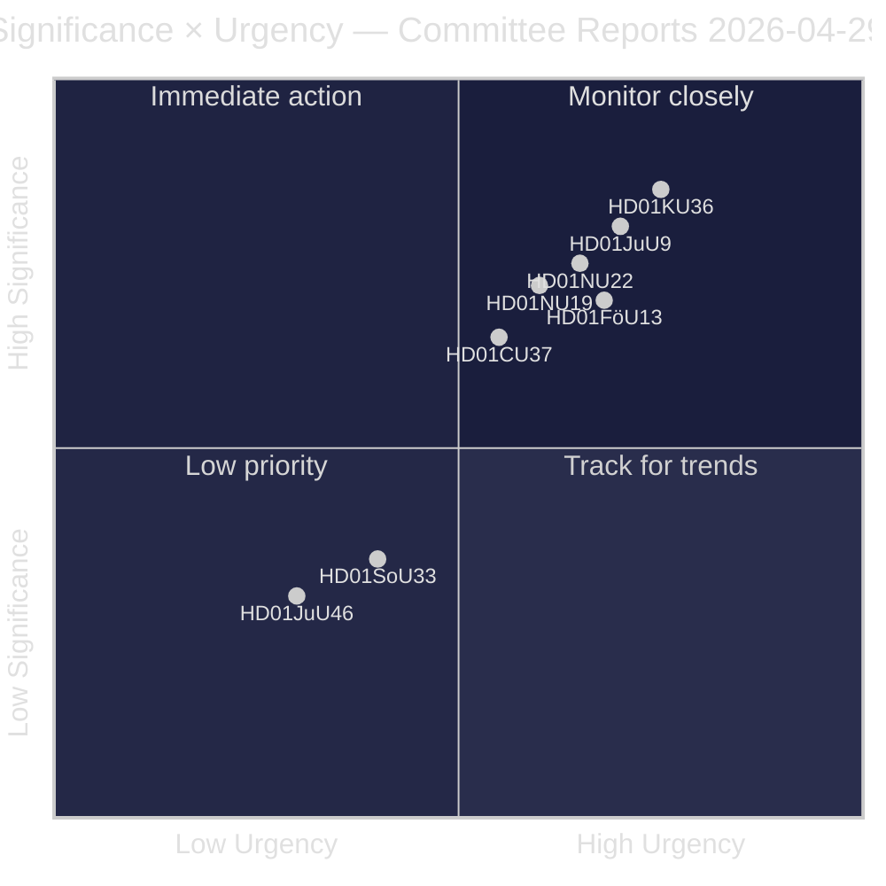
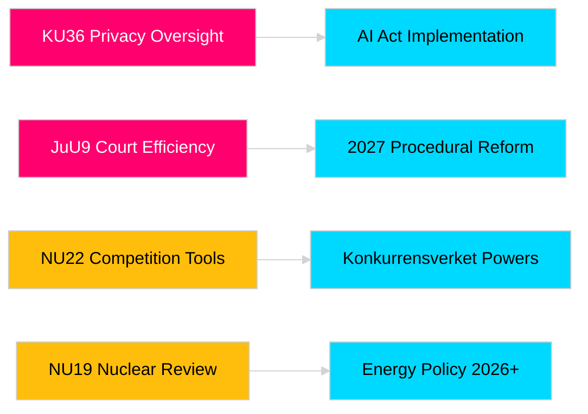

<!-- dir: rtl -->
# דוחות ועדות הריקסדאג מקדמים אחריות חקיקתית ומסגרות ביטחון

**מחבר**: James Pether Sörling  
**תאריך**: 2026-04-30  
**תאריך המאמר**: 2026-04-29  
**סיווג**: PUBLIC  
**רמת ביטחון**: MEDIUM-HIGH [B2]

## 🎯 תמצית

מושב ועדות הריקסדאג לאביב 2025/26 מספק שמונה דוחות הכוללים פיקוח על פרטיות, יעילות שיפוטית, פיקוח על חומרי נפץ, רפורמת היתרים למתקנים גרעיניים, מודרניזציה של דיני התחרות והתערבות בשוק הדיור. ביקורת הוועדה החוקתית על הנגישות הדיגיטלית (HD01KU36) ורפורמת יעילות בתי המשפט של ועדת המשפט (HD01JuU9) נושאות את המשקל האסטרטגי הגבוה ביותר, ומאותתות על כוונת הממשלה לשדרג את תשתית שלטון החוק בשנת בחירות 2026. שלושה הצעות משפיעות ישירות על ההתאמה הרגולטורית של שוודיה לאיחוד האירופי בעת מודעות ביטחונית נורדית מוגברת.

## 🧭 3 החלטות שדוח זה תומך בהן

1. **תקשורת ואחריות ציבורית**: אילו דוחות ועדה ראויים לסיקור מעמיק לאור הרלוונטיות בשנת בחירות והמשמעות הפוליטית?
2. **מעקב מדיניות**: אילו הצעות טומנות בחובן סיכוני יישום הדורשים מעקב עד לתגובת הריקסדאג (צפויה מאי–יוני 2026)?
3. **חברה אזרחית ומשפטנים**: אילו רפורמות משפטיות (JuU9 יעילות שיפוטית, KU36 פרטיות דיגיטלית, NU22 תחרות) דורשות תגובה מיידית מבעלי עניין?

## קריאה ב-60 שניות

- **מנהיגות בפרטיות (HD01KU36 [B2])**: KU מציעה 17 שיפורים למסגרות הנגישות הדיגיטלית בהתבסס על מחזור הפיקוח 2020–2024 — קובעת את האג'נדה ליישום חוק הבינה המלאכותית ומגבלות הפיקוח הממשלתי.
- **רפורמת בתי משפט (HD01JuU9 [B2])**: JuU מציגה חבילת רפורמה דיונית המכוונת לפיגורים בטיפול בתיקים, הליכים בכתב והגשות דיגיטליות — יעד יישום 2027.
- **מודרניזציה של תחרות (HD01NU22 [B2])**: NU מציגה כלי חקירה חדשים ל-Konkurrensverket המכוונים לשווקים פרטיים ורכש ציבורי; ההתאמה לתקנת השווקים הדיגיטליים של האיחוד האירופי היא מרכזית.
- **רישוי גרעיני (HD01NU19 [B2])**: NU מייעלת את בחינת המתקנים הגרעיניים תחת מבנה רשות האנרגיה החדש — קריטי לשאיפות הגרעיניות של שוודיה.
- **פיקוח על חומרי נפץ (HD01FöU13 [B3])**: FöU מחמירה בפיקוח על מבשרים ובשיתוף מידע בין-סוכנויות בהתאם לתקנה האירופית 2019/1148 — רלוונטיות ביטחונית מוגברת.
- **ערבות לדיור (HD01CU37 [B2])**: CU מאפשרת ערבויות שכירות עירוניות לקבוצות מוחלשות חברתית — שנוי במחלוקת בין ליברליזציה של שוק הדיור הממשלתי ומדיניות הדיור הסוציאל-דמוקרטית.
- **פישוט רישיונות הגשת שירות (HD01SoU33 [C2])**: SoU מבטלת את דרישת הגשת המזון המחייבת לרישיונות אלכוהול — ביטול רגולציה בענף האירוח.
- **משלחת אירופול (HD01JuU46 [C1])**: דוח אחריות פרלמנטרי שנתי — פרוצדורלי.

## המפעיל העתידי העיקרי

**הצבעת הלשכה על KU36 (צפויה ב-2026-05-06)**: ההצבעה הפרלמנטרית הראשונה על מסגרת מדיניות הפרטיות הדיגיטלית לאחר חוק הבינה המלאכותית האירופי — התוצאה מאותתת על האיזון בין הממשלה והאופוזיציה בנוגע למגבלות מדינת המעקב לקראת בחירות 2026.

## תווית ביטחון

ביטחון הערכה כולל: MEDIUM-HIGH. מקורות ראשוניים: דוחות ועדות הריקסדאג (ציבוריים). לא נעשה שימוש בנתונים קנייניים או דלופים.

<!-- source-sha: 34f4e52b496d9d798f623f205ad98b050ff2f0e7 -->
