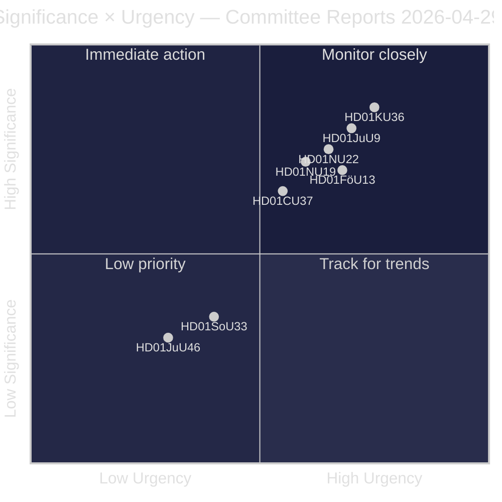
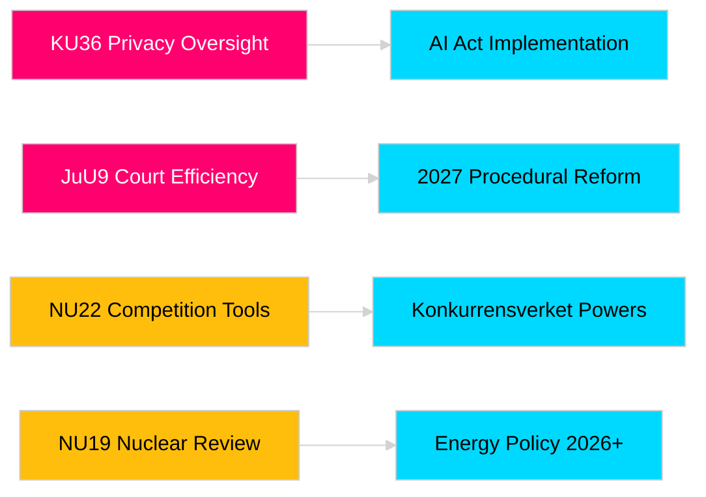

<!-- dir: rtl -->
# דוחות ועדות הריקסדאג מחזקים את אחריות החקיקה ומסגרות הביטחון

**מחבר**: James Pether Sörling  
**תאריך**: 2026-04-30  
**תאריך המאמר**: 2026-04-29  
**סיווג**: ציבורי  
**ביטחון**: בינוני-גבוה [B2]

## 🎯 תמצית מנהלים

מושב ועדות האביב של הריקסדאג 2025/26 מספק שמונה דוחות המכסים פיקוח על פרטיות, יעילות שיפוטית, בקרת חומרי נפץ, רפורמה בהיתרים למתקנים גרעיניים, מודרניזציה של דיני תחרות והתערבות בשוק הדיור. הבדיקה הרטרוספקטיבית של הוועדה החוקתית על שלמות דיגיטלית (HD01KU36) ורפורמת יעילות בתי המשפט של ועדת המשפטים (HD01JuU9) נושאות את המשקל האסטרטגי הגבוה ביותר, ומסמנות את כוונת הממשלה לחדש את תשתית שלטון החוק בשנת הבחירות 2026. שלושה הצעות משפיעות ישירות על ההתאמה הרגולטורית של שוודיה לאיחוד האירופי בתקופה של מודעות ביטחונית נורדית מוגברת.

## 🧭 3 החלטות שמסמך זה תומך בהן

1. **תקשורת ואחריות ציבורית**: אילו דוחות ועדות ראויים לסיקור מעמיק בהתחשב בחשיבות שנת הבחירות ומשמעותם הפוליטית?
2. **מעקב מדיניות**: אילו הצעות נושאות סיכוני יישום הדורשים מעקב עד להצבעה בריקסדאג (צפויה מאי–יוני 2026)?
3. **חברה אזרחית ומשפטנים**: אילו רפורמות משפטיות (JuU9 יעילות שיפוטית, KU36 פרטיות דיגיטלית, NU22 תחרות) דורשות תגובה מיידית מבעלי עניין?

## קריאה בת 60 שניות

- **מנהיגות בפרטיות (HD01KU36 [B2])**: KU מציעה 17 שיפורים למסגרות שלמות דיגיטלית בהתבסס על מחזור הפיקוח 2020–2024 — קובעת סדר יום ליישום תקנת הבינה המלאכותית וגבולות לפיקוח הסקטור הציבורי.
- **רפורמה שיפוטית (HD01JuU9 [B2])**: JuU מקדמת חבילת יעילות פרוצדורלית המכוונת לפיגורים בטיפול בתיקים, הליכים בכתב והגשות דיגיטליות — יעד יישום 2027.
- **מודרניזציה של התחרות (HD01NU22 [B2])**: NU מכניסה כלי חקירה חדשים עבור Konkurrensverket המכוונים לשווקים פרטיים ורכש ציבורי; חוק השווקים הדיגיטליים של האיחוד האירופי מרכזי.
- **היתר גרעיני (HD01NU19 [B2])**: NU מייעלת את בדיקת המתקנים הגרעיניים תחת המבנה החדש של Energimyndighet — קריטי לשאיפות הרחבת הגרעין של שוודיה.
- **בקרת חומרי נפץ (HD01FöU13 [B3])**: FöU מהדקת בקרת חומרי מוצא ושיתוף מידע מודיעיני בין-סוכנות בהתאם לתקנת האיחוד האירופי 2019/1148 — רלוונטיות ביטחונית מוגברת.
- **ערבות דיור (Housing guarantee, HD01CU37 [B2])**: CU מאפשרת ערבויות שכירות עירוניות לקבוצות הפגיעות חברתית — שנוי במחלוקת בין ליברליזציית שוק הדיור של הממשלה לבין מדיניות הדיור הסוציאל-דמוקרטית.
- **רישיון שירות (HD01SoU33 [C2])**: SoU מבטלת את דרישת שירות האוכל החובה לרישיונות אלכוהול — בטול רגולציה בענף האירוח.
- **משלחת אירופול (HD01JuU46 [C1])**: דוח אחריות פרלמנטרי שנתי — פרוצדורלי.

## המפעיל המרכזי העתידי

**הצבעת לשכה KU36 (צפויה 2026-05-06)**: ההצבעה הפרלמנטרית הראשונה על מסגרת מדיניות הפרטיות הדיגיטלית לאחר תקנת הבינה המלאכותית של האיחוד האירופי — התוצאה מסמנת את האיזון ממשלה/אופוזיציה על גבולות מדינת הפיקוח לפני בחירות 2026.

## סמן ביטחון

ביטחון הערכה כולל: בינוני-גבוה. מקורות ראשוניים: דוחות ריקסדאג (ציבוריים). לא נעשה שימוש בנתונים קנייניים או מודלפים.

<!-- source-sha: 34f4e52b496d9d798f623f205ad98b050ff2f0e7 -->
