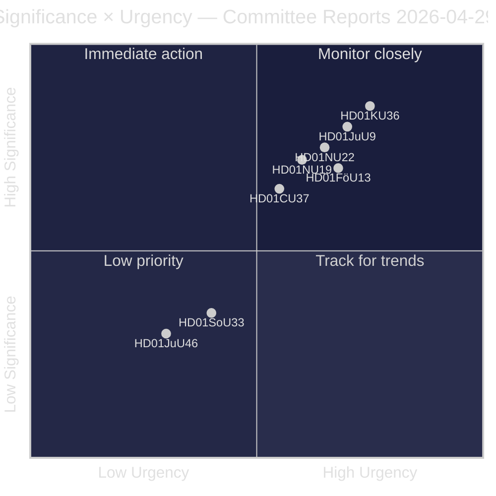
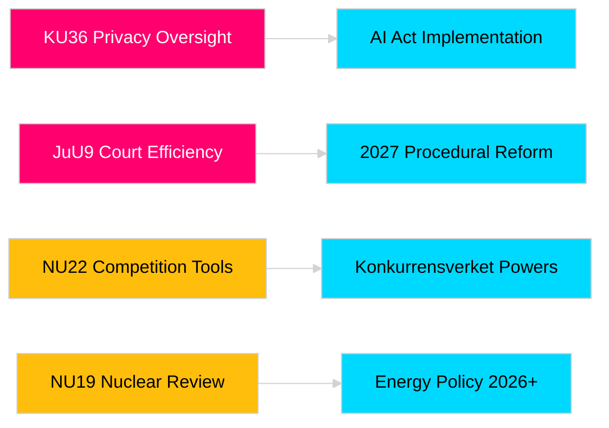

# リクスダーグ委員会報告が立法上の説明責任と安全保障の枠組みを前進させる

**著者**: James Pether Sörling  
**日付**: 2026-04-30  
**記事日付**: 2026-04-29  
**分類**: PUBLIC  
**信頼度**: MEDIUM-HIGH [B2]

## 🎯 要約

リクスダーグ（スウェーデン議会）の2025/26年春季委員会会期は、プライバシー監督、司法効率、爆発物規制、原子力施設の許可改革、競争法の近代化、住宅市場への介入にわたる8件の委員会報告を提出します。憲法委員会によるデジタル整合性の遡及的審査（HD01KU36）と司法委員会の裁判所効率化改革（HD01JuU9）が最も高い戦略的重要性を持ち、2026年選挙年における法の支配インフラの近代化という政府の意図を示しています。3つの提案は、北欧の安全保障意識が高まる中、スウェーデンのEU規制整合に直接影響します。

## 🧭 この報告が支援する3つの決定

1. **メディアと公的説明責任**: 選挙年の重要性と政策的重要性を踏まえ、どの委員会報告が詳細な取材に値するか？
2. **政策モニタリング**: リクスダーグ採決（2026年5月〜6月予定）までの追跡を要する実施リスクを持つ提案はどれか？
3. **市民社会と法律実務家**: どの法改正（JuU9裁判所効率化、KU36デジタルプライバシー、NU22競争）が利害関係者の即時対応を必要とするか？

## 60秒で読む

- **プライバシー主導（HD01KU36 [B2]）**: KUは2020〜2024年の監督サイクルに基づくデジタル整合性の枠組みへの17の改善を提案——AI法の実施と公共部門の監視制限の議題を設定します。
- **裁判所改革（HD01JuU9 [B2]）**: JuUは案件処理の遅延、書面手続き、デジタル提出を対象とした手続き効率化パッケージを提出——実施目標は2027年。
- **競争の近代化（HD01NU22 [B2]）**: NUはKonkurrensverketに民間市場と公共調達の両方を対象とした新たな調査ツールを導入；EU デジタル市場法への整合が中心的。
- **原子力許可（HD01NU19 [B2]）**: NUは新エネルギー庁構造の下で原子力施設審査を合理化——スウェーデンの原子力推進の野心に不可欠。
- **爆発物規制（HD01FöU13 [B3]）**: FöUはEU規則2019/1148に沿って前駆体管理と省庁横断的な情報共有を強化——安全保障政策上の重要性が増大。
- **住宅保証（HD01CU37 [B2]）**: CUは社会的弱者グループへの自治体賃貸保証を可能にする——政府の住宅市場自由化と社会民主主義的住宅政策の間で争点となっている。
- **飲食店許可の簡素化（HD01SoU33 [C2]）**: SoUはアルコール免許に対する食事提供の義務要件を廃止——接客業界の規制緩和。
- **ユーロポール代表団（HD01JuU46 [C1]）**: 年次議会説明責任報告書——手続き上のもの。

## 最も重要な将来のトリガー

**KU36本会議採決（2026-05-06予定）**: EU AI法施行後、デジタルプライバシー政策の枠組みに関する初の議会採決——結果は2026年選挙に向けた監視国家の限界をめぐる政府と野党のバランスを示します。

## 信頼度ラベル

全体的な評価信頼度：MEDIUM-HIGH。主要情報源：リクスダーグ委員会報告（公開）。独自情報または漏洩データは使用していません。

<!-- source-sha: 34f4e52b496d9d798f623f205ad98b050ff2f0e7 -->
