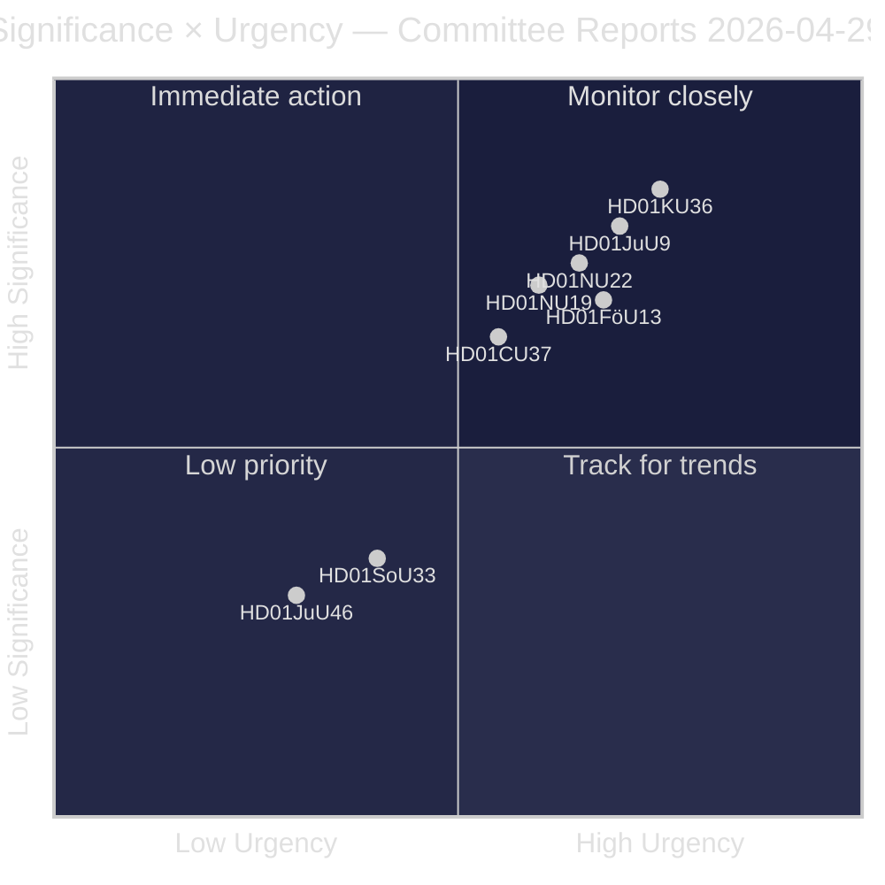
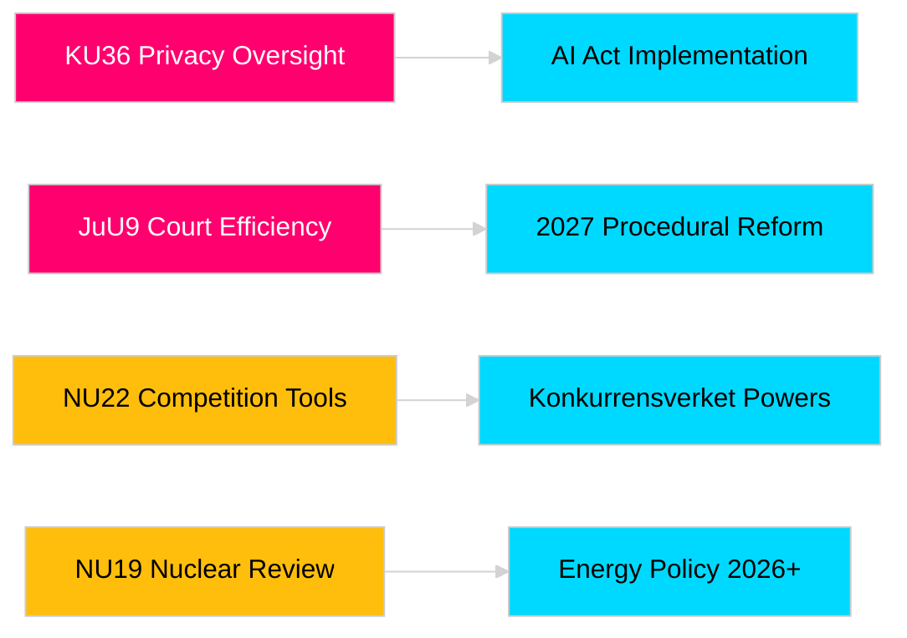

# 国会委員会報告書が立法責任と安全保障枠組みを強化

**著者**: James Pether Sörling  
**日付**: 2026-04-30  
**記事日付**: 2026-04-29  
**分類**: 公開  
**信頼度**: 中高 [B2]

## 🎯 要点

スウェーデン国会（Riksdag）2025/26年春期委員会会期では、プライバシー監視、司法効率、爆発物管理、原子力施設許可改革、競争法近代化、住宅市場介入を網羅する8件の答申が提出された。憲法委員会によるデジタル整合性の遡及的審査（HD01KU36）および司法委員会の司法効率改革（HD01JuU9）が最も高い戦略的重要性を持ち、2026年選挙年における法の支配インフラの近代化に向けた政府の意図を示している。3件の提案は、北欧安全保障意識が高まる中、スウェーデンのEU規制整合に直接影響する。

## 🧭 この要約が支援する3つの決定

1. **メディアと公的説明責任**: 選挙年の重要性と政治的意義を踏まえ、詳細な報道に値する委員会報告はどれか？
2. **政策モニタリング**: 国会投票（2026年5月～6月予定）まで追跡が必要な実施リスクを抱える提案はどれか？
3. **市民社会と法律実務家**: どの法律改革（JuU9司法効率、KU36デジタルプライバシー、NU22競争）が即時のステークホルダー対応を必要とするか？

## 60秒読解

- **プライバシーリーダーシップ（HD01KU36 [B2]）**: KUは2020～2024年の監視サイクルを踏まえてデジタル整合性枠組みの17項目の改善を提案——AI法施行と公共部門監視制限の議題を設定。
- **司法改革（HD01JuU9 [B2]）**: JuUは案件処理積滞、書面手続き、電子提出を対象とした手続き効率化パッケージを推進——実施目標2027年。
- **競争近代化（HD01NU22 [B2]）**: NUはKonkurrensverketに対し民間市場と公共調達を対象とした新調査ツールを導入；EUデジタル市場法が中心。
- **原子力許可（HD01NU19 [B2]）**: NUは新しいEnergimyndighet構造のもとで核施設審査を合理化——スウェーデンの原子力拡張意欲にとって重要。
- **爆発物管理（HD01FöU13 [B3]）**: FöUはEU規則2019/1148に従い前駆体管理と機関間情報共有を強化——安全保障政策上の重要性が高い。
- **住宅保証 (Housing guarantee, HD01CU37 [B2])**: CUは社会的脆弱グループへの自治体家賃保証を可能にする——政府の住宅市場自由化と社会民主主義的住宅政策の間で争点。
- **飲食サービス許可（HD01SoU33 [C2]）**: SoUはアルコール免許の義務的食事提供要件を廃止——飲食業界の規制緩和。
- **ユーロポール委任（HD01JuU46 [C1]）**: 年次議会説明責任報告書——手続き的。

## 最重要の将来のトリガー

**KU36本会議投票（2026-05-06予定）**: EU AI法後のデジタルプライバシー政策枠組みに関する最初の議会投票——結果は2026年選挙前の監視国家制限に関する政府/野党バランスを示す。

## 信頼度マーカー

全体的評価信頼度: 中高。一次資料：Riksdag答申（公開）。専有情報または漏洩データは使用せず。

<!-- source-sha: 06c5659c339f0846d505d906c42f224f6577bfe3 -->
