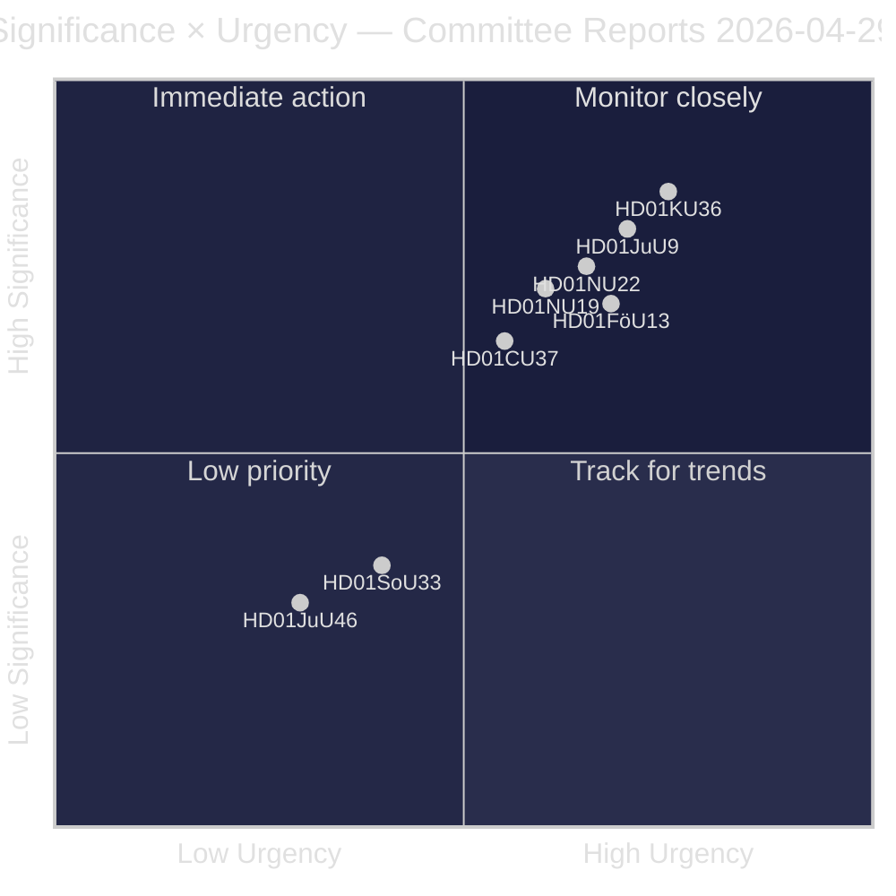
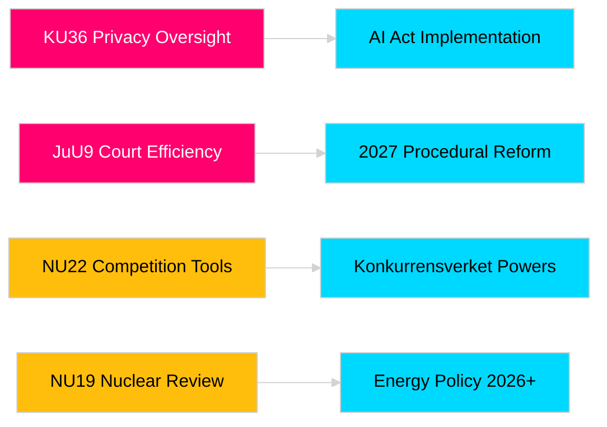

# 릭스다그 위원회 보고서가 입법 책임성과 안보 프레임워크를 강화합니다

**저자**: James Pether Sörling  
**날짜**: 2026-04-30  
**기사 날짜**: 2026-04-29  
**분류**: PUBLIC  
**신뢰도**: MEDIUM-HIGH [B2]

## 🎯 요약

릭스다그(스웨덴 의회)의 2025/26년 봄 위원회 회기는 개인정보 감독, 사법 효율성, 폭발물 통제, 핵시설 허가 개혁, 경쟁법 현대화, 주택 시장 개입에 걸친 8개의 위원회 보고서를 제출합니다. 헌법위원회의 디지털 무결성 소급 검토(HD01KU36)와 법사위원회의 법원 효율성 개혁(HD01JuU9)이 가장 높은 전략적 비중을 차지하며, 2026년 선거 연도에 법치 인프라를 현대화하려는 정부의 의도를 나타냅니다. 세 가지 제안은 북유럽 안보 의식이 높아지는 시점에 스웨덴의 EU 규제 정합에 직접 영향을 미칩니다.

## 🧭 이 보고서가 지원하는 3가지 결정

1. **언론과 공적 책임**: 선거 연도의 중요성과 정책적 의의를 고려할 때 어느 위원회 보고서가 심층 취재를 받을 자격이 있는가?
2. **정책 모니터링**: 릭스다그 표결(2026년 5~6월 예정)까지 추적을 요하는 시행 위험을 가진 제안은 무엇인가?
3. **시민 사회 및 법조인**: 어떤 법 개혁(JuU9 법원 효율성, KU36 디지털 개인정보, NU22 경쟁)이 이해관계자의 즉각적인 대응을 필요로 하는가?

## 60초 요약

- **개인정보 보호 리더십(HD01KU36 [B2])**: KU는 2020~2024년 감독 주기를 기반으로 디지털 무결성 프레임워크에 대한 17가지 개선사항을 제안——AI법 시행과 공공 부문 감시 제한의 의제를 설정합니다.
- **법원 개혁(HD01JuU9 [B2])**: JuU는 사건 처리 적체, 서면 절차, 디지털 제출을 겨냥한 절차 효율화 패키지를 제출——시행 목표 2027년.
- **경쟁 현대화(HD01NU22 [B2])**: NU는 민간 시장과 공공 조달 모두를 겨냥한 Konkurrensverket의 새로운 조사 도구를 도입; EU 디지털시장법 정합이 핵심.
- **핵 허가(HD01NU19 [B2])**: NU는 새 에너지청 구조 하에서 핵시설 심사를 간소화——스웨덴의 핵 확대 야심에 필수적.
- **폭발물 통제(HD01FöU13 [B3])**: FöU는 EU 규정 2019/1148에 따라 전구체 통제와 기관 간 정보 공유를 강화——고조된 안보 정책적 관련성.
- **주택 보증(HD01CU37 [B2])**: CU는 사회적 취약 계층을 위한 지자체 임대 보증을 가능하게 함——정부의 주택 시장 자유화와 사회민주주의적 주택 정책 간 쟁점.
- **영업 허가 간소화(HD01SoU33 [C2])**: SoU는 주류 면허에 대한 식사 서비스 의무 요건을 폐지——접객업 규제 완화.
- **유로폴 대표단(HD01JuU46 [C1])**: 연간 의회 책임 보고서——절차적.

## 가장 중요한 미래 트리거

**KU36 본회의 표결(2026-05-06 예정)**: EU AI법 이후 디지털 개인정보 정책 프레임워크에 관한 첫 번째 의회 표결——결과는 2026년 선거를 앞두고 감시 국가 한계에 대한 정부와 야당의 균형을 나타냅니다.

## 신뢰도 레이블

전체 평가 신뢰도: MEDIUM-HIGH. 1차 정보원: 릭스다그 위원회 보고서(공개). 독점 또는 유출 데이터는 사용하지 않았습니다.

<!-- source-sha: 34f4e52b496d9d798f623f205ad98b050ff2f0e7 -->
