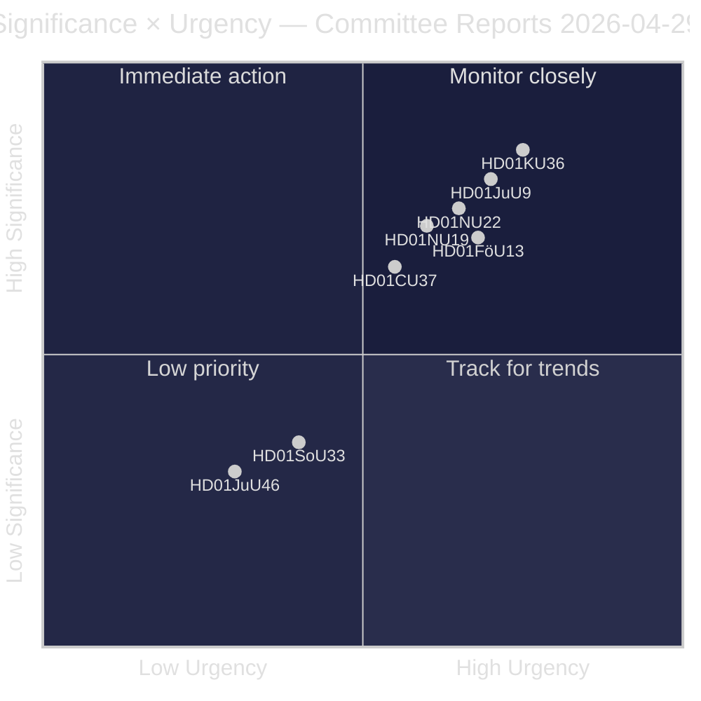
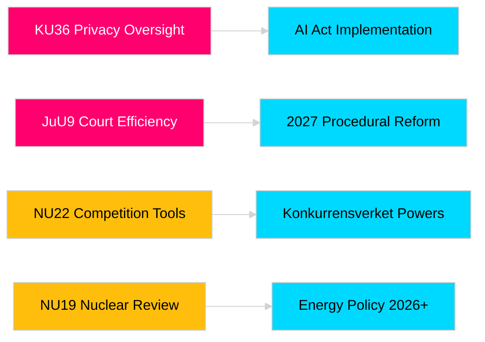

# 릭스다그 위원회 보고서, 입법 책임성과 안보 프레임워크 강화

**저자**: James Pether Sörling  
**날짜**: 2026-04-30  
**기사 날짜**: 2026-04-29  
**분류**: 공개  
**신뢰도**: 중상 [B2]

## 🎯 핵심 요약

스웨덴 의회(Riksdag) 2025/26년 봄 위원회 회기는 프라이버시 감독, 사법 효율성, 폭발물 통제, 핵시설 허가 개혁, 경쟁법 현대화, 주택시장 개입을 망라하는 8개의 보고서를 제출한다. 헌법위원회의 디지털 무결성에 대한 소급 검토(HD01KU36)와 사법위원회의 법원 효율성 개혁(HD01JuU9)이 가장 높은 전략적 비중을 지니며, 2026년 선거의 해에 법치국가 인프라를 현대화하려는 정부의 의도를 나타낸다. 세 가지 제안은 북유럽 안보 의식이 고조되는 시점에서 스웨덴의 EU 규제 정렬에 직접적인 영향을 미친다.

## 🧭 이 보고서가 지원하는 3가지 결정

1. **언론과 공적 책임**: 선거의 해 중요성과 정치적 의의를 감안할 때 심층 보도가 필요한 위원회 보고서는 무엇인가?
2. **정책 모니터링**: 릭스다그 투표(2026년 5월~6월 예정)까지 추적이 필요한 이행 위험을 안고 있는 제안은 무엇인가?
3. **시민사회와 법률 실무자**: 어떤 법률 개혁(JuU9 사법 효율성, KU36 디지털 프라이버시, NU22 경쟁)이 이해관계자의 즉각적인 대응을 요구하는가?

## 60초 읽기

- **프라이버시 리더십 (HD01KU36 [B2])**: KU는 2020~2024년 감독 주기를 바탕으로 디지털 무결성 프레임워크의 17가지 개선안을 제안함 — AI법 시행과 공공 부문 감시 제한을 위한 의제 설정.
- **사법 개혁 (HD01JuU9 [B2])**: JuU는 사건 처리 적체, 서면 절차, 디지털 제출을 목표로 하는 절차적 효율성 패키지를 추진함 — 이행 목표 2027년.
- **경쟁 현대화 (HD01NU22 [B2])**: NU는 민간 시장과 공공 조달을 대상으로 Konkurrensverket에 새로운 조사 도구를 도입함; EU 디지털 시장법이 핵심.
- **핵 허가 (HD01NU19 [B2])**: NU는 새로운 Energimyndighet 구조 아래 핵시설 검토를 간소화함 — 스웨덴의 핵에너지 확장 야망에 결정적.
- **폭발물 통제 (HD01FöU13 [B3])**: FöU는 EU 규정 2019/1148에 따라 전구체 통제 및 기관 간 정보 공유를 강화함 — 안보 정책적 관련성 증가.
- **주택 보증 (Housing guarantee, HD01CU37 [B2])**: CU는 사회적으로 취약한 집단을 위한 지방자치단체 임대 보증을 가능하게 함 — 정부의 주택시장 자유화와 사회민주주의 주택정책 사이에서 논쟁.
- **서비스 허가 (HD01SoU33 [C2])**: SoU는 주류 면허에 대한 의무적 음식 제공 요건을 폐지함 — 요식업 규제 완화.
- **유로폴 위임 (HD01JuU46 [C1])**: 연례 의회 책임 보고서 — 절차적.

## 가장 중요한 미래 트리거

**KU36 본회의 표결 (2026-05-06 예정)**: EU AI법 이후 디지털 프라이버시 정책 프레임워크에 관한 첫 번째 의회 표결 — 결과는 2026년 선거 전 감시국가 한계에 관한 정부/야당 균형을 나타냄.

## 신뢰도 표시

전체 평가 신뢰도: 중상. 1차 자료: 릭스다그 보고서(공개). 독점적 또는 유출된 데이터 미사용.

<!-- source-sha: 34f4e52b496d9d798f623f205ad98b050ff2f0e7 -->
