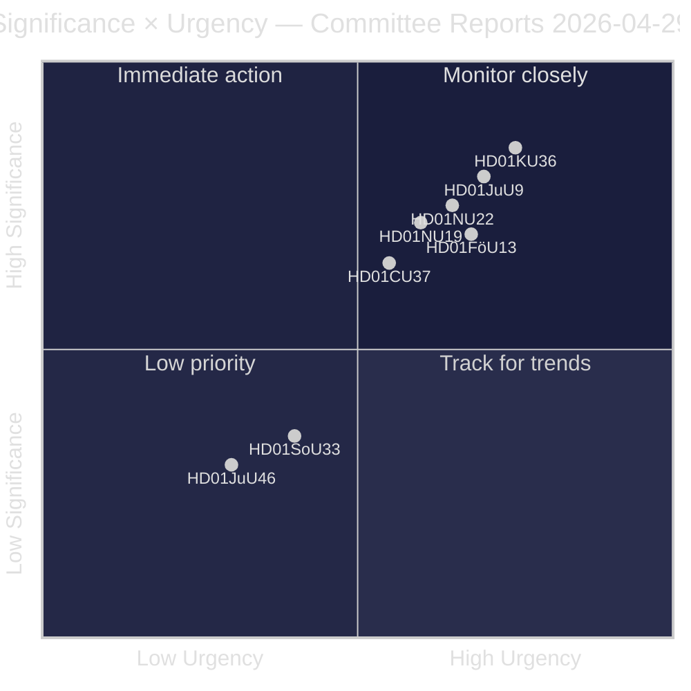
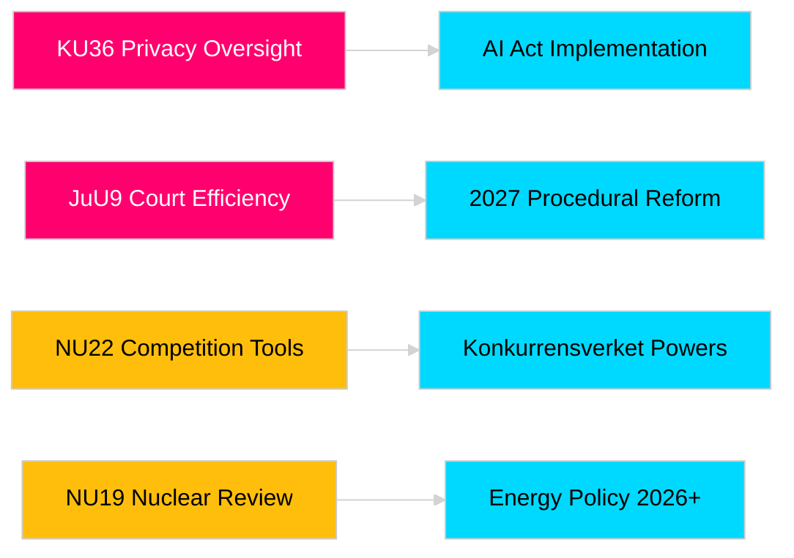

# Riksdag-commissierapporten versterken wetgevingsverantwoordelijkheid en veiligheidsraamwerken

**Auteur**: James Pether Sörling  
**Datum**: 2026-04-30  
**Artikeldatum**: 2026-04-29  
**Classificatie**: PUBLIC  
**Betrouwbaarheidsgraad**: MEDIUM-HIGH [B2]

## 🎯 Samenvatting

De voorjaarsvergadering van de commissies van de Riksdag 2025/26 levert acht commissierapporten op die privacytoezicht, gerechtelijke efficiëntie, explosievencontrole, vergunningshervorming voor kerncentrales, modernisering van het mededingingsrecht en interventies op de woningmarkt bestrijken. De retrospectieve evaluatie van digitale integriteit door de Grondwetscommissie (HD01KU36) en de hervorming van de gerechtelijke efficiëntie door de Justitiecommissie (HD01JuU9) hebben het hoogste strategische gewicht en signaleren de intentie van de regering om de infrastructuur van de rechtsstaat te moderniseren in het verkiezingsjaar 2026. Drie voorstellen raken direct aan de EU-regelgevingsaanpassing van Zweden op een moment van verhoogde Noordse veiligheidsbewustwording.

## 🧭 3 beslissingen die dit rapport ondersteunt

1. **Media en publieke verantwoording**: Welke commissierapporten verdienen diepgaande berichtgeving gezien de verkiezingsjaarsrelevantie en politieke betekenis?
2. **Politiek toezicht**: Welke voorstellen dragen uitvoeringsrisico's die opvolging vereisen tot aan de Riksdag-stemming (verwacht mei–juni 2026)?
3. **Maatschappelijk middenveld en rechtspractici**: Welke juridische hervormingen (JuU9 gerechtelijke efficiëntie, KU36 digitale privacy, NU22 mededinging) vereisen onmiddellijke reactie van belanghebbenden?

## Lezen in 60 seconden

- **Privacyleiderschap (HD01KU36 [B2])**: KU stelt 17 verbeteringen voor aan digitale integriteitskaders op basis van de toezichtscyclus 2020–2024 — stelt de agenda voor de implementatie van de AI-wet en grenzen aan overheidstoezicht.
- **Gerechtshervorming (HD01JuU9 [B2])**: JuU presenteert een pakket voor procesrechtelijke efficiëntie gericht op achterstanden in de zaakafhandeling, schriftelijke procedures en digitale indieningen — implementatiedoel 2027.
- **Mededingingsmodernisering (HD01NU22 [B2])**: NU introduceert nieuwe onderzoeksinstrumenten voor Konkurrensverket gericht op zowel private markten als overheidsaanbestedingen; afstemming op de EU-Digital-Marktenverordening staat centraal.
- **Nucleaire vergunning (HD01NU19 [B2])**: NU stroomlijnt de beoordeling van nucleaire installaties onder de nieuwe Energiagentschapsstructuur — cruciaal voor de nucleaire ambities van Zweden.
- **Explosievencontrole (HD01FöU13 [B3])**: FöU verscherpt de voorloopstofcontroles en interagentschappelijke informatie-uitwisseling overeenkomstig EU-verordening 2019/1148 — verhoogde veiligheidspolitieke relevantie.
- **Woninggarantie (HD01CU37 [B2])**: CU maakt gemeentelijke huurgaranties mogelijk voor sociaal kwetsbare groepen — omstreden tussen de woningmarktliberalisering van de regering en sociaaldemocratisch woonbeleid.
- **Vereenvoudiging horecavergunning (HD01SoU33 [C2])**: SoU schrapt de verplichte voedselserveringsvereiste voor alcoholvergunningen — deregulering van de horeca.
- **Europol-delegatie (HD01JuU46 [C1])**: Jaarlijks parlementair verantwoordingsverslag — procedureel.

## Belangrijkste toekomstige trigger

**KU36-kamersteming (verwacht 2026-05-06)**: Eerste parlementaire stemming over het beleidskader voor digitale privacy na de EU-AI-wet — de uitkomst signaleert het evenwicht Overheid/oppositie over grenzen aan de surveillance-staat vóór de verkiezingen van 2026.

## Betrouwbaarheidslabel

Totale beoordelingsbetrouwbaarheidsgraad: MEDIUM-HIGH. Primaire bronnen: Riksdag-commissierapporten (openbaar). Geen eigendomsrechtelijke of uitgelekte gegevens gebruikt.

<!-- source-sha: 34f4e52b496d9d798f623f205ad98b050ff2f0e7 -->
