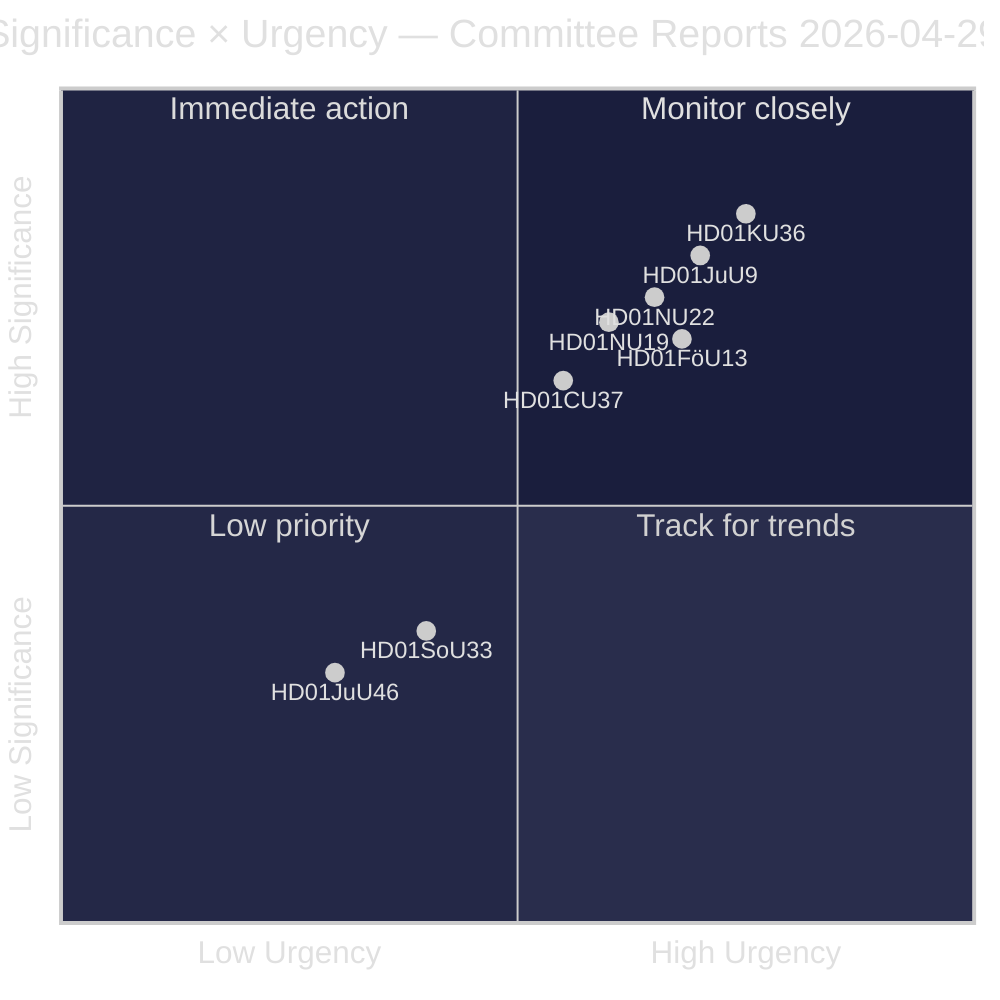
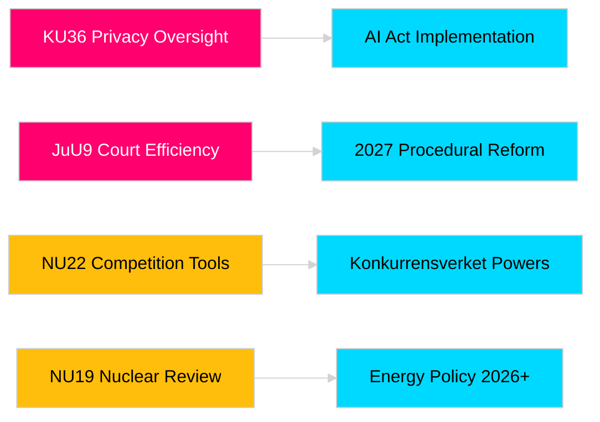

# Riksdag-commissierapporten versterken wetgevingsverantwoordelijkheid en veiligheidskaders

**Auteur**: James Pether Sörling  
**Datum**: 2026-04-30  
**Artikeldatum**: 2026-04-29  
**Classificatie**: OPENBAAR  
**Vertrouwen**: MIDDEN-HOOG [B2]

## 🎯 Samenvatting

De voorjaarssessie van de Riksdag-commissie 2025/26 levert acht rapporten op het gebied van privacytoezicht, gerechtelijke efficiëntie, explosiefbeheersing, hervorming van vergunningen voor kerninstallaties, modernisering van het mededingingsrecht en woningmarktinterventie. De retrospectieve beoordeling van digitale integriteit door de Constitutionele Commissie (HD01KU36) en de gerechtelijke efficiëntiehervorm van de Justitiecommissie (HD01JuU9) hebben het grootste strategische gewicht en signaleren de bedoeling van de regering om de rechtsstaatstinfrastructuur te moderniseren in het verkiezingsjaar 2026. Drie voorstellen hebben direct invloed op de EU-regelgevingsafstemming van Zweden in een tijd van verhoogd noordelijk veiligheidsbewustzijn.

## 🧭 3 beslissingen die dit document ondersteunt

1. **Media en publieke verantwoordelijkheid**: Welke commissierapporten verdienen diepgaande berichtgeving gezien de verkiezingsjaarssaillantie en politieke betekenis?
2. **Beleidsmonitoring**: Welke voorstellen dragen implementatierisico's die monitoring tot aan de Riksdag-stemming vereisen (verwacht mei–juni 2026)?
3. **Maatschappelijk middenveld en rechtsprofessionals**: Welke juridische hervormingen (JuU9 gerechtelijke efficiëntie, KU36 digitale privacy, NU22 concurrentie) vereisen directe respons van belanghebbenden?

## 60-seconden lezing

- **Privacyleiderschap (HD01KU36 [B2])**: KU stelt 17 verbeteringen voor aan digitale integriteitskaders op basis van haar toezichtscyclus 2020–2024 — stelt de agenda voor de implementatie van de AI-verordening en grenzen voor surveillance door de publieke sector.
- **Gerechtelijke hervorming (HD01JuU9 [B2])**: JuU drijft een procedureel efficiëntiepakket aan gericht op achterstanden in zaakbehandeling, schriftelijke procedures en digitale indieningen — implementatiedoelstelling 2027.
- **Concurrentiemodernisering (HD01NU22 [B2])**: NU introduceert nieuwe onderzoekstools voor Konkurrensverket gericht op zowel private markten als overheidsaanbestedingen; de EU-wet inzake digitale markten is centraal.
- **Kernvergunning (HD01NU19 [B2])**: NU stroomlijnt de beoordeling van kerninstallaties onder de nieuwe Energimyndighet-structuur — cruciaal voor Zwedens kernenergie-uitbreidingsambities.
- **Explosiefbeheersing (HD01FöU13 [B3])**: FöU scherpt de controle op precursoren en interagentschaps-inlichtingendeling aan overeenkomstig EU-Verordening 2019/1148 — verhoogde veiligheidspolitieke relevantie.
- **Woongarantie (Housing guarantee, HD01CU37 [B2])**: CU maakt gemeentelijke huurgaranties voor sociaal kwetsbare groepen mogelijk — omstreden tussen de woningmarktliberalisering van de regering en sociaaldemocratisch woonbeleid.
- **Serveervergrunning (HD01SoU33 [C2])**: SoU schrapt de verplichte maaltijdverplichting voor drankvergunningen — deregulering van de horecasector.
- **Europol-delegatie (HD01JuU46 [C1])**: Jaarlijks parlementair verantwoordingsrapport — procedureel.

## Belangrijkste toekomstige trigger

**KU36 kamervotum (verwacht 2026-05-06)**: Eerste parlementaire stemming over het kader voor digitaal privacybeleid na de EU AI-verordening — de uitkomst signaleert het regeringsopositionssaldo over de grenzen van de surveillance staat voor de verkiezingen van 2026.

## Betrouwbaarheidslabel

Algehele beoordelingsbetrouwbaarheid: MIDDEN-HOOG. Primaire bronnen: Riksdag-rapporten (openbaar). Geen propriëtaire of gelekte data gebruikt.

<!-- source-sha: 34f4e52b496d9d798f623f205ad98b050ff2f0e7 -->
