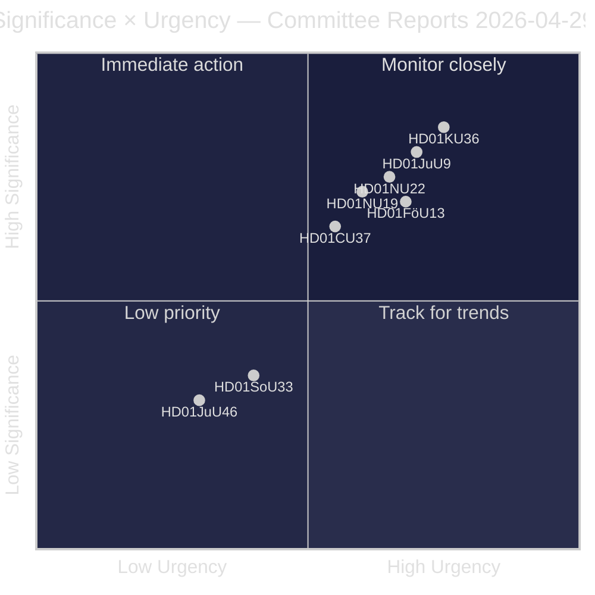
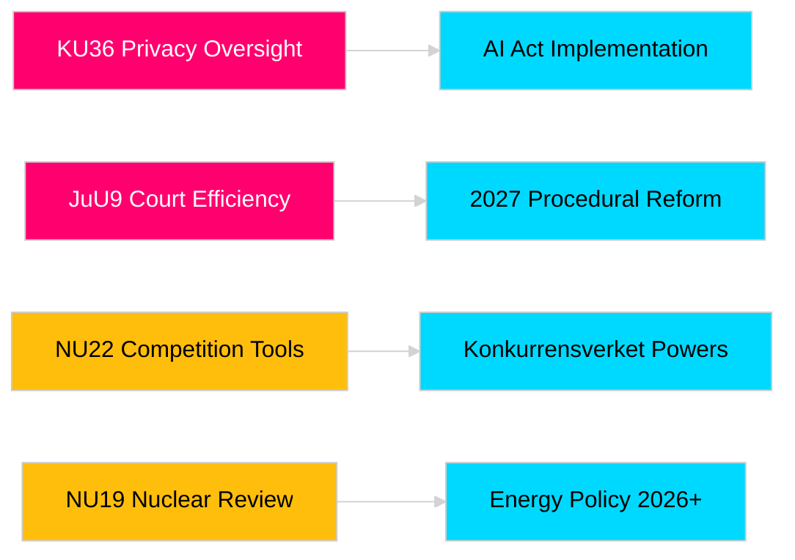

# Riksdagens utvalgsrapporter styrker lovgivningsansvar og sikkerhetsrammer

**Forfatter**: James Pether Sörling  
**Dato**: 2026-04-30  
**Artikeldato**: 2026-04-29  
**Klassifikasjon**: OFFENTLIG  
**Konfidens**: MEDIUM-HØY [B2]

## 🎯 Sammendrag

Riksdagens vårsesjons utvalg 2025/26 leverer åtte betenkninger innen personvern, domstolseffektivitet, eksplosivkontroll, reform av konsesjonsprosessen for kjernekraftverk, modernisering av konkurranselovgivningen og boligmarkedsintervensjon. Konstitusjonskomiteen retrospektive gjennomgang av digital integritet (HD01KU36) og Justiskomiteen domstolseffektivitetsreform (HD01JuU9) har størst strategisk vekt og signalerer regjeringens intensjon om å modernisere rettsstatsinfrastrukturen i valgåret 2026. Tre forslag påvirker direkte Sveriges EU-reguleringstilpasning i en tid med økt nordisk sikkerhetsbevissthet.

## 🧭 3 beslutninger dette notatet støtter

1. **Medier og offentlig ansvarlighet**: De utvalgsrapporter fortjener grundig dekning gitt valgårssaliens og politisk betydning?
2. **Politisk overvåking**: De forslag bærer implementeringsrisiko som krever oppfølging frem til Riksdagsavstemning (forventet mai–juni 2026)?
3. **Sivilsamfunn og juridiske utøvere**: De rettsreformer (JuU9 domstolseffektivitet, KU36 digital personvern, NU22 konkurranse) krever umiddelbar interessentrespons?

## 60-sekunders lesning

- **Personvernlederskab (HD01KU36 [B2])**: KU foreslår 17 forbedringer av rammer for digital integritet bygget på sitt tilsynssyklus 2020–2024 — setter agendaen for implementering av AI-forordningen og grenser for offentlig sektorovervåking.
- **Domstolsreform (HD01JuU9 [B2])**: JuU fremmer en prosedyreeffektivitetspakke rettet mot saksbehandlingsrestanser, skriftlige prosedyrer og digital innlevering — implementeringsmål 2027.
- **Konkurransemodernisering (HD01NU22 [B2])**: NU innfører nye etterforskningsverktøy for Konkurrensverket rettet mot både private markeder og offentlig anskaffelse; EUs digitale markedslov er sentral.
- **Kjernekraftstillatelse (HD01NU19 [B2])**: NU strømlinjeformer gjennomgang av kjernekraftanlegg under den nye Energimyndighetens struktur — avgjørende for Sveriges kjernekraftutvidelsesамbisjoner.
- **Eksplosivkontroll (HD01FöU13 [B3])**: FöU strammer inn kontroll med forløpermaterialer og tverretatlig etterretningsdeling i tråd med EU-forordning 2019/1148 — økt sikkerhetspolitisk relevans.
- **Boliggaranti (Housing guarantee, HD01CU37 [B2])**: CU muliggjør kommunale leigarantier for sosialt utsatte grupper — omstridt mellom regjeringens boligmarkedsliberalisering og sosialdemokratisk boligpolitikk.
- **Serveringstillatelse (HD01SoU33 [C2])**: SoU fjerner obligatorisk matkrav for alkoholbevilgninger — deregulering av restaurantbransjen.
- **Europol-delegasjon (HD01JuU46 [C1])**: Årlig parlamentarisk ansvarsrapport — prosedyremessig.

## Viktigste fremtidige trigger

**KU36 kammeravtemning (forventet 2026-05-06)**: Første parlamentsavstemning om rammer for digital personvernpolitikk etter EUs AI-forordning — utfallet signalerer regjerings-/opposisjonssaldo om overvåkingsstatens grenser foran valget 2026.

## Konfidensmarkering

Overordnet vurderingskonfidens: MEDIUM-HØY. Primære kilder: Riksdagens betenkninger (offentlige). Ingen proprietære eller lekkede data brukt.

<!-- source-sha: 06c5659c339f0846d505d906c42f224f6577bfe3 -->
