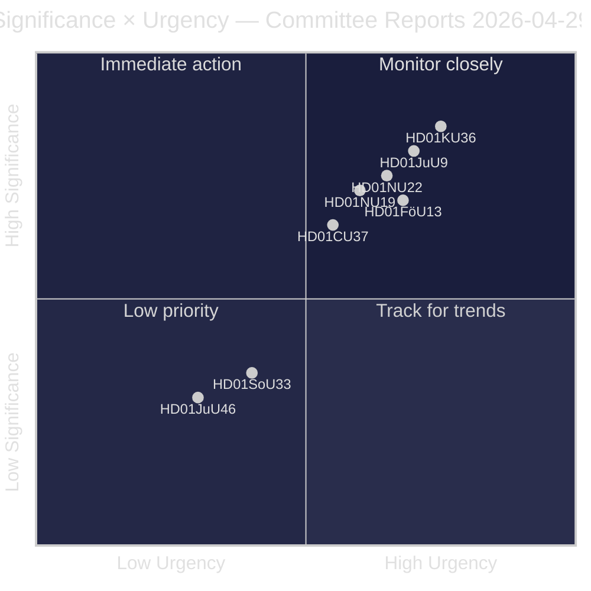
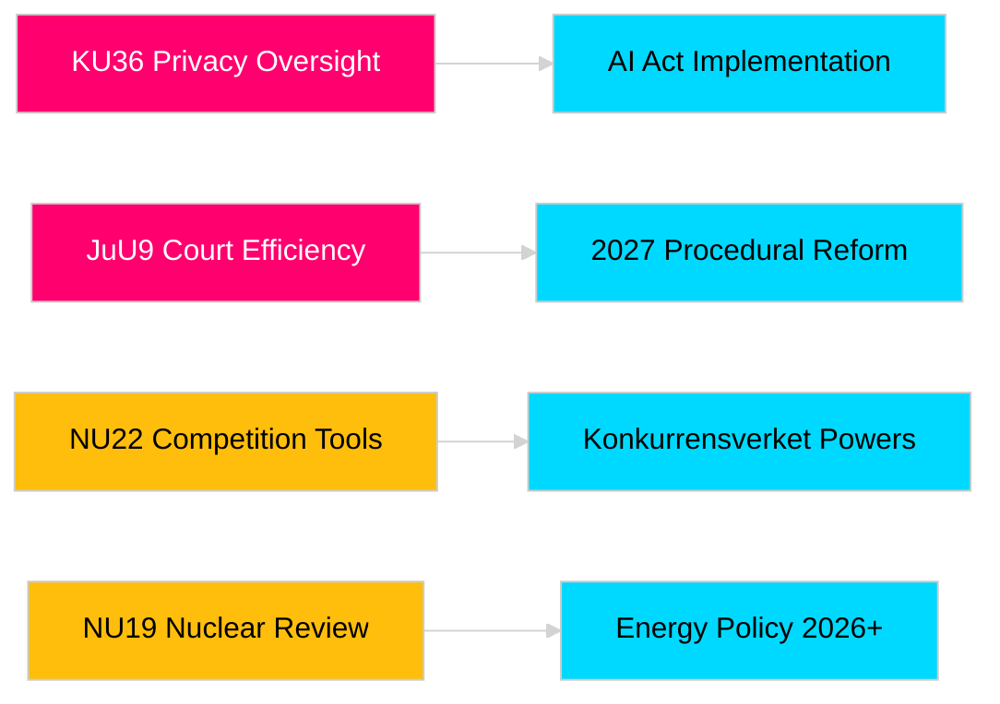

# Riksdagens utvalgsrapporter styrker lovgivningsansvar og sikkerhetsrammer

**Forfatter**: James Pether Sörling  
**Dato**: 2026-04-30  
**Artikkeldato**: 2026-04-29  
**Klassifisering**: PUBLIC  
**Konfidensgrad**: MEDIUM-HIGH [B2]

## 🎯 Sammendrag

Riksdagens utvalgsøkt våren 2025/26 leverer åtte betenkninger som spenner over personvernstilsyn, retslig effektivitet, kontroll av sprengstoff, tillatelsesreform for kjernekraftanlegg, modernisering av konkurranseretten og inngrep i boligmarkedet. Grunnlovsutvalgets retrospektive gjennomgang av digital integritet (HD01KU36) og Justisutvalgets domstolseffektiviseringsreform (HD01JuU9) har den høyeste strategiske vekten og signaliserer regjeringens hensikt om å modernisere rettsstatens infrastruktur i valgåret 2026. Tre forslag påvirker direkte Sveriges EU-reguleringstilpasning i en tid med økt nordisk sikkerhetsbevissthet.

## 🧭 3 beslutninger dette brevet støtter

1. **Medier og offentlig ansvarlighet**: Hvilke utvalgsrapporter fortjener grundig dekning gitt valgårets aktualitet og politisk betydning?
2. **Politisk overvåking**: Hvilke forslag medfører implementeringsrisiko som krever oppfølging frem til Riksdagens avstemning (forventet mai–juni 2026)?
3. **Sivilsamfunn og jurister**: Hvilke rettsreformer (JuU9 domstolseffektivitet, KU36 digital personvern, NU22 konkurranse) krever umiddelbar interessentsrespons?

## Les på 60 sekunder

- **Personvernledelse (HD01KU36 [B2])**: KU foreslår 17 forbedringer av rammer for digital integritet basert på overvåkningssyklusen 2020–2024 — setter dagsorden for implementering av AI-forordningen og grenser for statlig overvåking.
- **Domstolsreform (HD01JuU9 [B2])**: JuU fremmer en pakke for prosessrettslig effektivisering rettet mot saksbehandlingsrestanser, skriftlige prosedyrer og digitale innleveringer — implementeringsmål 2027.
- **Konkurransemodernisering (HD01NU22 [B2])**: NU innfører nye etterforskningsverktøy for Konkurrensverket rettet mot både private markeder og offentlig innkjøp; tilpasning til EUs forordning om digitale markeder er sentral.
- **Kjernekrafttillatelse (HD01NU19 [B2])**: NU effektiviserer kjernekraftprøving under ny Energimyndighetstruktur — avgjørende for Sveriges kjernekraftambisjoner.
- **Eksplosivkontroll (HD01FöU13 [B3])**: FöU strammer inn på forløperkontroller og tverretatlig informasjonsdeling i tråd med EU-forordning 2019/1148 — økt sikkerhetspolitisk relevans.
- **Boliggaranti (HD01CU37 [B2])**: CU muliggjør kommunale leieguarantier for sosialt utsatte grupper — omstridt mellom regjeringens boligmarkedsliberalisering og sosialdemokratisk boligpolitikk.
- **Serveringsbevillingforenkling (HD01SoU33 [C2])**: SoU fjerner obligatorisk krav om matservering for alkoholbevillinger — deregulering for serveringsbransjen.
- **Europol-delegasjon (HD01JuU46 [C1])**: Årlig parlamentarisk redegjørelsesrapport — prosedyremessig.

## Viktigste fremtidige utløser

**KU36 kammeravstemning (forventet 2026-05-06)**: Første parlamentariske avstemning om rammer for digital personvernpolitikk etter EUs AI-forordning — utfallet signaliserer balansen mellom Regjering og opposisjon om grenser for overvåkningsstaten foran valget 2026.

## Konfidensvurdering

Samlet vurderingskonfidensgrad: MEDIUM-HIGH. Primære kilder: Riksdagens betenkninger (offentlige). Ingen proprietære eller lekkede data brukt.

<!-- source-sha: 34f4e52b496d9d798f623f205ad98b050ff2f0e7 -->
