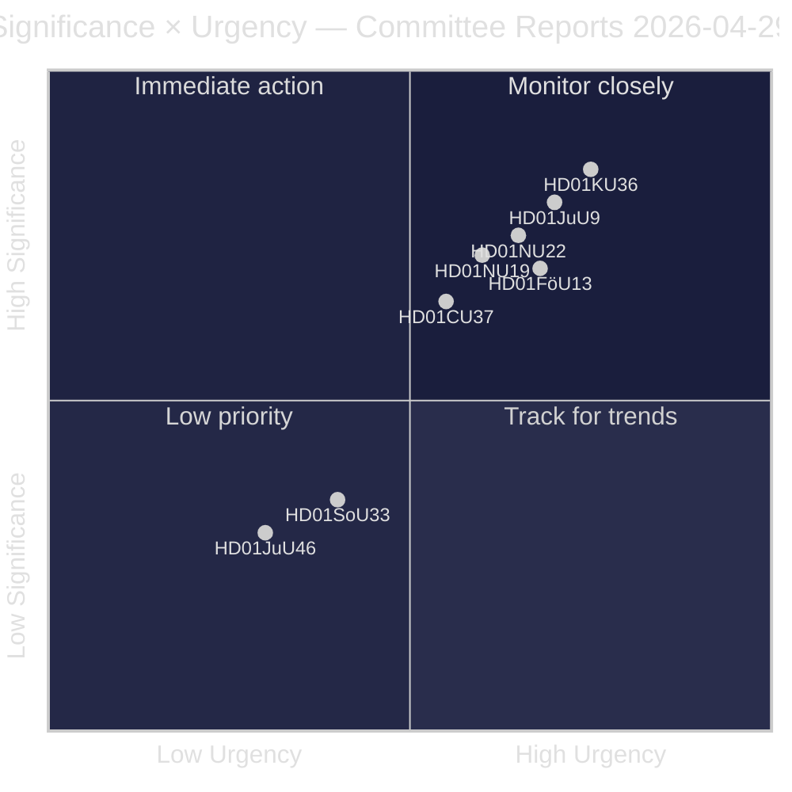
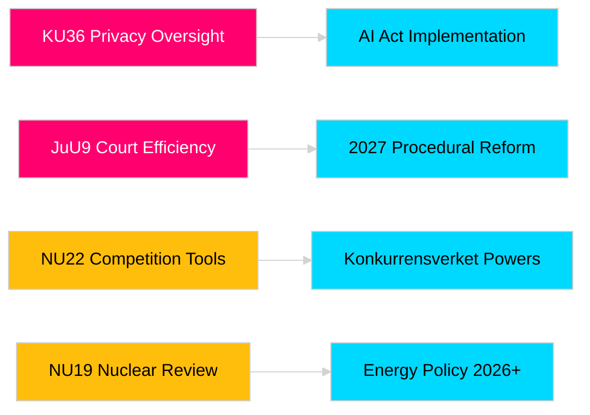

# Riksdagsutskottens betänkanden stärker lagstiftningsansvar och säkerhetsramar

**Författare**: James Pether Sörling  
**Datum**: 2026-04-30  
**Artikeldatum**: 2026-04-29  
**Klassificering**: OFFENTLIG  
**Konfidens**: MEDIUM-HÖG [B2]

## 🎯 Sammanfattning

Riksdagens vårtermin 2025/26 levererar åtta betänkanden inom integritetsgranskning, domstolseffektivitet, sprängämneskontroll, tillståndsreform för kärnkraftsanläggningar, modernisering av konkurrensrätten och bostadsmarknadsintervention. Konstitutionsutskottets retrospektiva granskning av digital integritet (HD01KU36) och Justitieutskottets domstolseffektivitetsreform (HD01JuU9) väger tyngst strategiskt och signalerar regeringens vilja att modernisera rättsstatens infrastruktur i valår 2026. Tre förslag påverkar direkt Sveriges EU-regleringsanpassning i ett läge av förhöjd nordisk säkerhetsmedvetenhet.

## 🧭 3 beslut som detta PM stödjer

1. **Medier och allmänhetsgranskning**: Vilka utskottsbetänkanden förtjänar djuprapportering med tanke på valårssaliens och politisk vikt?
2. **Policybevakning**: Vilka förslag bär genomföranderisker som kräver uppföljning fram till Riksdagsomröstning (förväntad maj–juni 2026)?
3. **Civilsamhälle och jurister**: Vilka rättsreformer (JuU9 domstolseffektivitet, KU36 digital integritet, NU22 konkurrens) kräver omedelbar intressenthanttering?

## 60-sekunders läsning

- **Integritetsledarskap (HD01KU36 [B2])**: KU föreslår 17 förbättringar av ramverket för digital integritet baserat på sitt tillsynscykel 2020–2024 — sätter agendan för implementeringen av AI-förordningen och gränser för offentlig sektorövervakning.
- **Domstolsreform (HD01JuU9 [B2])**: JuU driver ett procedursteffektivitetspaket för att minska balansen av ärenden, skriftliga förfaranden och digitala inlämningar — implementeringsmål 2027.
- **Konkurrensmodernisering (HD01NU22 [B2])**: NU inför nya utredningsverktyg för Konkurrensverket riktade mot både privata marknader och offentlig upphandling; EU:s digitala marknadslag central.
- **Kärnkraftstillståndsgivning (HD01NU19 [B2])**: NU effektiviserar granskningen av kärnkraftsanläggningar under den nya Energimyndighetens struktur — avgörande för Sveriges kärnkraftsexpansionsambitioner.
- **Sprängämneskontroll (HD01FöU13 [B3])**: FöU skärper föregångarmaterialkontroll och underrättelsesamverkan mellan myndigheter i linje med EU-förordning 2019/1148 — förhöjd säkerhetspolitisk relevans.
- **Bostadsgaranti (Housing guarantee, HD01CU37 [B2])**: CU möjliggör kommunala hyresgarantier för socialt utsatta grupper — omtvistat mellan regeringens bostadsmarknadsliberalisering och socialdemokratisk bostadspolitik.
- **Serveringstillstånd (HD01SoU33 [C2])**: SoU tar bort obligatoriskt matkravet för alkoholtillstånd — avreglering av restaurangbranschen.
- **Europoldelegation (HD01JuU46 [C1])**: Riksdagens årsredovisning för parlamentariskt ansvarsutkrävande — procedurellt.

## Viktigaste framtida trigger

**KU36 kammarvotum (förväntat 2026-05-06)**: Första parlamentsomröstningen om ramverket för digital integritetspolitik efter EU:s AI-förordning — resultatet signalerar regering/oppositionssaldo om övervakningsstatens gränser inför valet 2026.

## Konfidensmarkering

Övergripande konfidens: MEDIUM-HÖG. Primärkällor: Riksdagens betänkanden (offentliga). Inga proprietära eller läckta uppgifter används.

<!-- source-sha: 06c5659c339f0846d505d906c42f224f6577bfe3 -->
