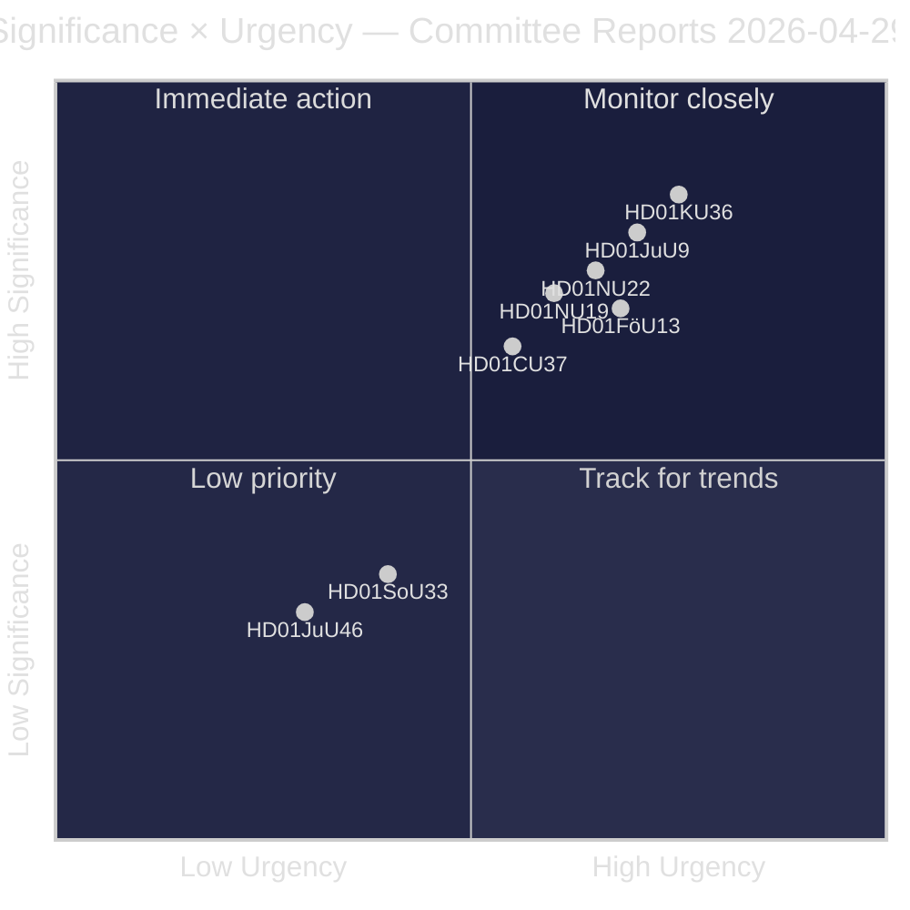
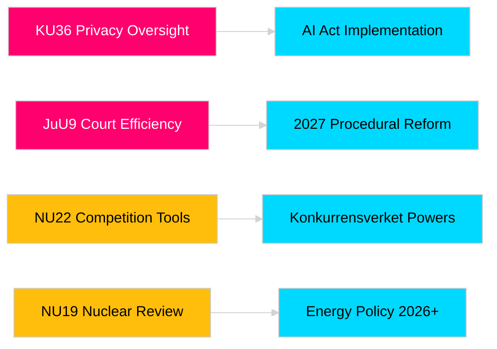

# Riksdagens utskottsbetänkanden stärker lagstiftningsansvar och säkerhetsramverk

**Författare**: James Pether Sörling  
**Datum**: 2026-04-30  
**Artikeldatum**: 2026-04-29  
**Klassificering**: PUBLIC  
**Konfidensgrad**: MEDIUM-HIGH [B2]

## 🎯 Sammanfattning

Riksdagens utskottssession våren 2025/26 levererar åtta betänkanden som spänner över integritetsövervakning, rättsväsendets effektivitet, kontroll av sprängämnen, tillståndsprövning för kärnkraftsanläggningar, modernisering av konkurrensrätten och ingripanden på bostadsmarknaden. Konstitutionsutskottets retrospektiva granskning av digital integritet (HD01KU36) och Justitieutskottets domstolseffektiviseringsreform (HD01JuU9) har det högsta strategiska värdet och signalerar regeringens avsikt att modernisera rättsstatens infrastruktur under valåret 2026. Tre förslag påverkar direkt Sveriges EU-rättsliga anpassning under en tid av förhöjd nordisk säkerhetsmedvetenhet.

## 🧭 3 beslut som detta underlag stöder

1. **Media och offentlig granskning**: Vilka utskottsbetänkanden förtjänar fördjupad bevakning med hänsyn till valårssaliens och politisk betydelse?
2. **Politisk uppföljning**: Vilka förslag medför implementeringsrisker som kräver uppföljning fram till Riksdagens omröstning (förväntas maj–juni 2026)?
3. **Civilsamhälle och jurister**: Vilka rättsreformer (JuU9 domstolseffektivitet, KU36 digital integritet, NU22 konkurrens) kräver omedelbar intressentsrespons?

## Läs på 60 sekunder

- **Integritetsledarskap (HD01KU36 [B2])**: KU föreslår 17 förbättringar av ramverk för digital integritet med utgångspunkt i övervakningstidsperioden 2020–2024 — sätter dagordningen för implementering av AI-förordningen och gränser för statlig övervakning.
- **Domstolsreform (HD01JuU9 [B2])**: JuU lägger fram ett paket för processrättslig effektivisering som riktar sig mot balansen i ärendehanteringen, skriftliga förfaranden och digitala inlagor — implementeringsmål 2027.
- **Konkurrensmodernisering (HD01NU22 [B2])**: NU inför nya utredningsverktyg för Konkurrensverket riktade mot både privata marknader och offentlig upphandling; anpassning till EU:s förordning om digitala marknader är central.
- **Kärnkraftstillstånd (HD01NU19 [B2])**: NU effektiviserar kärnkraftsgranskning under ny Energimyndighetstruktur — avgörande för Sveriges kärnkraftsambitioner.
- **Sprängämneskontroll (HD01FöU13 [B3])**: FöU skärper kontrollerna av prekursorer och myndighetsövergripande informationsdelning i enlighet med EU-förordning 2019/1148 — förhöjd säkerhetspolitisk relevans.
- **Bostadsgaranti (HD01CU37 [B2])**: CU möjliggör kommunala hyresgarantier för socialt utsatta grupper — omtvistat mellan regeringens bostadsmarknadsliberalisering och socialdemokratisk bostadspolitik.
- **Serveringstillstånd förenkling (HD01SoU33 [C2])**: SoU tar bort obligatoriskt krav på matservering för alkoholtillstånd — avreglering för besöksnäringen.
- **Europol-delegation (HD01JuU46 [C1])**: Årlig parlamentarisk redovisningsrapport — procedurell.

## Viktigaste framåtblickande utlösare

**KU36:s kammaromröstning (förväntas 2026-05-06)**: Första parlamentariska omröstningen om ramen för digital integritetspolitik efter EU:s AI-förordning — utfallet signalerar balansen mellan Regering och opposition kring gränser för övervakningsstaten inför valet 2026.

## Konfidensklassificering

Övergripande bedömningskonfidensgrad: MEDIUM-HIGH. Primära källor: Riksdagens betänkanden (offentliga). Ingen proprietär eller läckt data använd.

<!-- source-sha: 34f4e52b496d9d798f623f205ad98b050ff2f0e7 -->
