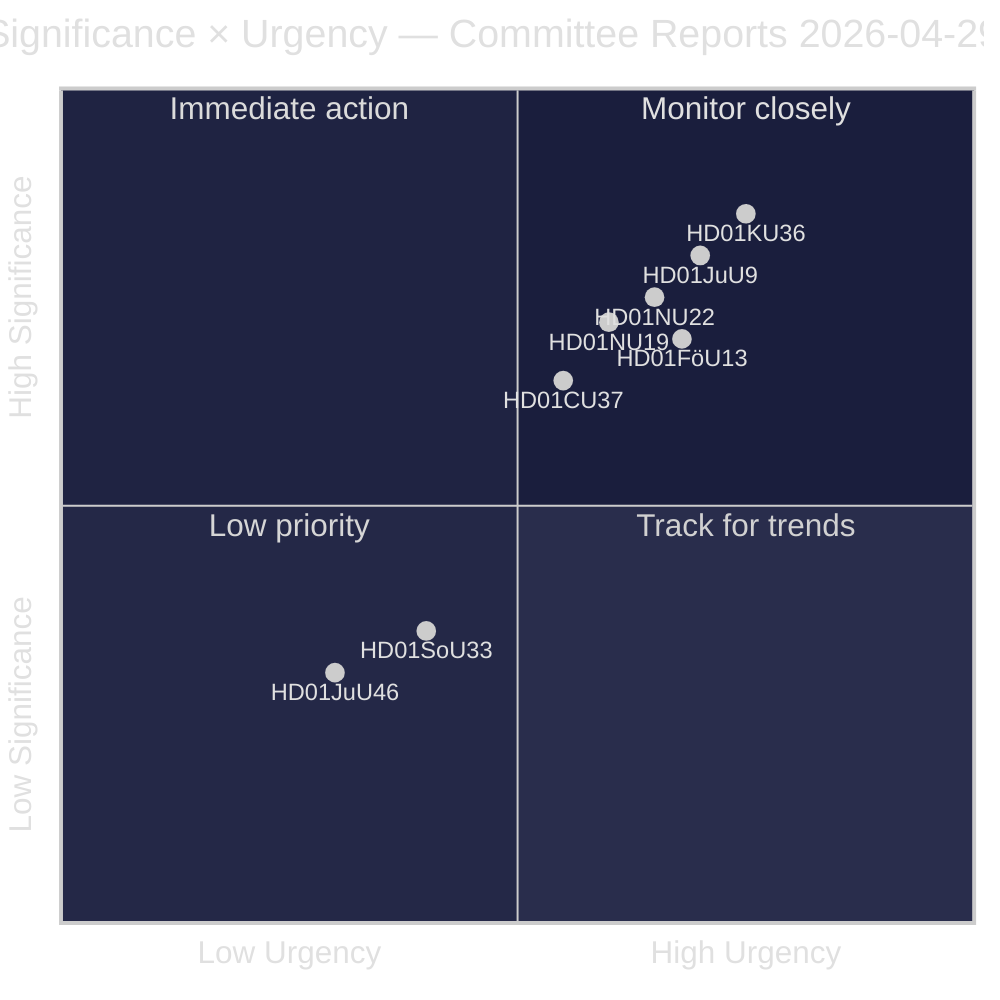
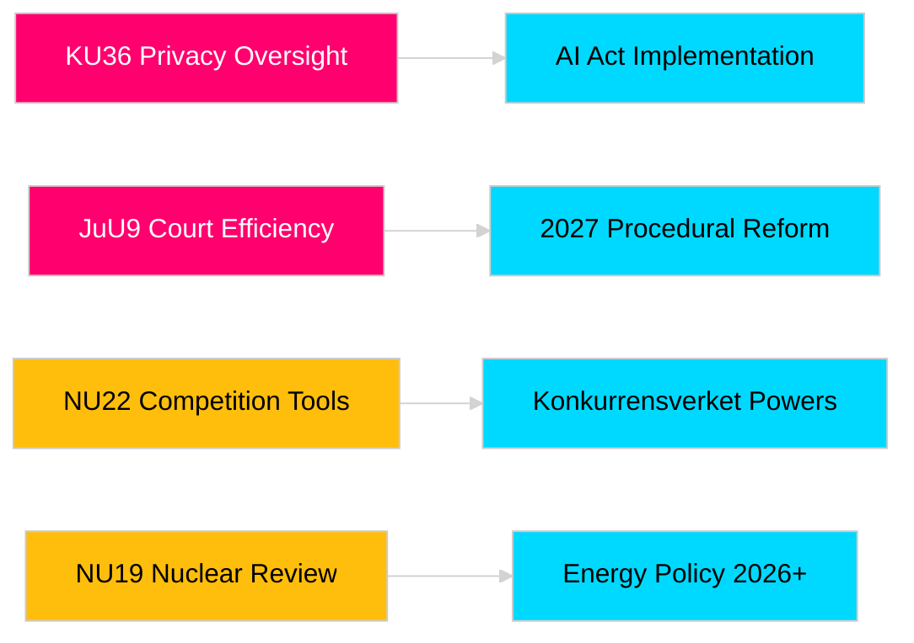

# 瑞典议会委员会报告强化立法责任与安全框架

**作者**: James Pether Sörling  
**日期**: 2026-04-30  
**文章日期**: 2026-04-29  
**分类**: 公开  
**置信度**: 中高 [B2]

## 🎯 执行摘要

瑞典议会（Riksdag）2025/26年春季委员会会期提交了八份报告，涵盖隐私监督、司法效率、爆炸物管控、核设施许可改革、竞争法现代化以及住房市场干预。宪法委员会对数字完整性的回溯性审查（HD01KU36）和司法委员会的法院效率改革（HD01JuU9）具有最高战略分量，表明政府在2026年选举年推进法治基础设施现代化的意图。在北欧安全意识增强的背景下，三项提案直接影响瑞典与欧盟的监管对齐。

## 🧭 本简报支持的三项决策

1. **媒体与公共问责**: 鉴于选举年的重要性和政治意义，哪些委员会报告值得深度报道？
2. **政策监测**: 哪些提案存在需要追踪至议会投票（预计2026年5至6月）的实施风险？
3. **公民社会与法律从业者**: 哪些法律改革（JuU9司法效率、KU36数字隐私、NU22竞争）需要利益相关者立即作出回应？

## 60秒速读

- **隐私领导力（HD01KU36 [B2]）**: KU提议基于其2020至2024年监督周期对数字完整性框架进行17项改进——为人工智能法规实施和公共部门监控限制设置议程。
- **司法改革（HD01JuU9 [B2]）**: JuU推进针对案件积压、书面程序和数字提交的程序效率改革包——实施目标2027年。
- **竞争现代化（HD01NU22 [B2]）**: NU为Konkurrensverket引入新调查工具，面向私人市场和公共采购；欧盟数字市场法居于核心。
- **核能许可（HD01NU19 [B2]）**: NU在新能源机构（Energimyndighet）架构下简化核设施审查——对瑞典核能扩张雄心至关重要。
- **爆炸物管控（HD01FöU13 [B3]）**: FöU依据欧盟法规2019/1148强化前体管控和跨机构情报共享——安全政策关联性提升。
- **住房保证 (Housing guarantee, HD01CU37 [B2])**: CU允许为社会弱势群体提供市政租金担保——政府住房市场自由化与社会民主党住房政策之间存在争议。
- **服务许可（HD01SoU33 [C2]）**: SoU取消酒类许可证的强制性餐饮服务要求——餐饮行业放松管制。
- **欧洲刑警组织代表团（HD01JuU46 [C1]）**: 年度议会责任报告——程序性事务。

## 最重要的未来触发因素

**KU36全院投票（预计2026-05-06）**: 欧盟AI法规出台后首次关于数字隐私政策框架的议会投票——结果将在2026年选举前揭示政府与反对党在监控国家边界问题上的力量对比。

## 置信度标记

总体评估置信度：中高。主要来源：瑞典议会报告（公开）。未使用专有或泄露数据。

<!-- source-sha: 34f4e52b496d9d798f623f205ad98b050ff2f0e7 -->
