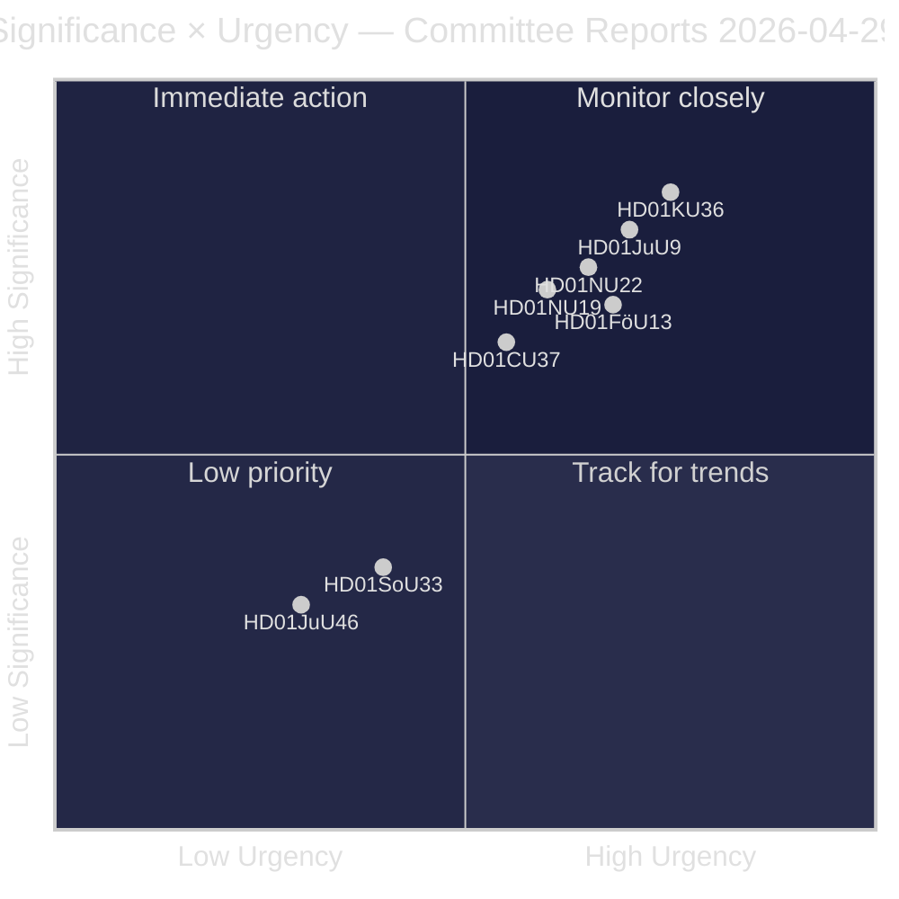
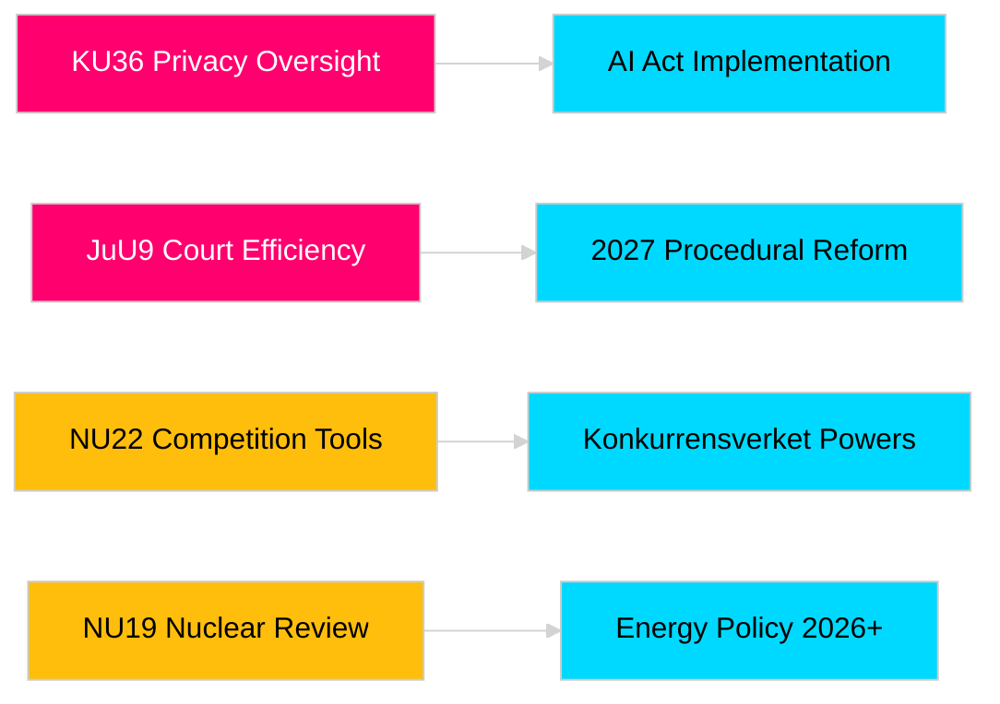

# 瑞典议会委员会报告推进立法问责与安全框架建设

**作者**: James Pether Sörling  
**日期**: 2026-04-30  
**文章日期**: 2026-04-29  
**分类**: PUBLIC  
**置信度**: MEDIUM-HIGH [B2]

## 🎯 摘要

瑞典议会（Riksdag）2025/26年春季委员会会期提交了八份委员会报告，涵盖隐私监督、司法效率、爆炸物管控、核设施许可改革、竞争法现代化以及住房市场干预。宪法委员会对数字诚信的回顾性审查（HD01KU36）和司法委员会的法院效率改革（HD01JuU9）具有最高战略权重，表明政府有意在2026年大选年现代化法治基础设施。三项提案直接影响瑞典在北欧安全意识增强背景下的欧盟法规协调。

## 🧭 本报告支持的3项决策

1. **媒体与公共问责**: 考虑到大选年的重要性和政治意义，哪些委员会报告值得深度报道？
2. **政策监测**: 哪些提案存在需要跟踪至Riksdag投票（预计2026年5月至6月）的实施风险？
3. **公民社会与法律从业者**: 哪些法律改革（JuU9法院效率、KU36数字隐私、NU22竞争）需要利益相关方立即回应？

## 60秒阅读

- **隐私领导力（HD01KU36 [B2]）**: KU提议在2020–2024年监督周期基础上对数字诚信框架进行17项改进——为《人工智能法》实施和公共部门监控限制设定议程。
- **法院改革（HD01JuU9 [B2]）**: JuU提出针对案件处理积压、书面程序和数字提交的程序效率改革方案——实施目标2027年。
- **竞争现代化（HD01NU22 [B2]）**: NU为Konkurrensverket引入针对私人市场和公共采购的新调查工具；与欧盟《数字市场法》协调居于核心地位。
- **核许可（HD01NU19 [B2]）**: NU在新能源局架构下简化核设施审查——对瑞典核能扩张雄心至关重要。
- **爆炸物管控（HD01FöU13 [B3]）**: FöU依据欧盟法规2019/1148加强前体物质管控和跨机构信息共享——安全政策相关性显著提升。
- **住房保障（HD01CU37 [B2]）**: CU允许市政府为社会弱势群体提供租房担保——在政府住房市场自由化与社会民主党住房政策之间存在争议。
- **服务许可简化（HD01SoU33 [C2]）**: SoU取消酒类许可的强制餐饮要求——餐饮业解除管制。
- **欧洲刑警组织代表团（HD01JuU46 [C1]）**: 年度议会问责报告——程序性事项。

## 最重要的前瞻触发因素

**KU36全体投票（预计2026-05-06）**: 欧盟《人工智能法》出台后关于数字隐私政策框架的首次议会投票——结果将显示政府与反对党在2026年大选前对监控国家边界的立场平衡。

## 置信度标签

总体评估置信度：MEDIUM-HIGH。主要来源：Riksdag委员会报告（公开）。未使用任何专有或泄露数据。

<!-- source-sha: 34f4e52b496d9d798f623f205ad98b050ff2f0e7 -->
