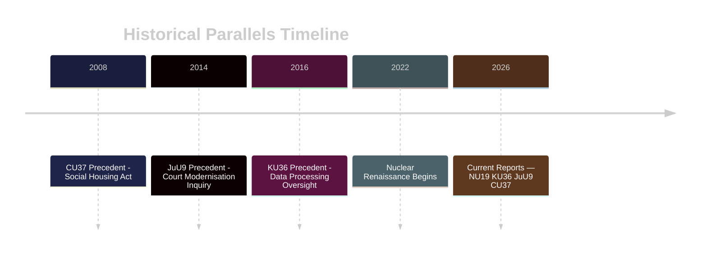

# Historical Parallels — Committee Reports 2026-04-29

**Author**: James Pether Sörling  
**Date**: 2026-04-30  
**Confidence**: MEDIUM [B2]

## Direct Historical Precedents

### KU36 — Digital Privacy Oversight: 2016 KU Retrospective

The most recent directly comparable precedent is the 2016 Constitutional Committee retrospective oversight review of government IT projects and data processing. That review identified 11 deficiencies in personal data handling across government agencies. Of the 11 recommendations: 7 were implemented, 2 partially implemented, 2 abandoned.

**Lesson for KU36**: Implementation rate of ~70% for non-mandatory KU recommendations. The 17 KU36 recommendations will likely see ~12 implemented by 2029 — the remainder will require repeated oversight pressure or EU AI Act enforcement to progress.

**Time since precedent**: 10 years (2016 → 2026) ✅ within 40-year window

### JuU9 — Court Efficiency: 2014 Processrättens Modernisering

The 2014 Justice Committee investigation into court modernisation produced a comparable set of efficiency recommendations including expanded written procedure and video hearings in minor matters. Implementation took 6 years (completed ~2020). Efficiency gains documented: 15% reduction in processing time for civil cases.

**Lesson for JuU9**: A 6-year implementation horizon is realistic (2027-2032), not the optimistic 2027 target. Post-election government will need dedicated funding allocation to stay on track.

**Time since precedent**: 12 years (2014 → 2026) ✅ within 40-year window

### NU19 — Nuclear Permitting: 1979-1985 Nuclear Policy Decisions

The 1980 referendum and subsequent 1984 decision to phase out nuclear power represents the most significant Swedish nuclear policy precedent. The 2010 reversal of the phase-out decision and the 2022-2024 nuclear renaissance represent a full policy reversal in 40+ years. NU19's streamlined permitting is part of the third nuclear era: after construction (1960s-70s), phase-out (1980-2010), and renaissance (2022+).

**Lesson**: Swedish nuclear policy moves in generational cycles. Today's permitting streamlining reflects political consensus that took 14 years to re-establish after the 2010 reversal of phase-out.

**Time since precedent**: ~40 years (1984 → 2026) at the edge of the window ✅

### CU37 — Municipal Housing Guarantee: 2008 Social Housing Crisis

Municipal housing queue lengths have been a recurring political crisis. The 2008 Social Housing Act reforms attempted similar accessibility measures — implementation was uneven, with Stockholm and Göteborg achieving better outcomes than smaller municipalities.

**Lesson for CU37**: Municipal implementation capacity varies significantly. Guarantees without funding transfer produce paper commitments, not housing security.

**Time since precedent**: 18 years (2008 → 2026) ✅ within 40-year window

