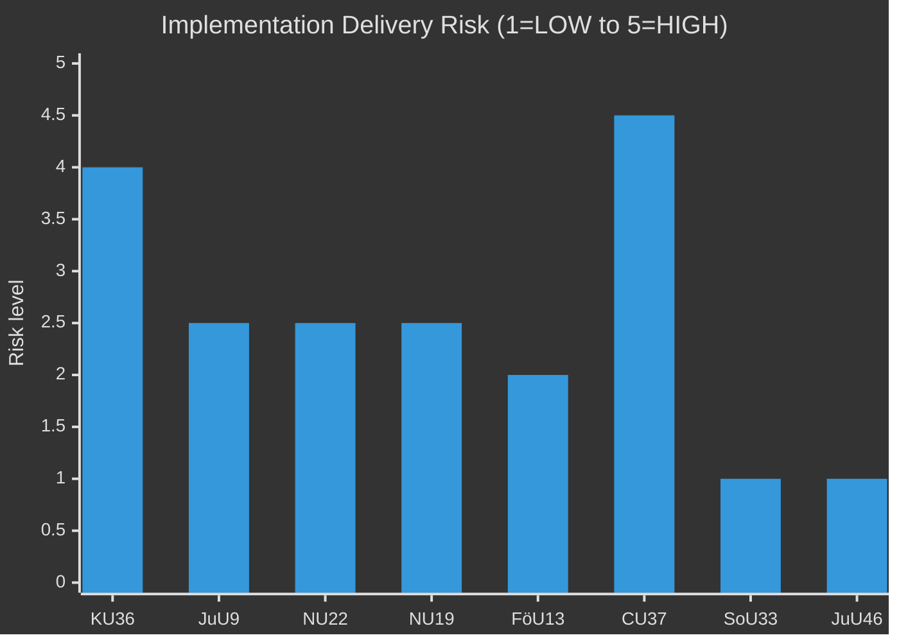

# Implementation Feasibility Assessment — Committee Reports 2026-04-29

**Author**: James Pether Sörling  
**Date**: 2026-04-30  
**Confidence**: MEDIUM [B2]

## Delivery Risk Matrix

| Report | Implementation lead agency | Technical complexity | Political will | Funding certainty | Overall risk |
|--------|--------------------------|---------------------|---------------|------------------|-------------|
| KU36 | Datainspektionen + multiple agencies | HIGH (AI Act alignment) | HIGH | LOW (no budget line yet) | HIGH |
| JuU9 | Domstolsverket | MEDIUM (digital systems) | HIGH | MEDIUM | MEDIUM |
| NU22 | Konkurrensverket | MEDIUM (new legal powers) | HIGH | LOW | MEDIUM |
| NU19 | Strålsäkerhetsmyndigheten (SSM) | HIGH (regulatory reform) | HIGH | LOW | MEDIUM |
| FöU13 | Myndigheten för samhällsskydd och beredskap (MSB) | MEDIUM (EU directive) | HIGH | LOW | MEDIUM |
| CU37 | Kommunerna (249 municipalities) | LOW (guarantee mechanism) | MEDIUM | VERY LOW | HIGH |
| SoU33 | Folkhälsomyndigheten | LOW (rule removal) | HIGH | NOT APPLICABLE | LOW |
| JuU46 | Rikspolisstyrelsen / EUROPOL liaison | LOW (delegation report) | HIGH | NOT APPLICABLE | LOW |

## Statskontoret Relevance by Agency

| Agency | Statskontoret relevance | Status |
|--------|------------------------|--------|
| Datainspektionen | Capacity assessment needed — recent AI mandate expansion | Relevant; no current assessment retrieved |
| Domstolsverket | IT procurement history — previous digital projects scrutinised | Relevant; check Statskontoret 2023-2024 court IT review |
| MSB | EU directive implementation track record | Relevant; EU 2016/1148 NIS2 implementation review (2024) |
| Konkurrensverket | Capacity for expanded investigation mandate | Relevant; budget expansion request pending |

## Critical Path Analysis — JuU9 (highest visibility)

**2026 Q2**: Chamber vote (May). Government commission to Domstolsverket.  
**2026 Q3–Q4**: Post-election, new government must reaffirm commitment. Risk: new coalition may reprioritise budget.  
**2027**: Pilot digital hearing system in administrative courts.  
**2028-2029**: Full rollout. Processing time target: -20%.

**Critical path risks**: IT procurement delays (historical 18–24 month slippage), post-election budget reallocation, union resistance (court personnel).

## KU36 Implementation Pathway

KU36 recommendations are not automatically legally binding — they require either:  
(a) Government bill implementing each recommendation, or  
(b) EU AI Act Article 25+ direct applicability (from August 2026)

**Fastest route**: EU AI Act's direct effect will implement approximately 6 of 17 KU36 recommendations without a government bill. The remaining 11 require legislative follow-up.

