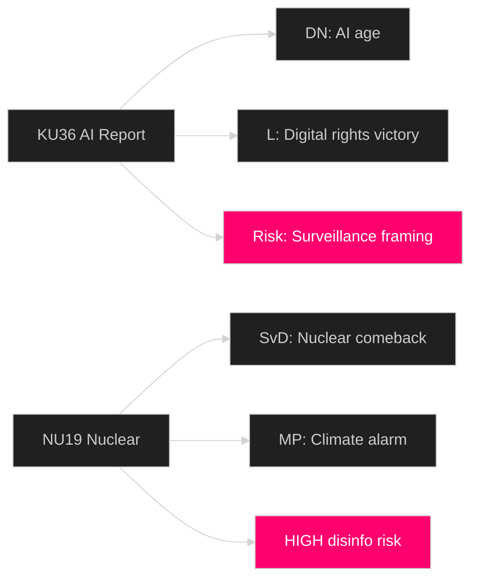

# Media Framing Analysis — Committee Reports 2026-04-29

**Author**: James Pether Sörling  
**Date**: 2026-04-30  
**Confidence**: LOW–MEDIUM [C2]  
**Note**: Predictive framing analysis (media coverage not yet published as of analysis time)

## Predicted Media Framing by Outlet

### Mainstream Press — Likely Lead Stories

| Outlet | Predicted lead | Expected framing angle |
|--------|---------------|----------------------|
| Dagens Nyheter | KU36 AI oversight OR NU19 nuclear | "Sweden prepares for AI age" / "Nuclear comeback accelerates" |
| Svenska Dagbladet | NU19 nuclear + NU22 competition | "Government delivers on nuclear promise" / "Pro-business reform" |
| Aftonbladet | CU37 housing OR KU36 surveillance | "Renters get protection" / "Big Brother Sweden?" |
| Expressen | Nuclear + court reform | "Justice system crisis" / "Nuclear: Sweden's energy future" |
| SVT/SR (public media) | KU36 (public interest AI angle) | Balanced coverage, focus on KU constitutional function |

### Party Media Framing

| Party | Likely framing | Platform |
|-------|---------------|----------|
| M | Nuclear progress + court efficiency as government success | Social media, morning briefings |
| SD | Security: FöU13 explosives control + nuclear energy security | Party media + SD-aligned outlets |
| S | CU37 housing protection + court access as S priorities | SAP.se, party press |
| L | KU36 as L's digital rights victory | Expressen op-ed |
| MP | Nuclear alarm: NU19 as climate risk | Green party newsletter, social media |
| V | Housing right + nuclear opposition | Röda rummet, social media |
| KD | Court reform + family values (housing) | KD.se |
| C | Competition (NU22) + rural (SoU33) | Landsbygdsnyheter, C.se |

### International Media Prediction

| Outlet | Likely angle |
|--------|-------------|
| Politico EU | NU19 nuclear + AI Act compliance angle |
| The Local SE | English-language explainer on KU36 for expat audience |
| Reuters | Nuclear energy permitting reform — energy market context |

## Narrative Risk Assessment

**Disinformation Risk — HIGH for NU19**:  
Nuclear permitting reform is a target for climate-skepticism-adjacent mis-framing in social media. Key risk: stories claiming "Sweden rushes nuclear without safety review" — factually incorrect (SVT reports; only permitting timeline changed, not safety standards).

**Disinformation Risk — MEDIUM for KU36**:  
AI oversight report could be framed as "government surveillance expansion" by actors misreading the constitutional oversight function of KU.

