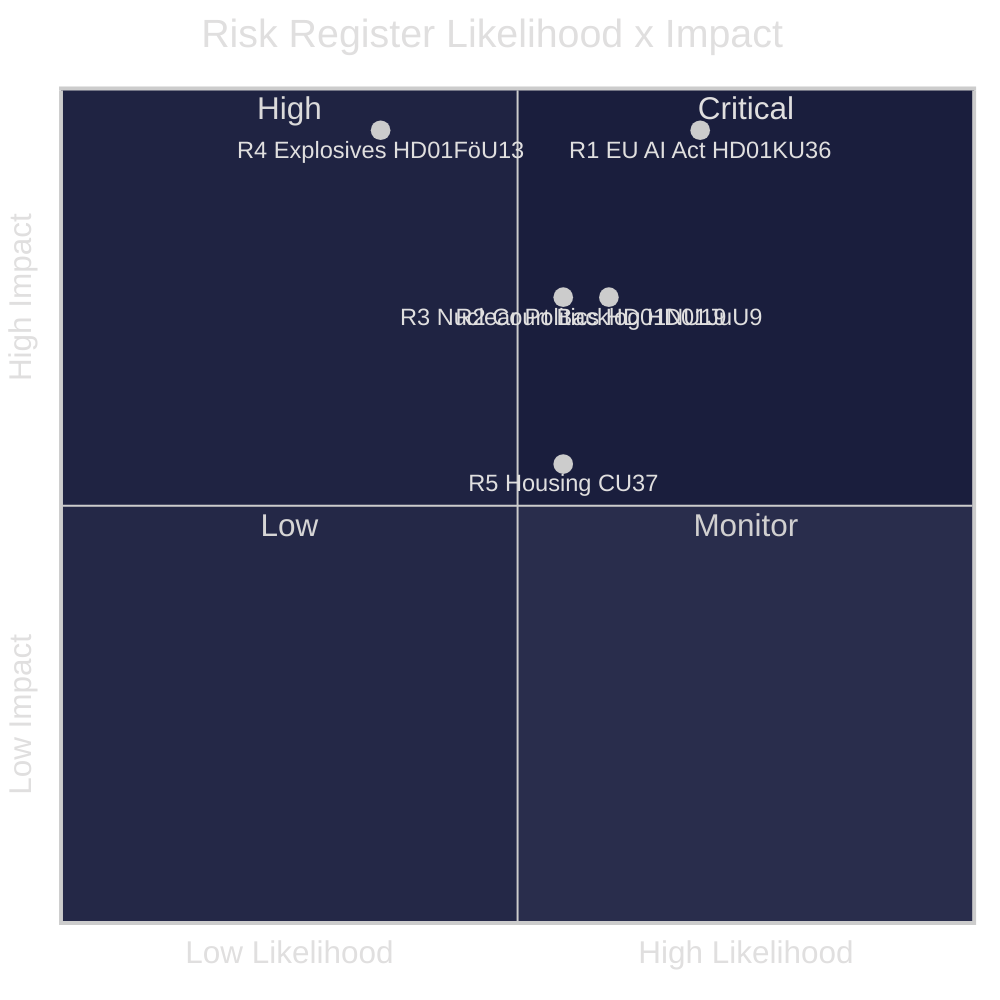
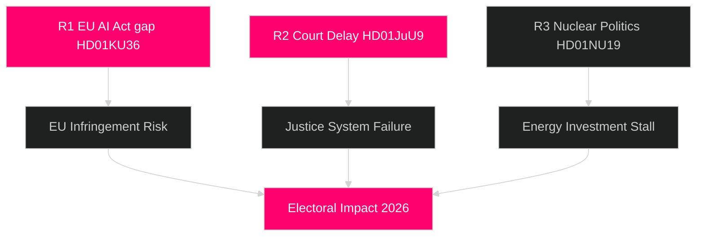

# Risk Assessment -- Committee Reports 2026-04-29

**Author**: James Pether Sorling  
**Date**: 2026-04-30  
**Confidence**: MEDIUM [B2]

## 5-Dimension Risk Register

| Risk ID | Description | Dimension | L | I | L*I | Cascading Chain |
|---------|-------------|-----------|---|---|-----|-----------------|
| R1 | EU AI Act non-compliance if KU36 unimplemented | Institutional | 4 | 5 | 20 | KU36 gap: HD01KU36 |
| R2 | Court backlog worsens during JuU9 reform | Operational | 3 | 4 | 12 | HD01JuU9 delay |
| R3 | Nuclear opposition disrupts NU19 permitting | Political | 3 | 4 | 12 | HD01NU19 |
| R4 | Explosives breach despite FöU13 controls | Security | 2 | 5 | 10 | HD01FöU13 gap |
| R5 | Municipal guarantee rent inflation CU37 | Economic | 3 | 3 | 9 | HD01CU37 |

## Cascading Chains

**Primary**: AI oversight gap (HD01KU36) to EU infringement to admin disruption to electoral impact 2026  
**Secondary**: Court delay (HD01JuU9) to persistent backlog to rule-of-law erosion to international reputation

## Posterior Probabilities

| Risk | Prior P | Updated P (if recommendations accepted) | Delta |
|------|---------|----------------------------------------|-------|
| R1 EU infringement | 0.40 | 0.25 | -0.15 |
| R2 Court backlog | 0.55 | 0.35 | -0.20 |

