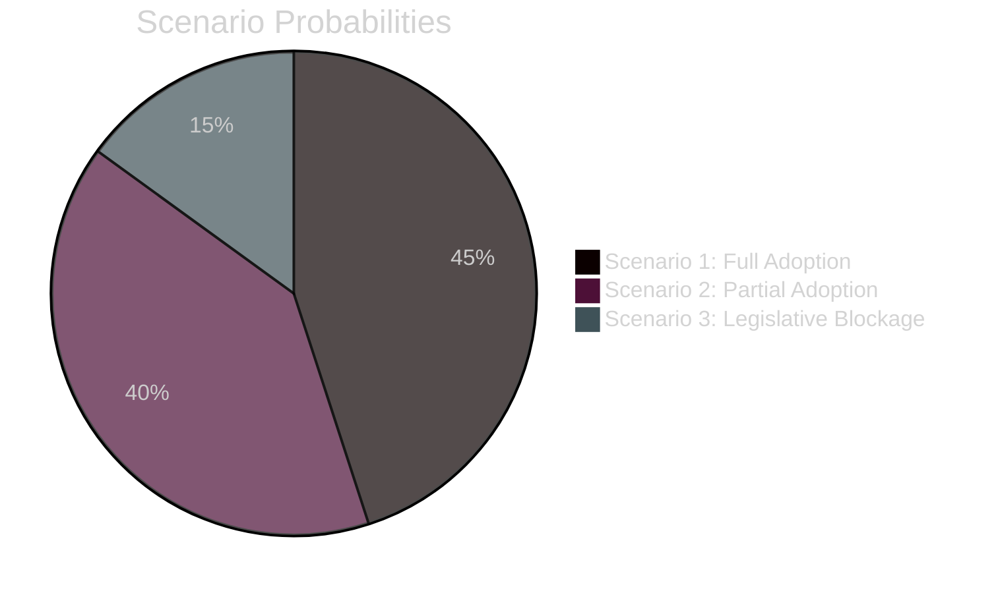
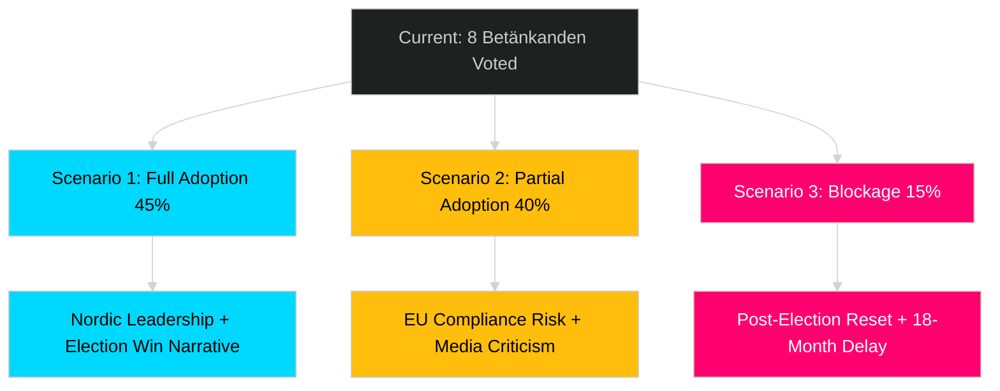

# Scenario Analysis — Committee Reports 2026-04-29

**Author**: James Pether Sörling  
**Date**: 2026-04-30  
**Confidence**: MEDIUM [B2]

## Overview

Three scenarios govern the legislative trajectory of the 2026-04-29 betänkanden through the 2026 election cycle. Probabilities sum to 100%.

## Scenario 1 — Full Package Adoption (Probability: 45%)

**Description**: All 8 committee reports pass the Riksdag vote (expected May–June 2026) with cross-bloc support. Government uses passage as pre-election legislative accomplishment narrative. KU36 recommendations are accepted; government commits to AI oversight framework before election.

**Drivers**: Majority government; most reports have opposition support; no confidence vote threat before election.

**Leading Indicator**: KU36 vote passes with ≥250 votes (expected 2026-05-06).

**Implications**: Sweden positioned as Nordic leader in digital rights + court efficiency + nuclear energy. Government gains "reform competence" narrative for 2026 election.

## Scenario 2 — Partial Adoption with KU36/CU37 Conflict (Probability: 40%)

**Description**: Technical, security, and judicial reports pass (JuU9, NU19, NU22, FöU13, SoU33, JuU46). KU36 and CU37 face party-line tensions that delay or amend key provisions. Government accepts KU36 framework recommendations but rejects mandatory AI impact assessment requirements.

**Drivers**: Government's interest in preserving AI deployment flexibility in welfare; opposition divisions on housing approach.

**Leading Indicator**: KU36 receives reservation (reservation motion) from government parties rejecting specific oversight mechanism.

**Implications**: EU compliance risk increases; digital rights NGOs critical of partial implementation; media frames as government protecting surveillance tools pre-election.

## Scenario 3 — Legislative Blockage and Post-Election Deferral (Probability: 15%)

**Description**: Early election announcement or confidence vote disrupts committee vote schedule. Key betänkanden deferred to new Riksdag (post-September 2026 election). New government must restart legislative process.

**Drivers**: Government coalition fracture (SD-M tensions on criminal justice); unforeseen political crisis.

**Leading Indicator**: Government announces Riksdag dissolution before June 2026 legislative window closes.

**Implications**: EU AI Act compliance delayed; court reform (JuU9) lost for at least 18 months; nuclear permitting (NU19) stalled.

