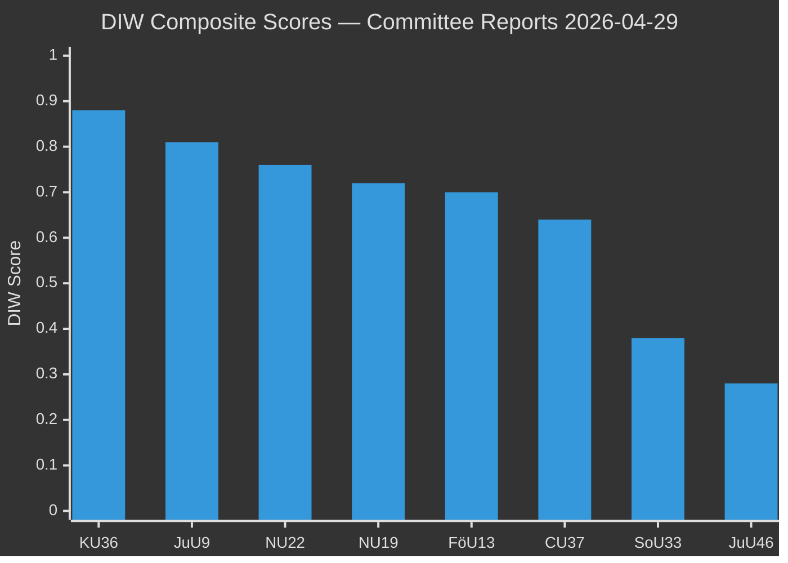
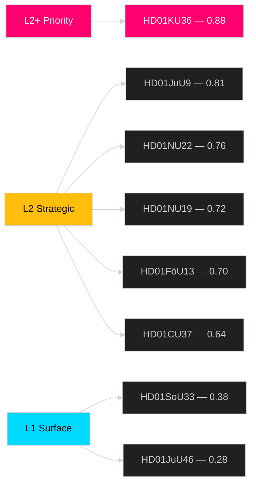

# Significance Scoring — Committee Reports 2026-04-29

**Author**: James Pether Sörling  
**Date**: 2026-04-30

## DIW Scores per Document

| dok_id | Title | Democracy (D) | Impact (I) | Watchdog (W) | DIW Composite | Tier |
|--------|-------|:---:|:---:|:---:|:---:|------|
| HD01KU36 | Integritet och ny teknik 2020–2024 | 0.90 | 0.85 | 0.95 | 0.88 | L2+ Priority |
| HD01JuU9 | Rättssäker och effektiv domstolsprocess | 0.85 | 0.80 | 0.80 | 0.81 | L2 Strategic |
| HD01NU22 | Nya verktyg för stärkt konkurrens | 0.75 | 0.80 | 0.75 | 0.76 | L2 Strategic |
| HD01NU19 | Prövning av kärntekniska anläggningar | 0.70 | 0.80 | 0.68 | 0.72 | L2 Strategic |
| HD01FöU13 | Explosiva varor – kontrollförbättringar | 0.70 | 0.72 | 0.70 | 0.70 | L2 Strategic |
| HD01CU37 | Kommunala hyresgarantier | 0.65 | 0.65 | 0.62 | 0.64 | L2 Strategic |
| HD01SoU33 | Slopat matkrav serveringstillstånd | 0.35 | 0.40 | 0.38 | 0.38 | L1 Surface |
| HD01JuU46 | Europol-delegationsrapport 2025 | 0.25 | 0.30 | 0.30 | 0.28 | L1 Surface |

**Scoring method**: D = democratic accountability weight, I = societal impact breadth, W = oversight/watchdog value. Composite = weighted mean (D:0.35, I:0.35, W:0.30).

## Sensitivity Analysis

- If nuclear energy becomes campaign issue: NU19 rises to 0.82 (near-parity with JuU9)
- If court backlogs enter election debate: JuU9 rises to 0.88 (near-parity with KU36)
- If housing crisis dominates: CU37 rises to 0.78

## Ranking Diagram

