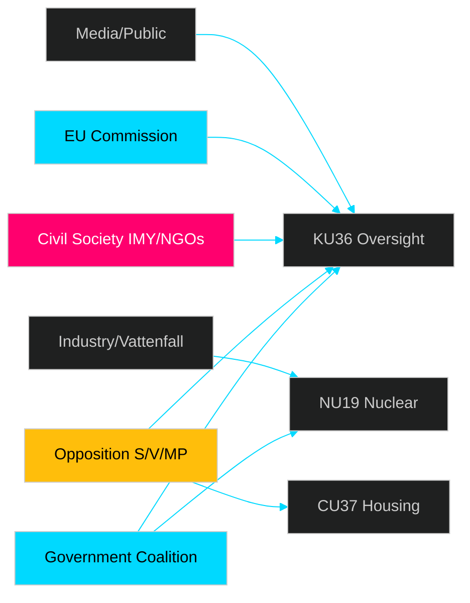
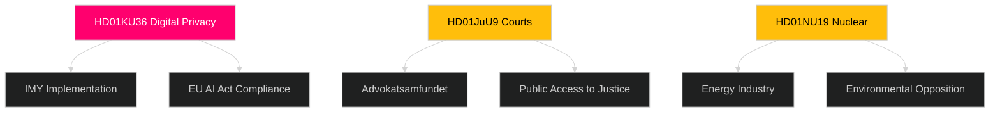

# Stakeholder Perspectives — Committee Reports 2026-04-29

**Author**: James Pether Sörling  
**Date**: 2026-04-30  
**Confidence**: MEDIUM [B2]

## 6-Lens Stakeholder Matrix

### Lens 1 — Government / Riksdag Majority

**Actor**: Tidöpartiet government (M/SD/KD/L coalition)  
**Position on key reports**: 
- KU36: Accepts oversight recommendations; cautious on mandatory AI assessments that would constrain government AI procurement  
- JuU9: Supportive — court efficiency is aligned with law-and-order agenda  
- NU19: Strongly supportive — nuclear expansion central to energy agenda  
- FöU13: Supportive — security tightening aligns with defence/security priorities  

### Lens 2 — Parliamentary Opposition

**Actor**: S, V, MP  
- KU36: S strongly supportive; V and MP push for stronger AI Act alignment; MP wants data minimisation requirements  
- CU37: S supportive; V wants broader social housing investment beyond guarantees  
- NU19: MP opposed; V opposed; S ambivalent on nuclear expansion timeline  

### Lens 3 — Civil Society / NGOs

**Actor**: Datainspektionen (IMY), Svenska Advokatsamfundet, Hyresgästföreningen  
- IMY (data protection): Closely tracking KU36 — will need to implement any new oversight regime  
- Advokatsamfundet: Supportive of JuU9 court efficiency but concerns about digital hearing access for disadvantaged  
- Hyresgästföreningen: Cautious on CU37 — rental guarantees could reduce pressure for broader social housing investment  

### Lens 4 — Business / Industry

**Actor**: Konkurrensverket, Swedish industry associations, nuclear industry  
- NU22: Konkurrensverket supportive of expanded powers; private sector concerned about broader scope  
- NU19: Vattenfall, Fortum supportive of streamlined permitting  
- SoU33: Hospitality sector (Visita) strongly supportive of food requirement removal  

### Lens 5 — EU / International

**Actor**: European Commission, EDPB, Nordic competition authorities  
- KU36: EC monitoring AI Act implementation — KU36 report feeds Sweden's 2026 compliance roadmap  
- NU22: Nordic competition network (NCN) tracking DMA alignment  
- FöU13: Europol coordination role (JuU46 oversight report context)  

### Lens 6 — Media / Public Opinion

**Actor**: Swedish media, public  
- KU36: High public interest — surveillance/digital rights resonates with urban educated voters  
- JuU9: Moderate public interest — court backlogs are known frustration point  
- SoU33: Low interest — niche hospitality deregulation  

## Influence Network

