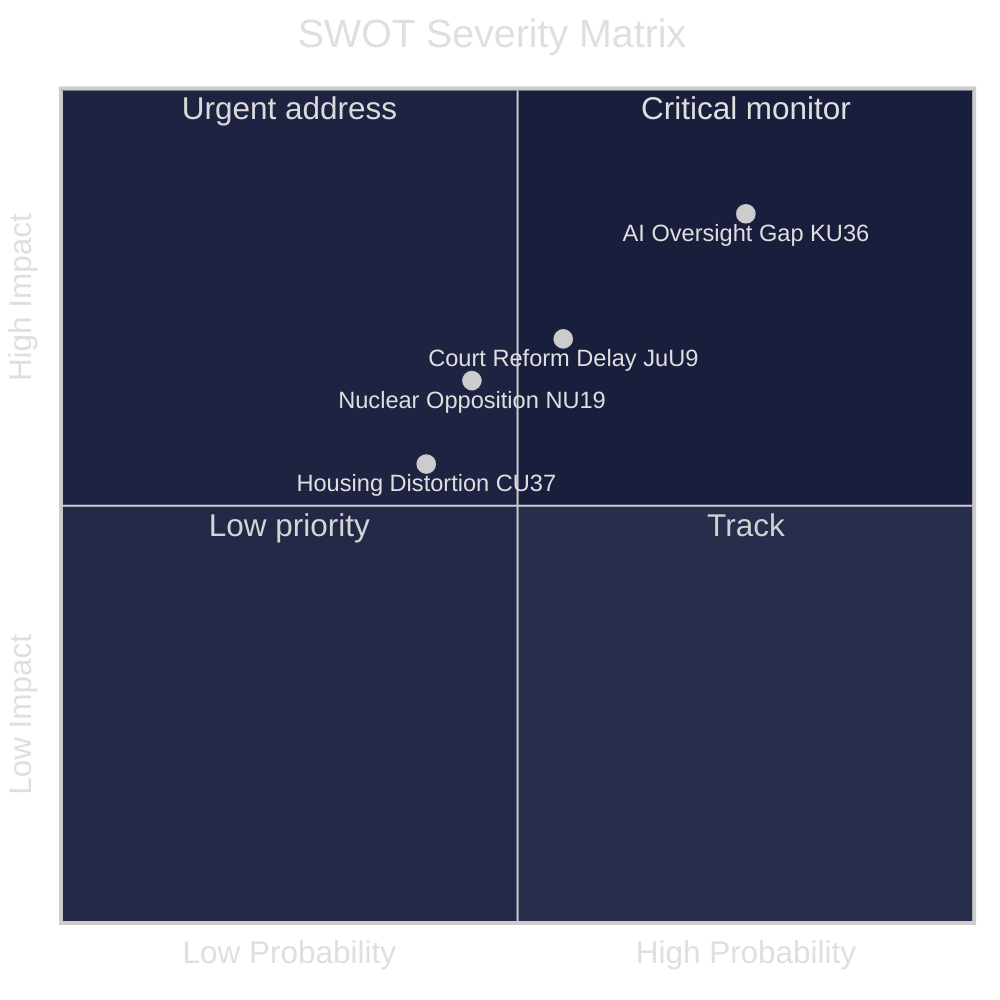
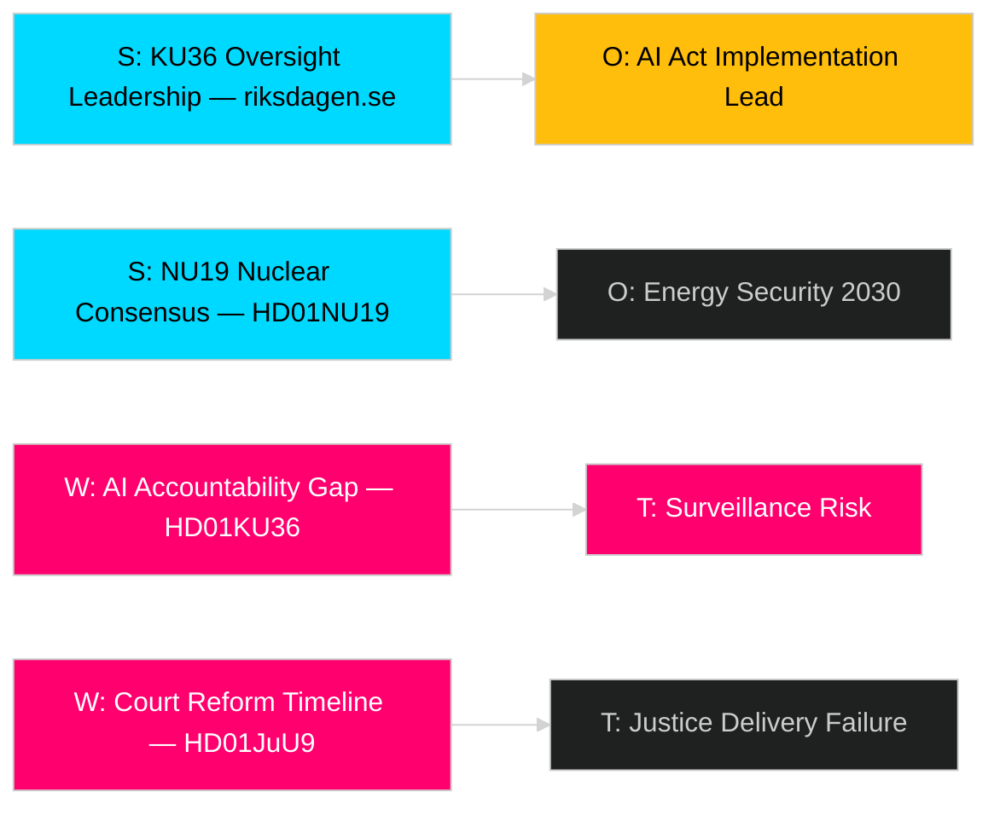

# SWOT Analysis — Committee Reports 2026-04-29

**Author**: James Pether Sörling  
**Date**: 2026-04-30  
**Confidence**: MEDIUM [B2]

## Strengths

| Evidence | Description | Admiralty |
|----------|-------------|-----------|
| HD01KU36 | Sweden leads Nordic peers in Constitutional Committee digital oversight; 17 concrete recommendations demonstrate institutional maturity and cross-party accountability | [B2] |
| HD01JuU9 | JuU9 proposes evidence-based court efficiency measures including digital hearings and written procedure expansion — reduces systemic justice delays | [B2] |
| HD01NU19 | Nuclear facility permitting reform enables Sweden's nuclear expansion agenda; cross-bloc support signals rare bipartisan energy consensus | [B2] |
| data.riksdagen.se (HD01NU22) | Competition law modernisation gives Konkurrensverket market intelligence tools comparable to EU competition authorities | [B2] |

## Weaknesses

| Evidence | Description | Admiralty |
|----------|-------------|-----------|
| HD01KU36 | KU oversight cycle identified gaps in governmental AI system accountability; no mandatory pre-deployment assessment requirement proposed — weaker than EU AI Act requirements | [B2] |
| HD01CU37 | Municipal rental guarantees rely on local government capacity that varies widely; Stockholm-centric implementation risk | [B2] |
| HD01JuU9 | Court reform timeline (target 2027) is post-election — implementation risk if government changes | [B3] |

## Opportunities

| Evidence | Description | Admiralty |
|----------|-------------|-----------|
| HD01KU36 | EU AI Act implementation window (by Aug 2026) creates legislative momentum for comprehensive digital rights framework | [B2] |
| HD01NU22 | DMA enforcement experience positions Sweden for lead role in Nordic competition network | [B2] |
| HD01FöU13 | Cross-agency explosives intelligence sharing creates institutional precedent for broader Nordic security data exchange | [B3] |
| riksdagen.se | Spring 2026 legislative sprint enables bundled rule-of-law reform before election — rare reform window | [B2] |

## Threats

| Evidence | Description | Admiralty |
|----------|-------------|-----------|
| HD01KU36 | Government AI deployment in welfare and immigration without privacy safeguards — KU oversight gap explicitly flagged | [B2] |
| HD01JuU9 | Court backlog crisis may worsen if digital infrastructure investment under-delivered | [B3] |
| HD01NU19 | Nuclear permitting reform could accelerate facilities opposed by environmental coalition — opposition risk | [B3] |
| HD01CU37 | Housing market distortion risk: rental guarantees could inflate rents in tight markets | [C3] |

## TOWS Matrix

| | Strengths | Weaknesses |
|---|-----------|------------|
| **Opportunities** | SO: Use KU36 momentum to lead EU AI Act implementation with Nordic model | WO: Address implementation fragmentation in CU37 via national housing agency coordination |
| **Threats** | ST: Leverage NU22 competition tools to prevent tech monopoly harm to privacy | WT: JuU9 reform delayed + AI surveillance gaps = rule-of-law double vulnerability |

## Cross-SWOT

KU36 (digital rights) × FöU13 (security intel sharing) = institutional tension: same data infrastructure that enables security intelligence can undermine privacy — KU oversight critical.

