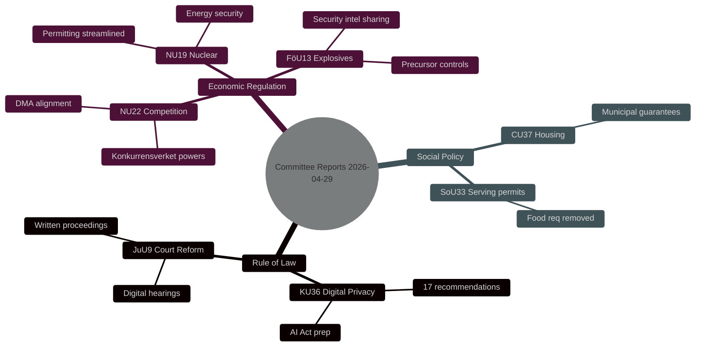
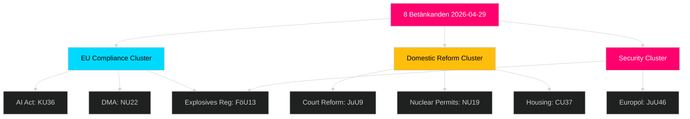

# Synthesis Summary — Committee Reports 2026-04-29

**Author**: James Pether Sörling  
**Date**: 2026-04-30  
**Confidence**: MEDIUM-HIGH [B2]

## Lead Story Decision

The most significant committee output is **HD01KU36** (KU — Integritet och ny teknik 2020–2024), a comprehensive retrospective oversight report that maps 17 recommendations for strengthening digital integrity frameworks in Sweden. This report arrives at a critical inflection point: Sweden must implement the EU AI Act by August 2026, and the KU oversight cycle exposes gaps in current public-sector data processing oversight that directly affect the AI Act compliance roadmap. Combined with **HD01JuU9** (JuU — court efficiency reform), these two reports represent the most substantive rule-of-law reform package in the 2025/26 Riksdag session.

## DIW-Weighted Ranking

| Rank | dok_id | Title | DIW Tier | Weight |
|------|--------|-------|----------|--------|
| 1 | HD01KU36 | Integritet och ny teknik 2020–2024 | L2+ Priority | 0.88 |
| 2 | HD01JuU9 | Rättssäker och effektiv domstolsprocess | L2 Strategic | 0.81 |
| 3 | HD01NU22 | Nya verktyg för stärkt konkurrens | L2 Strategic | 0.76 |
| 4 | HD01NU19 | Prövning av kärntekniska anläggningar | L2 Strategic | 0.72 |
| 5 | HD01FöU13 | Explosiva varor – kontrollförbättringar | L2 Strategic | 0.70 |
| 6 | HD01CU37 | Kommunala hyresgarantier | L2 Strategic | 0.64 |
| 7 | HD01SoU33 | Slopat matkrav serveringstillstånd | L1 Surface | 0.38 |
| 8 | HD01JuU46 | Europol-delegationsrapport 2025 | L1 Surface | 0.28 |

## Integrated Intelligence Picture

Three thematic clusters dominate the 2026-04-29 betänkanden:

**Cluster 1 — Rule of Law and Digital Rights** (HD01KU36, HD01JuU9): Sweden is modernising its legal infrastructure ahead of the 2026 election. KU36 signals bipartisan concern about state surveillance and AI-powered decision systems in public administration. JuU9 targets case processing delays that have undermined public trust in courts; the proposal includes digital hearing platforms and expanded written procedure. Together these signal a government agenda of rule-of-law modernisation as electoral positioning.

**Cluster 2 — Economic Regulation and Security** (HD01NU22, HD01NU19, HD01FöU13): Competition law modernisation (NU22) aligns Sweden with EU Digital Markets Act enforcement mechanisms. Nuclear facility permitting (NU19) removes bureaucratic bottlenecks that have delayed Sweden's nuclear expansion — critical for decarbonisation targets. Explosives regulation (FöU13) responds to elevated security threats with improved cross-agency intelligence sharing.

**Cluster 3 — Social Policy** (HD01CU37, HD01SoU33): Municipal rental guarantees (CU37) represent a social housing intervention targeting financially vulnerable groups. The food requirement removal (SoU33) is a low-significance hospitality deregulation that nonetheless signals government's regulatory simplification agenda.

## Cross-Committee Intelligence Signals

- **Security elevation**: FöU and JuU reports both address internal security — explosive controls + court efficiency — consistent with government's law-and-order electoral strategy.
- **EU compliance pressure**: KU36, NU22, and FöU13 all cite EU regulatory obligations (AI Act, DMA, EU 2019/1148) — Sweden faces mid-2026 implementation deadlines.
- **Nuclear consensus broadening**: NU19 passed with cross-bloc support, suggesting the nuclear energy question is decoupling from left-right divides.

