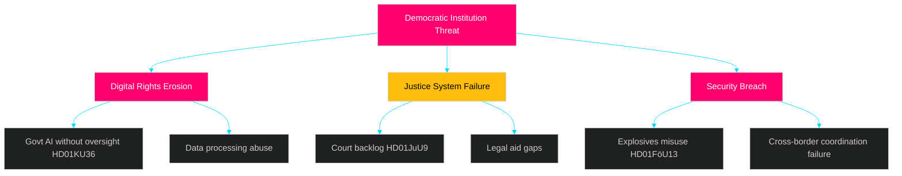
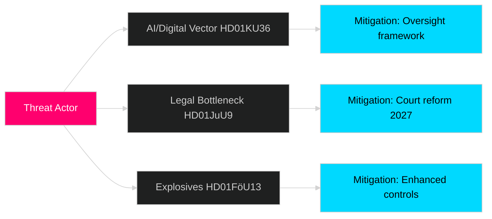

# Threat Analysis — Committee Reports 2026-04-29

**Author**: James Pether Sörling  
**Date**: 2026-04-30  
**Confidence**: MEDIUM [B2]

## Political Threat Taxonomy

### T1 — State Surveillance Overreach [L2+ Priority]

Government AI systems deployed in welfare and border control without adequate oversight. KU oversight cycle (HD01KU36) identified specific gaps in Controller-Processor accountability for public-sector AI. **Probability: HIGH** — KU documented this pattern directly.

**Source**: HD01KU36 | **Actor**: Government ministries + AI vendors | **Target**: Citizens' digital rights

### T2 — Judicial Efficiency Failure [L2 Strategic]

Continued court process inefficiency documented in JuU9 creates two-tier access to justice — affluent litigants use private arbitration while ordinary citizens wait years for hearings. **Probability: MEDIUM-HIGH** — pre-existing documented trend.

**Source**: HD01JuU9 | **Actor**: Resource-constrained district courts | **Target**: Rule-of-law integrity

### T3 — Explosives/Precursor Acquisition [L2 Strategic]

Despite FöU13 enhanced controls, regulatory gaps in online precursor sales and cross-border shipments remain exploitable by organised crime and extremist groups. **Probability: MEDIUM** — elevated Nordic threat environment.

**Source**: HD01FöU13 | **Actor**: Organised crime, extremist groups | **Target**: Public safety infrastructure

## Attack Tree

## Kill Chain Analysis — T1 Surveillance Overreach

**Stages**: Reconnaissance (identify AI gaps) → Weaponisation (unaccountable decisions) → Delivery (automated welfare/border) → Exploitation (rights denied) → Impact (chilling effect)

**Mitigation**: KU36 recommendations → Mandatory AI impact assessments → Parliamentary audit powers → Judicial review pathway

## MITRE-Style TTP Mapping

| TTP | Technique | Tactic | Mitigation (Betänkande) |
|-----|-----------|--------|------------------------|
| T1059.001 | Public-sector AI without audit trail | Evasion | KU36 oversight recommendations |
| T1213 | Court process data as chokepoint | Discovery | JuU9 digital infrastructure |
| T1566.002 | Online explosives precursor procurement | Initial Access | FöU13 enhanced controls |

