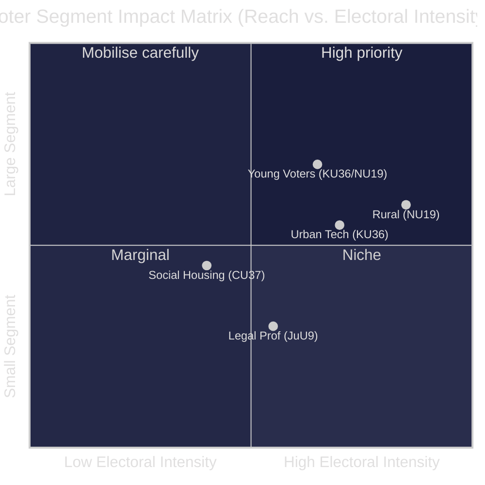

# Voter Segmentation Analysis — Committee Reports 2026-04-29

**Author**: James Pether Sörling  
**Date**: 2026-04-30  
**Confidence**: MEDIUM [B2]

## Demographic Impact Mapping

### Segment 1: Urban Tech Workers (18-45, high education)

**Primary reports**: KU36 (digital privacy), NU22 (competition)

**Impact**: HIGH positive. KU36's AI oversight framework directly addresses algorithmic decision-making concerns relevant to tech workers exposed to automated HR and financial systems. NU22's DMA alignment reduces platform lock-in that affects digital services.

**Electoral implication**: This segment is disproportionately L and M voters — KU36 could reinforce L brand as digital rights champion.

### Segment 2: Rural and Semi-Rural Voters (all ages)

**Primary reports**: NU19 (nuclear), SoU33 (alcohol permits), CU37 (housing)

**Impact**: MIXED. NU19 supports energy security and rural industry. SoU33's alcohol permit relaxation benefits rural event venues. CU37's housing guarantee has limited rural relevance.

**Electoral implication**: Rural SD and C voters are the key battleground. NU19 is the most mobilising issue; SoU33 provides marginal C loyalty signal.

### Segment 3: Social Housing Dependent (lower income, urban periphery)

**Primary reports**: CU37 (municipal housing guarantee)

**Impact**: MODERATE positive. Municipal rental guarantees reduce precarity for those in insecure housing situations.

**Electoral implication**: This is V and S core territory. V opposition to coalition housing policy makes CU37 a symbolic differentiator.

### Segment 4: Legal/Administrative Professionals

**Primary reports**: JuU9 (court efficiency), NU22 (competition law)

**Impact**: HIGH positive for JuU9. Long processing times in courts directly affect legal practitioners and justice-sector workers.

**Electoral implication**: Professionalised voters (lawyers, civil servants) are disproportionately L and M — JuU9 reinforces that brand.

### Segment 5: Young Voters (18-29)

**Primary reports**: KU36, NU19, CU37

**Impact**: KU36 (digital rights) is the most salient for this demographic. NU19 generates concern (climate) but energy security narrative is gaining. CU37 housing guarantee affects young city renters directly.

**Electoral implication**: This segment is the most volatile. MP and V compete for climate-conscious youth; M/SD compete on affordability.

## Regional Dimension

| Region | Most relevant reports | Primary party beneficiary |
|--------|----------------------|--------------------------|
| Storstadsregioner (Stockholm, Göteborg, Malmö) | KU36, JuU9, CU37 | L, S, V |
| Mälardalen | NU19 (Forsmark), KU36 | M, SD |
| Norrland | NU19 (Luleå nuclear expansion interest), SoU33 | SD, C |
| Västra Götaland | NU22, JuU9 | M, C, L |

