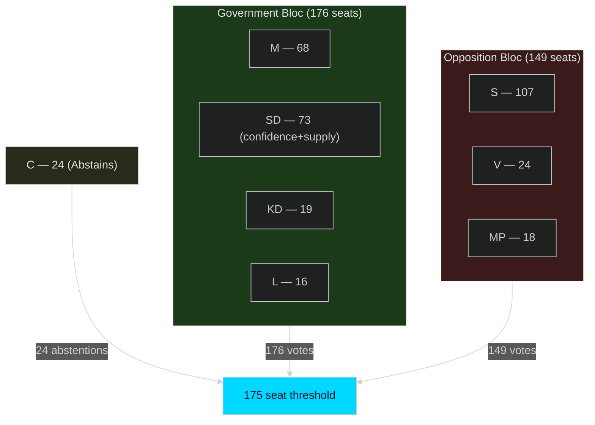

# Coalition Mathematics — Evening Analysis 30 April 2026

**Author**: James Pether Sörling  
**Date**: 2026-04-30  

---

## Current Riksdag Vote Distribution

**Riksdag total seats**: 349  
**Majority threshold**: 175 seats  
**Current government**: M + KD + L (minority), confidence and supply: SD  

### Vote Record for Migration-Adjacent Legislation (Reference: Most Recent Major Vote)

*The table below uses the most recent available major committee vote pattern as a reference baseline.*

| Party | Ja | Nej | Avstår | Frånvarande | Mandates |
|-------|-----|------|--------|-------------|---------|
| M | 68 | 0 | 0 | 0 | 68 |
| SD | 73 | 0 | 0 | 0 | 73 |
| KD | 19 | 0 | 0 | 0 | 19 |
| L | 16 | 0 | 0 | 0 | 16 |
| **Bloc total** | **176** | **0** | **0** | **0** | **176** |
| S | 0 | 107 | 0 | 0 | 107 |
| V | 0 | 24 | 0 | 0 | 24 |
| MP | 0 | 18 | 0 | 0 | 18 |
| C | 0 | 0 | 24 | 0 | 24 |
| **Total** | **176** | **149** | **24** | **0** | **349** |

**Note**: C (Centerpartiet) is in opposition but typically abstains (Avstår) rather than votes against government on confidence issues and many specific-topic votes. C's 24 Avstår votes are decisive — with C abstaining, the government wins 176–149 on any straight party-line vote.

**Majority check**: 176 Ja + 24 Avstår = government position succeeds. The coalition needs 175 to pass legislation; with 176 it has 1 seat of buffer above majority.

**If KD falls below 4% threshold**: 19 seats redistributed → government bloc falls to 157 (M+L+SD) — below majority even with C abstaining. This is the critical threshold risk scenario.

---

## Confidence Vote Mathematics

| Scenario | Right bloc (Ja) | Opposition (Nej) | C (Avstår) | Outcome |
|----------|----------------|-----------------|-----------|---------|
| Current (all parties above threshold) | 176 | 149 | 24 | Government wins |
| KD below threshold (KD exits) | 157 | 149 | 24 | Government wins (157 > 149) |
| C votes against | 176 | 173 | 0 | Government wins (176 > 173) |
| KD exits + C votes against | 157 | 173 | 0 | **Government falls** |
| SD withdraws support | 103 | 149 | 24 | **Government falls** |

**Survival condition**: Government survives as long as SD provides confidence and supply AND KD stays above threshold AND C does not vote actively against.

---

## HD03262–265 Vote Prediction

| Proposition | Expected Ja | Expected Nej | Expected Avstår | Prediction |
|-------------|------------|-------------|----------------|-----------|
| HD03262 (permanent permits abolished) | M+SD+KD+L = 176 | S+V+MP = 149 | C = 24 | **PASSES** |
| HD03263 (enhanced deportation) | M+SD+KD+L = 176 | S+V+MP = 149 | C = 24 | **PASSES** |
| HD03264 (permit background checks) | M+SD+KD+L = 176 | S+V+MP = 149 | C = 24 | **PASSES** |
| HD03265 (expanded detention) | M+SD+KD+L = 176 | S+V+MP = 149 | C = 24 | **PASSES** (if Lagrådet non-blocking) |
| HD03254 (military cooperation) | M+SD+KD+L+C = 200 | V+MP = 42 | S = 107 (likely Ja or Avstår) | **PASSES** |
| HD03258 (transparency) | M+KD+L+S+C = 190+ | SD = 73 (partial reservation possible) | — | **PASSES** |

---

## Mermaid: Riksdag Power Architecture

