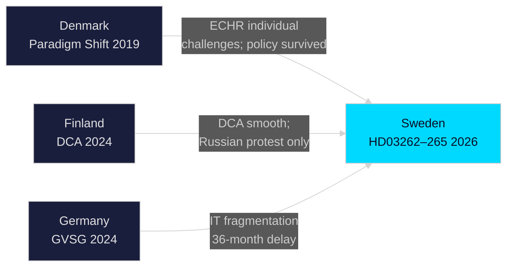

# Comparative International Analysis — Evening Analysis 30 April 2026

**Author**: James Pether Sörling  
**Date**: 2026-04-30  

---

## Comparator Jurisdictions

### Comparator 1 — Denmark (Migration Framework)

**Context**: Denmark has pursued the most restrictive migration policy in the Nordic region under successive governments (S-led Mette Frederiksen government, then current coalition). Denmark introduced "paradigm shift" in 2019 shifting from integration to return-focus.

**Danish measure**: Lov om udlændinge §7, stk. 2 — Danish "B-status" (temporary protection) replacing permanent protection for Syrian refugees; and 2022 removal of permanent residence track for some categories.

**Outcome**: Danish government expelled from several EU solidarity mechanisms; Udlændingestyrelsen implemented return policy but faced ECHR challenge on Zubaydullo Muidinov removal. ECHR found Denmark violated Art. 3 in specific case but did not block the broader policy framework.

**Relevance to Sweden**:
- HD03262 (Swedish permanent permit abolition) closely parallels Danish 2019 paradigm shift. Denmark's experience suggests: policy is implementable but will face individual ECHR challenge cases, not a system-level block.
- Danish Udlændingestyrelsen capacity analysis shows implementation took 18–24 months to stabilise operationally — relevant to HD03263/264 timeline.
- Danish model suggests coalition can absorb ECHR individual case challenges without the broader policy being struck down.

**Intelligence value for Sweden**: Scenario A (Migration Maximalism Delivers) is supported by Danish precedent. ECHR individual challenges do not block the policy framework.

---

### Comparator 2 — Finland (Defence Cooperation)

**Context**: Finland joined NATO in April 2023, completing the Nordic defence transformation. Finland–US Defence Cooperation Agreement (DCA) signed January 2024, providing US forces access to 15 Finnish military bases.

**Finnish measure**: Laki sotilaallisesta kriisinhallinnasta amendment 2024 + DCA implementation legislation — the closest parallel to Sweden's HD03254 (enhanced operational military cooperation).

**Outcome**: Finnish DCA passed Eduskunta (parliament) with 173/200 votes. Opposition from Vasemmistoliitto (Left Alliance) and some Social Democrats. Implementation timeline 18 months from passage. No significant legal challenges. Russian diplomatic protest filed but no material escalation.

**Relevance to Sweden**:
- HD03254 is following the Finnish DCA model. Finnish precedent suggests broad parliamentary support (Sweden already has FöU and Defence Committee consensus), rapid implementation, and Russian protest-but-no-escalation.
- Finnish defence procurement acceleration post-DCA offers Sweden a roadmap: F-35 programme, Patria vehicles, NASAMS — parallel to Sweden's expected Saab/BAE procurement under HD03254.

**Intelligence value for Sweden**: HD03254 implementation is likely smooth. Finnish precedent strongly supports Scenario A for the defence cooperation strand.

---

### Comparator 3 — Germany (Healthcare/Mental Health Integration)

**Context**: Germany's Gesundheitsversorgungsstärkungsgesetz (GVSG) 2024 attempted to integrate addiction medicine and psychiatric care at the Länder level — closely parallel to HD03251.

**Outcome**: Implementation delayed 18 months beyond the statutory deadline in 11 of 16 Länder due to IT system fragmentation. Bundesgesundheitsministerium commissioned emergency IT interoperability standard (HL7 FHIR national profile) to resolve the integration barrier.

**Relevance to Sweden**:
- HD03251's 18-month implementation target is optimistic given similar IT fragmentation at Swedish regional (Region) level. German experience suggests 36 months is the realistic operational timeline.
- Socialstyrelsen's concern about HD03251 (referenced in the stakeholder analysis) is confirmed by German comparative evidence.
- Forward indicator: Sweden should monitor whether Socialstyrelsen requests timeline extension in autumn 2026.

**Intelligence value for Sweden**: W3 (healthcare integration timeline) risk is elevated by German precedent.

---

## International Context Table

| Domain | Sweden 2026 | Denmark | Finland | Germany |
|--------|------------|---------|---------|---------|
| Migration restriction | HD03262–265 (new) | Paradigm shift 2019 | Moderate (NATO focus) | AfD pressure, CDU response |
| ECHR outcome | Unknown — filing expected | Individual challenges; policy survived | N/A for migration | Individual cases |
| Defence cooperation | HD03254 (NATO operational) | NATO member 1949; DCA with US 2024 | DCA 2024; 15 bases | NATO; no comparable bilateral DCA |
| Healthcare integration | HD03251 (new) | Integrated care 2022 | — | GVSG 2024 (delayed) |
| Election proximity | 149 days | — | — | — |

## Mermaid: Comparative Legal Challenge Outcomes

