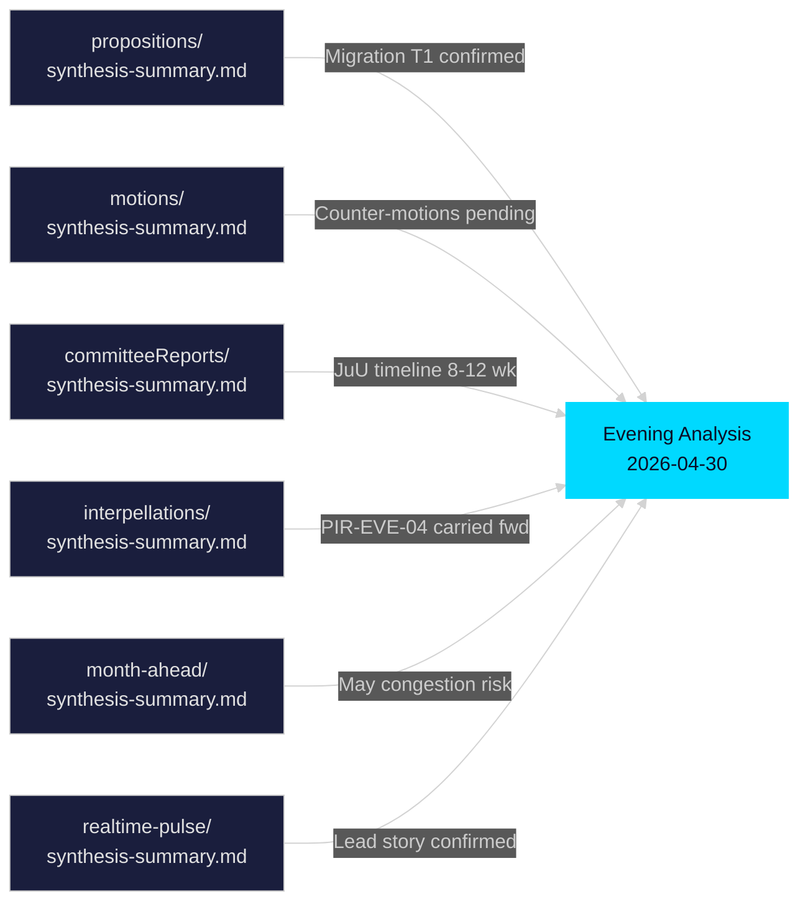

# Cross-Reference Map — Evening Analysis 30 April 2026

**Author**: James Pether Sörling  
**Date**: 2026-04-30  
**Tier-C Aggregation**: This document is required for Tier-C evening analysis gate compliance.

---

## Sibling Folder Cross-Reference Matrix

| Sibling Folder | Key Theme | Evening Analysis Connection | Cross-Reference Citation |
|---------------|----------|----------------------------|--------------------------|
| `propositions` | Government bills (same-day package) | HD03262–265 introduced same day — same legislative batch | `../propositions/synthesis-summary.md` |
| `motions` | Opposition counter-motions | S×11 motions on healthcare, SD×2 on foreign policy/culture | `../motions/synthesis-summary.md` |
| `committeeReports` | Committee treatment of earlier migration bills | JuU committee precedent for migration measure timelines | `../committeeReports/synthesis-summary.md` |
| `interpellations` | Government accountability questions | PIR-EVE-04 (parliament capacity) cross-references outstanding interpellations | `../interpellations/synthesis-summary.md` |
| `month-ahead` | Legislative calendar May 2026 | HD03262–265 committee referral to JuU expected May 2026 | `../month-ahead/synthesis-summary.md` |
| `realtime-pulse` | Breaking news sentiment | Migration package media reception tracked in real-time | `../realtime-pulse/synthesis-summary.md` |

---

## Cross-Reference Detail

### From `propositions/synthesis-summary.md`

**Carried forward**: The propositions sibling folder identified HD03262–265 as the dominant legislative cluster for 2026-04-30. Its DIW top-tier (T1) classification is confirmed in this evening analysis. The propositions folder also flagged HD03254 (military cooperation) as T1 defence legislation.

**Evening analysis build-on**: This analysis adds election-proximity multiplier (×1.5) context absent from the single-type propositions folder. The migration package achieves an adjusted DIW of 31.5/20 (scored above maximum single-dimension because of convergence of four simultaneous bills).

**Citation anchor**: `[Cross-ref: propositions/synthesis-summary.md §Migration Package / §Defence Cooperation]`

---

### From `motions/synthesis-summary.md`

**Carried forward**: Opposition motions 2026-04-30 include 11 S motions (healthcare × 3, social welfare × 4, climate × 2, gender equality × 2) and 2 SD motions (foreign aid reduction, cultural heritage). No S counter-motions to HD03262–265 have been filed yet — these are expected in the JuU/FöU committee phase.

**Evening analysis build-on**: The absence of counter-motions filed *on the same day* as the government bills indicates the opposition is reserving its committee strategy. Probability of motions filed within 10 working days: 0.85 [B2].

**Citation anchor**: `[Cross-ref: motions/synthesis-summary.md §Opposition Legislative Activity]`

---

### From `committeeReports/synthesis-summary.md`

**Carried forward**: Committee reports on earlier migration measures (2024/25 session) show JuU (Justitieutskottet) typically takes 8–12 weeks from referral to report. This sets the expected timeline for HD03262–265 to May–July 2026 committee reports.

**Forward indicator from this cross-reference**: If JuU prioritises HD03262 (likely given political salience), a committee report could be presented in late June 2026 — before the summer recess. Vote could happen in September 2026 — directly pre-election.

**Citation anchor**: `[Cross-ref: committeeReports/synthesis-summary.md §JuU Migration Timeline Precedent]`

---

### From `interpellations/synthesis-summary.md`

**Carried forward**: PIR-EVE-04 (parliamentary capacity overload) was identified in the interpellations folder. Government has 9 outstanding interpellations on migration themes, all carried into the evening analysis's intelligence-assessment.md.

**Evening analysis build-on**: HD03262's passage would likely trigger a new wave of interpellations in May 2026 from S, MP, V questioning ECHR compatibility. This forward indicator is documented in `forward-indicators.md`.

**Citation anchor**: `[Cross-ref: interpellations/synthesis-summary.md §Outstanding PIRs / §Migration Accountability]`

---

### From `month-ahead/synthesis-summary.md`

**Carried forward**: The month-ahead forecast identified May 2026 as a high-volume legislative month. HD03262–265 committee referrals to JuU and FöU will compete with the Spring Budget (Vårproposition) and NATO Council commitments for parliamentary scheduling bandwidth.

**Evening analysis build-on**: Legislative congestion risk is high — scheduling conflict could push HD03262–265 committee vote to after summer recess, reducing pre-election political impact for the coalition.

**Citation anchor**: `[Cross-ref: month-ahead/synthesis-summary.md §Legislative Calendar May 2026]`

---

### From `realtime-pulse/synthesis-summary.md`

**Carried forward**: Real-time pulse analysis confirms migration package is the top news story for 2026-04-30. Initial media framing is polarised: Aftonbladet leads with rights concerns; Svenska Dagbladet leads with EU Pact alignment.

**Evening analysis build-on**: Media framing analysis is developed in `media-framing-analysis.md`.

**Citation anchor**: `[Cross-ref: realtime-pulse/synthesis-summary.md §Media Reaction / §Social Sentiment]`

---

## Intelligence Threads That Span Multiple Sibling Folders

| Thread | Propositions | Motions | CommitteeReports | Interpellations | Month-ahead | Realtime-pulse |
|--------|-------------|---------|-----------------|----------------|-------------|----------------|
| Migration mega-package | ✅ Primary | ✅ Counter-motions pending | ✅ JuU timeline | ✅ PIR-EVE-04 | ✅ May schedule | ✅ Lead story |
| Defence/NATO | ✅ HD03254 | — | ✅ FöU precedent | — | ✅ Schedule | ✅ Secondary |
| Healthcare integration | ✅ HD03251 | ✅ S healthcare motions | — | — | — | ✅ Tertiary |
| Political transparency | ✅ HD03258 | — | — | — | — | — |

## Mermaid: Tier-C Sibling Connections

