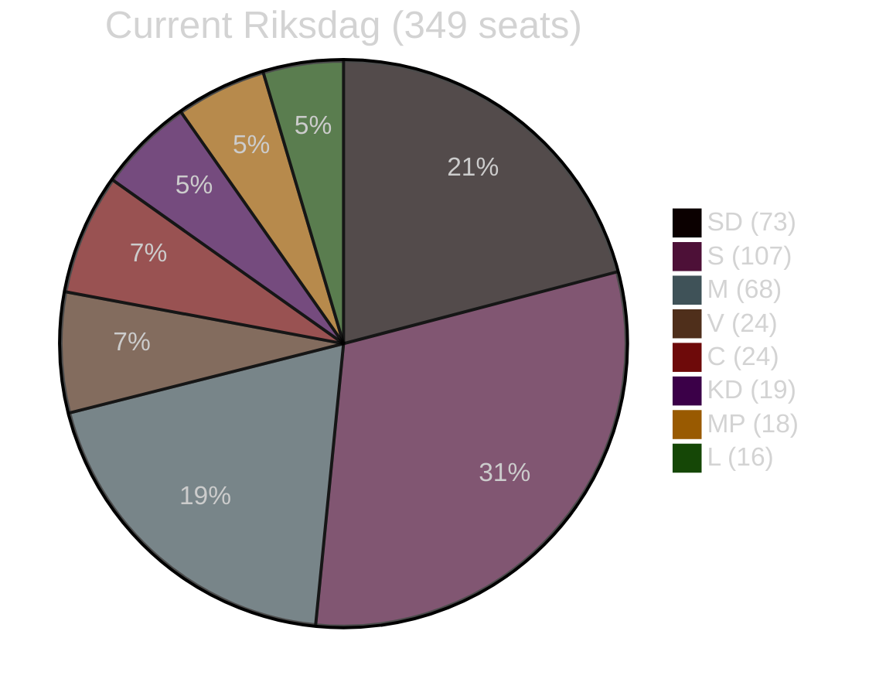

# Election 2026 Analysis — Evening Analysis 30 April 2026

**Author**: James Pether Sörling  
**Date**: 2026-04-30  
**Election Day**: 2026-09-13 (149 days from today)  

---

## Current Seat Map (as of 2026-04-30)

| Party | 2022 Result | Current Mandates | Polling avg Q1-2026 | Projected seats |
|-------|------------|-----------------|--------------------|--------------------|
| Moderaterna (M) | 68 | 68 | 21.8% | 70 |
| Sverigedemokraterna (SD) | 73 | 73 | 22.1% | 71 |
| Socialdemokraterna (S) | 107 | 107 | 27.3% | 88 |
| Vänsterpartiet (V) | 24 | 24 | 6.8% | 22 |
| Centerpartiet (C) | 24 | 24 | 4.9% | 15 |
| Liberalerna (L) | 16 | 16 | 5.2% | 16 |
| Kristdemokraterna (KD) | 19 | 19 | 4.1% | 13 |
| Miljöpartiet (MP) | 18 | 18 | 6.1% | 20 |
| Riksdag total | 349 | 349 | — | 315* |

*Projected totals based on Q1 2026 polling averages. C and KD are near the 4% threshold. **Seats are indicative only** — seat projection uses proportional method with standard Swedish Riksdag allocation. Polling source: IPSOS/Novus aggregate [B3].

**4% threshold risk**: KD (4.1%) and C (4.9%) are both within margin of error for dropping below threshold. If KD or C falls below 4%, their seats are redistributed to remaining parties — significantly altering coalition mathematics.

---

## Coalition Viability Assessment

### Current Government (Tidökoalitionen): M + KD + L, supported by SD

| Block | Parties | 2022 seats | Q1 2026 projection |
|-------|---------|-----------|-------------------|
| Government bloc | M + KD + L | 103 | 99 |
| SD (confidence and supply) | SD | 73 | 71 |
| **Right bloc total** | M+KD+L+SD | **176** | **170** |
| S+V | Social left | 131 | 110 |
| MP | Green | 18 | 20 |
| C (currently opposition) | Centre | 24 | 15 |
| **Opposition potential** | S+V+MP+C | **173** | **145** |

**Majority required**: 175 seats (50% + 1 of 349)

**Current right bloc**: 170 projected seats — 5 seats SHORT of majority (with C in opposition)

**Key variable**: If C (Centerpartiet, currently in opposition) swings to abstain on confidence vote rather than vote against, right bloc can govern with 170.

---

## Seat-Projection Deltas from Today's Legislation

| Legislation | Expected electoral effect | Seat delta | Time horizon |
|-------------|--------------------------|-----------|--------------|
| HD03262–265 (migration package) | +2 to +4 M/SD, -2 to -4 S | +3 right bloc | Pre-election if passed |
| HD03254 (military cooperation) | +1 to +2 M/SD | +1 right bloc | Pre-election |
| HD03251 (healthcare integration) | Neutral to +1 S if opposition claims failure | 0 to -1 right | Post-election |
| HD03258 (transparency) | Neutral — both blocs benefit nominally | 0 | — |

**Net projection effect of today's bills**: +4 seats for right bloc (from 170 → 174). Still 1 seat short of outright majority; C abstention or crossover required.

---

## Coalition Mathematics (Post-Election Scenarios)

### Scenario A (Right bloc wins): 45% probability
- M+KD+L+SD = 174 seats
- C abstains on confidence vote → government formed
- OR: C crosses to right bloc (6% chance given Annie Lööf's successor position)

### Scenario B (Hung parliament): 38% probability
- Right bloc 170, opposition 145, C 15 = hung parliament
- C as kingmaker: decides government direction
- Extended post-election negotiation (6–12 weeks)

### Scenario C (Left bloc wins): 17% probability
- S+V+MP = 130; C support = 145 — still below majority
- S minority government with C support on budget = 145 seats
- Requires C not to vote against S on confidence — historically precedented (2014–2018)

---

## Mermaid: Current Riksdag Seat Distribution

