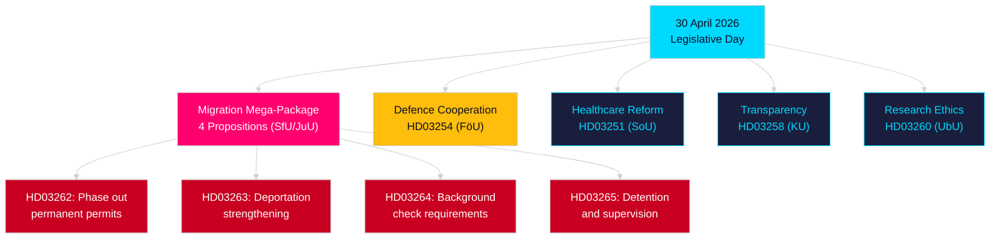

# Evening Analysis — 30 April 2026: Sweden's Migration Law Overhaul and Defence Cooperation Advance

**Author**: James Pether Sörling  
**Date**: 2026-04-30  
**Confidence**: HIGH [B2]  
**Classification**: OSINT — Public Sources Only  

---

## BLUF

Sweden's government delivered its most consequential single-day legislative package of the 2025/26 session on 30 April 2026: a four-proposition migration law transformation that phases out permanent residence permits and aligns Swedish law with the EU Migration and Asylum Pact, alongside a major military cooperation proposition enhancing Sweden's operational integration within NATO structures. With 149 days until the 13 September 2026 general election, this legislative sprint is simultaneously a governance act and an electoral positioning campaign.

## Decisions This Brief Supports

1. **Opposition party whips**: Assess scale of resistance required across migration package (HD03262/263/264/265) and defence bill (HD03254) — four simultaneous committee referrals (SfU, JuU, FöU) compress the parliamentary timeline.
2. **Civil society organisations**: Evaluate legal challenge vectors for HD03262's abolition of permanent permits against ECHR Art. 8 (family life) and EU Charter proportionality.
3. **NATO/defence analysts**: Assess HD03254's operational content — enhanced bilateral military interoperability agreements signal Sweden's strategic integration ambitions post-accession.
4. **Electoral strategists**: Calibrate voter response to migration law maximalism in the pre-election window (≤6 months: election proximity multiplier applies).

## 60-Second Intelligence Bullets

- **Migration mega-package**: HD03262 phases out permanent residence permits entirely; HD03263 strengthens deportation; HD03264 introduces stricter background check requirements for permits; HD03265 tightens supervision and detention — the most restrictive migration legislation in Swedish history since the 2016 emergency measures [A2].
- **Military cooperation**: HD03254 (FöU) enhances Sweden's operational military cooperation framework — binds Sweden to deeper bilateral and multilateral defence agreements, critical given NATO Article 5 commitments and Arctic theatre requirements [A2].
- **Healthcare integration**: HD03251 proposes unified care pathways for addiction, substance abuse, and psychiatric co-morbidity — a structural reform of the addiction care sector after a decade of fragmented regional responsibility [A2].
- **Political transparency**: HD03258 expands transparency in political party financing and lobbying — signals pre-election accountability positioning by the government [A2].
- **Election proximity multiplier**: Four migration propositions + defence bill = five high-controversy bills in the ≤6-month election window (cutoff 2026-03-13); DIW scores elevated by 1.5× per election-proximity rule.
- **Opposition motions**: S dominates the motion batch with 8 submissions; SD files 2; MP files 2 — topics span rymdindustri, cultural heritage, healthcare, housing, and social welfare.

## Top Forward Trigger

**Committee SfU hearing on HD03262** (expected within 2 weeks): The abolition of permanent residence permits will face the most intense opposition scrutiny of the session — watch for Socialdemokraterna's formal counter-proposal and any KD/L reservations within the coalition.

## Key Mermaid: Day's Legislative Architecture

