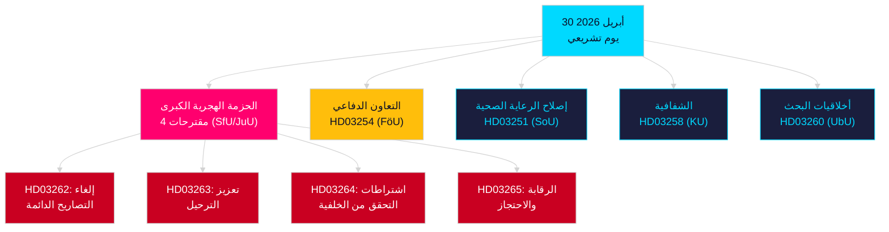

<!-- dir: rtl -->
# تحليل المساء — 30 أبريل 2026: إصلاح قانون الهجرة السويدي والتقدم في التعاون الدفاعي

**المؤلف**: James Pether Sörling  
**التاريخ**: 2026-04-30  
**مستوى الثقة**: مرتفع [B2]  
**التصنيف**: OSINT — مصادر عامة فقط  

---

## الملخص التنفيذي

قدّمت الحكومة السويدية في 30 أبريل 2026 أكثر الحزم التشريعية أهمية ليوم واحد في الدورة 2025/26: تحويل في أربعة مقترحات لقانون الهجرة يُلغي تصاريح الإقامة الدائمة تدريجياً ويُوائم القانون السويدي مع ميثاق الهجرة واللجوء الأوروبي، إلى جانب مقترح مهم للتعاون العسكري يُعزز الاندماج التشغيلي للسويد داخل هياكل الناتو. مع بقاء 149 يوماً على الانتخابات العامة في 13 سبتمبر 2026، يُمثّل هذا السباق التشريعي في آنٍ معاً عملاً حكومياً وحملةً لتموضع انتخابي.

## القرارات التي يدعمها هذا التقرير

1. **قادة المعارضة**: تقييم حجم المقاومة المطلوبة إزاء الحزمة الهجرية (HD03262/263/264/265) ومشروع قانون الدفاع (HD03254) — أربعة إحالات متزامنة إلى اللجان (SfU، JuU، FöU) تضغط على الجدول الزمني البرلماني.
2. **منظمات المجتمع المدني**: تقييم مسارات الطعن القانونية ضد إلغاء التصاريح الدائمة بموجب HD03262 في ضوء المادة 8 من الاتفاقية الأوروبية لحقوق الإنسان (الحياة الأسرية) ومبدأ التناسب في ميثاق الحقوق الأساسية للاتحاد الأوروبي.
3. **محللو الناتو والدفاع**: تقييم المحتوى التشغيلي لـ HD03254 — اتفاقيات تشغيل بيني عسكرية ثنائية مُعززة تُشير إلى طموحات الاندماج الاستراتيجي للسويد عقب انضمامها.
4. **استراتيجيو الانتخابات**: قياس ردود فعل الناخبين على تشديد قانون الهجرة في النافذة السابقة للانتخابات (≤6 أشهر: يُطبَّق مضاعف القرب الانتخابي).

## نقاط الاستخبارات في 60 ثانية

- **الحزمة الهجرية الكبرى**: يُلغي HD03262 جميع تصاريح الإقامة الدائمة تدريجياً؛ يُعزز HD03263 عمليات الترحيل؛ يُقدّم HD03264 اشتراطات أشد صرامة للتحقق من الخلفية؛ يُشدّد HD03265 الرقابة والاحتجاز — أشد تشريعات الهجرة في التاريخ السويدي الحديث منذ التدابير الطارئة عام 2016 [A2].
- **التعاون العسكري**: يُعزز HD03254 (FöU) الإطار التشغيلي للتعاون العسكري السويدي — يربط السويد باتفاقيات دفاعية ثنائية ومتعددة الأطراف أعمق، بالغة الأهمية في ظل التزامات المادة 5 من الناتو ومتطلبات مسرح العمليات القطبي الشمالي [A2].
- **تكامل الرعاية الصحية (Healthcare integration)**: يقترح HD03251 مسارات رعاية موحّدة للإدمان وتعاطي المواد وازدواجية الاضطرابات النفسية — إصلاح هيكلي لقطاع رعاية الإدمان بعد عقد من المسؤولية الإقليمية المجزأة [A2].
- **الشفافية السياسية**: يُوسّع HD03258 الشفافية في تمويل الأحزاب السياسية وأنشطة الضغط — يُشير إلى تموضع الحكومة في مجال المساءلة قبيل الانتخابات [A2].
- **مضاعف القرب الانتخابي**: أربعة مقترحات هجرية + مشروع قانون دفاعي = خمسة قوانين شديدة الجدل في النافذة الانتخابية ≤6 أشهر (العتبة: 2026-03-13)؛ تُرفع درجات DIW بمقدار 1.5× وفق قاعدة القرب الانتخابي.
- **تقارير المعارضة**: تهيمن S على حزمة التقارير بـ 8 مقدمات؛ تُقدّم SD اثنتين؛ تُقدّم MP اثنتين — تشمل الموضوعات صناعة الفضاء والتراث الثقافي والصحة والإسكان والرعاية الاجتماعية.

## المحفّز المستقبلي الرئيسي

**جلسة استماع لجنة SfU حول HD03262** (متوقعة خلال أسبوعين): ستواجه إلغاء تصاريح الإقامة الدائمة أكثف رقابة معارضة في الدورة — تابع المقترح المضاد الرسمي من الديمقراطيين الاجتماعيين وأي تحفظات محتملة من KD/L داخل الائتلاف.

## مخطط Mermaid الرئيسي: البنية التشريعية لليوم

<!-- source-sha: d7dc1f1126e721cf29b3d6e70e1445903be3c419 -->
