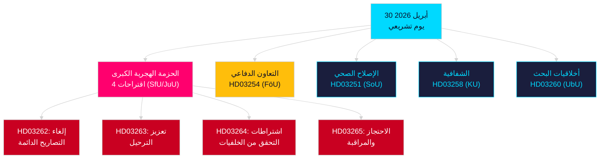

<!-- dir: rtl -->
# تحليل مسائي — 30 أبريل 2026: السويد تصلح قانون الهجرة وتدفع التعاون الدفاعي إلى الأمام

**المؤلف**: James Pether Sörling  
**التاريخ**: 2026-04-30  
**مستوى الثقة**: HIGH [B2]  
**التصنيف**: OSINT — مصادر عامة فقط  

---

## الملخص التنفيذي

قدّمت الحكومة السويدية في 30 أبريل 2026 أكثر الحزم التشريعية في يوم واحد شمولاً في دورة 2025/26: تحوّل هجري من أربعة اقتراحات يُلغي تصاريح الإقامة الدائمة ويُوائم القانون السويدي مع ميثاق الهجرة واللجوء الأوروبي، إلى جانب اقتراح تعاون عسكري رئيسي يعزز الاندماج العملياتي للسويد في هياكل حلف الناتو. مع 149 يوماً على الانتخابات البرلمانية في 13 سبتمبر 2026، يُمثّل هذا السباق التشريعي في آنٍ واحد إجراءً حكومياً وحملةً لتحديد المواقع الانتخابية.

## القرارات التي يدعمها هذا الموجز

1. **قادة الكتل البرلمانية لأحزاب المعارضة**: تقييم حجم المقاومة اللازمة ضد حزمة الهجرة (HD03262/263/264/265) واقتراح الدفاع (HD03254) — أربعة إحالات متزامنة إلى اللجان (SfU، JuU، FöU) تضغط على الجدول الزمني البرلماني.
2. **منظمات المجتمع المدني**: تقييم متجهات الطعن القانوني لإلغاء التصاريح الدائمة في HD03262 في مواجهة المادة 8 من الاتفاقية الأوروبية لحقوق الإنسان (الحياة الأسرية) ومبدأ التناسب في ميثاق الحقوق الأساسية للاتحاد الأوروبي.
3. **محللو الناتو/الدفاع**: تقييم المحتوى العملياتي للـ HD03254 — اتفاقيات التشغيل البيني العسكري الثنائية المعززة تُشير إلى طموحات التكامل الاستراتيجي للسويد بعد الانضمام إلى الناتو.
4. **استراتيجيو الانتخابات**: معايرة استجابة الناخبين للتشدد في قانون الهجرة في فترات ما قبل الانتخابات (≤6 أشهر: يُطبّق معامل قرب الانتخابات).

## نقاط الاستخبارات في 60 ثانية

- **الحزمة الهجرية الكبرى**: يُلغي HD03262 تصاريح الإقامة الدائمة كلياً؛ يُعزز HD03263 الترحيل؛ يُدخل HD03264 اشتراطات أكثر صرامة للتحقق من الخلفيات للتصاريح؛ يُشدد HD03265 المراقبة والاحتجاز — أكثر تشريعات الهجرة تقييداً في التاريخ السويدي منذ إجراءات الطوارئ عام 2016 [A2].
- **التعاون العسكري**: يُعزز HD03254 (FöU) الإطار العملياتي للتعاون العسكري السويدي — يربط السويد باتفاقيات دفاعية ثنائية ومتعددة الأطراف أعمق، وهو أمر حاسم في ضوء التزامات المادة 5 من معاهدة الناتو ومتطلبات المسرح القطبي الشمالي [A2].
- **التكامل الصحي**: يقترح HD03251 مسارات علاج موحدة للإدمان وتعاطي المخدرات والاضطراب النفسي المصاحب — إصلاح هيكلي لخدمات الإدمان بعد عقد من المسؤولية الإقليمية المجزأة [A2].
- **الشفافية السياسية**: يُوسّع HD03258 شفافية تمويل الأحزاب السياسية والضغط السياسي — يُشير إلى تموضع الحكومة لتحقيق المساءلة قبيل الانتخابات [A2].
- **معامل قرب الانتخابات**: أربعة اقتراحات هجرة + اقتراح دفاع = خمسة مشاريع قوانين شديدة الجدل في نافذة انتخابية ≤6 أشهر (الحد 2026-03-13)؛ ارتفع مؤشر DIW بمقدار 1.5× وفقاً لقاعدة قرب الانتخابات.
- **اقتراحات المعارضة**: يهيمن حزب S على حزمة الاقتراحات بـ8 تقديمات؛ يُقدّم SD اقتراحين؛ يُقدّم MP اقتراحين — تشمل الموضوعات صناعة الفضاء والتراث الثقافي والرعاية الصحية والإسكان والرفاه الاجتماعي.

## المحفز الأبرز المقبل

**جلسة استماع لجنة SfU بشأن HD03262** (متوقعة خلال أسبوعين): سيواجه إلغاء تصاريح الإقامة الدائمة أشد فحص للمعارضة في الدورة — رصد المقترح المضاد الرسمي للديمقراطيين الاشتراكيين وأي تحفظات محتملة من KD/L داخل الائتلاف.

## مخطط Mermaid الأبرز: البنية التشريعية لليوم

<!-- source-sha: 34f4e52b496d9d798f623f205ad98b050ff2f0e7 -->
